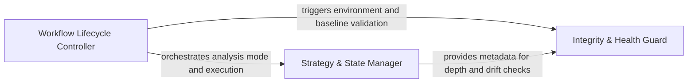

## Details

Acts as the central controller for the action. It validates the environment, manages the transition between full codebase scans and incremental PR analysis, and ensures metadata consistency across runs.

### Workflow Lifecycle Controller
Acts as the primary entry point and high-level coordinator. It manages the sequential execution of the action, handles quota enforcement to prevent runaway CI costs, and dispatches tasks to the strategy and validation layers.

**Related Classes/Methods**:

- `scripts.engine_adapter.main`:523-601
- `scripts.engine_adapter.run_head`:338-359
- `scripts.engine_adapter._is_quota_exhausted`:69-84

**Source Files:**

- [`scripts/engine_adapter.py`](https://github.com/CodeBoarding/CodeBoarding-action/blob/main/.codeboardingscripts/engine_adapter.py)
  - `scripts.engine_adapter._is_quota_exhausted` ([L69-L84](https://github.com/CodeBoarding/CodeBoarding-action/blob/main/.codeboardingscripts/engine_adapter.py#L69-L84)) - Function
  - `scripts.engine_adapter._flag_quota_exhausted` ([L87-L96](https://github.com/CodeBoarding/CodeBoarding-action/blob/main/.codeboardingscripts/engine_adapter.py#L87-L96)) - Function
  - `scripts.engine_adapter.run_seed` ([L257-L284](https://github.com/CodeBoarding/CodeBoarding-action/blob/main/.codeboardingscripts/engine_adapter.py#L257-L284)) - Function
  - `scripts.engine_adapter.run_head` ([L338-L359](https://github.com/CodeBoarding/CodeBoarding-action/blob/main/.codeboardingscripts/engine_adapter.py#L338-L359)) - Function
  - `scripts.engine_adapter.run_concat` ([L448-L461](https://github.com/CodeBoarding/CodeBoarding-action/blob/main/.codeboardingscripts/engine_adapter.py#L448-L461)) - Function
  - `scripts.engine_adapter.main` ([L523-L601](https://github.com/CodeBoarding/CodeBoarding-action/blob/main/.codeboardingscripts/engine_adapter.py#L523-L601)) - Function

### Strategy & State Manager
The decision-making engine that determines the analysis mode (Full vs. Incremental). It tracks commit hashes and metadata to ensure that PR analysis only processes changed files, maintaining consistency with the established baseline.

**Related Classes/Methods**:

- `scripts.engine_adapter.run_analyze`:362-429
- `scripts.engine_adapter._incremental_or_full`:287-335
- `scripts.engine_adapter._load_metadata`:112-122
- `scripts.engine_adapter.run_analyze.full`:378-394

**Source Files:**

- [`scripts/engine_adapter.py`](https://github.com/CodeBoarding/CodeBoarding-action/blob/main/.codeboardingscripts/engine_adapter.py)
  - `scripts.engine_adapter._log_path` ([L99-L100](https://github.com/CodeBoarding/CodeBoarding-action/blob/main/.codeboardingscripts/engine_adapter.py#L99-L100)) - Function
  - `scripts.engine_adapter._clear_dir` ([L103-L109](https://github.com/CodeBoarding/CodeBoarding-action/blob/main/.codeboardingscripts/engine_adapter.py#L103-L109)) - Function
  - `scripts.engine_adapter._load_metadata` ([L112-L122](https://github.com/CodeBoarding/CodeBoarding-action/blob/main/.codeboardingscripts/engine_adapter.py#L112-L122)) - Function
  - `scripts.engine_adapter._metadata_commit` ([L132-L134](https://github.com/CodeBoarding/CodeBoarding-action/blob/main/.codeboardingscripts/engine_adapter.py#L132-L134)) - Function
  - `scripts.engine_adapter.baseline_info` ([L137-L147](https://github.com/CodeBoarding/CodeBoarding-action/blob/main/.codeboardingscripts/engine_adapter.py#L137-L147)) - Function
  - `scripts.engine_adapter.run_base` ([L242-L254](https://github.com/CodeBoarding/CodeBoarding-action/blob/main/.codeboardingscripts/engine_adapter.py#L242-L254)) - Function
  - `scripts.engine_adapter._incremental_or_full` ([L287-L335](https://github.com/CodeBoarding/CodeBoarding-action/blob/main/.codeboardingscripts/engine_adapter.py#L287-L335)) - Function
  - `scripts.engine_adapter.run_analyze` ([L362-L429](https://github.com/CodeBoarding/CodeBoarding-action/blob/main/.codeboardingscripts/engine_adapter.py#L362-L429)) - Function
  - `scripts.engine_adapter.run_analyze.full` ([L378-L394](https://github.com/CodeBoarding/CodeBoarding-action/blob/main/.codeboardingscripts/engine_adapter.py#L378-L394)) - Function
  - `scripts.engine_adapter.run_render` ([L432-L445](https://github.com/CodeBoarding/CodeBoarding-action/blob/main/.codeboardingscripts/engine_adapter.py#L432-L445)) - Function

### Integrity & Health Guard
Performs pre-flight validation of the environment and post-analysis quality checks. It specifically looks for "baseline drift"—where documentation becomes desynchronized from the code—and reports on the structural integrity of the generated Mermaid diagrams.

**Related Classes/Methods**:

- `scripts.engine_adapter.validate_base_analysis`:184-239
- `scripts.engine_adapter._docs_only_baseline_drift`:150-181
- `scripts.engine_adapter.run_health`:491-520

**Source Files:**

- [`scripts/engine_adapter.py`](https://github.com/CodeBoarding/CodeBoarding-action/blob/main/.codeboardingscripts/engine_adapter.py)
  - `scripts.engine_adapter._metadata_depth` ([L125-L129](https://github.com/CodeBoarding/CodeBoarding-action/blob/main/.codeboardingscripts/engine_adapter.py#L125-L129)) - Function
  - `scripts.engine_adapter._docs_only_baseline_drift` ([L150-L181](https://github.com/CodeBoarding/CodeBoarding-action/blob/main/.codeboardingscripts/engine_adapter.py#L150-L181)) - Function
  - `scripts.engine_adapter._docs_only_baseline_drift.git` ([L153-L160](https://github.com/CodeBoarding/CodeBoarding-action/blob/main/.codeboardingscripts/engine_adapter.py#L153-L160)) - Function
  - `scripts.engine_adapter.validate_base_analysis` ([L184-L239](https://github.com/CodeBoarding/CodeBoarding-action/blob/main/.codeboardingscripts/engine_adapter.py#L184-L239)) - Function
  - `scripts.engine_adapter._count_report_issues` ([L464-L477](https://github.com/CodeBoarding/CodeBoarding-action/blob/main/.codeboardingscripts/engine_adapter.py#L464-L477)) - Function
  - `scripts.engine_adapter._count_health_report` ([L480-L488](https://github.com/CodeBoarding/CodeBoarding-action/blob/main/.codeboardingscripts/engine_adapter.py#L480-L488)) - Function
  - `scripts.engine_adapter.run_health` ([L491-L520](https://github.com/CodeBoarding/CodeBoarding-action/blob/main/.codeboardingscripts/engine_adapter.py#L491-L520)) - Function

### [FAQ](https://github.com/CodeBoarding/GeneratedOnBoardings/tree/main?tab=readme-ov-file#faq)