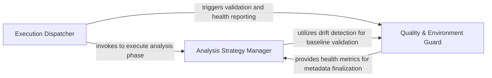

## Details

Acts as the central controller for the action. It validates the environment, manages the transition between full codebase scans and incremental PR analysis, and ensures metadata consistency across runs.

### Execution Dispatcher
Acts as the primary entry point and high-level coordinator. It sequences the execution phases (seed, analyze, render, health) and manages the global execution context for the GitHub Action.

**Related Classes/Methods**:

- `scripts.engine_adapter.main`:488-558
- `scripts.engine_adapter.run_head`:303-324
- `scripts.engine_adapter.run_render`:397-410

**Source Files:**

- [`scripts/engine_adapter.py`](https://github.com/CodeBoarding/CodeBoarding-action/blob/main/.codeboardingscripts/engine_adapter.py)
  - `scripts.engine_adapter.run_seed` ([L222-L249](https://github.com/CodeBoarding/CodeBoarding-action/blob/main/.codeboardingscripts/engine_adapter.py#L222-L249)) - Function
  - `scripts.engine_adapter.run_head` ([L303-L324](https://github.com/CodeBoarding/CodeBoarding-action/blob/main/.codeboardingscripts/engine_adapter.py#L303-L324)) - Function
  - `scripts.engine_adapter.run_render` ([L397-L410](https://github.com/CodeBoarding/CodeBoarding-action/blob/main/.codeboardingscripts/engine_adapter.py#L397-L410)) - Function
  - `scripts.engine_adapter.run_concat` ([L413-L426](https://github.com/CodeBoarding/CodeBoarding-action/blob/main/.codeboardingscripts/engine_adapter.py#L413-L426)) - Function
  - `scripts.engine_adapter.main` ([L488-L558](https://github.com/CodeBoarding/CodeBoarding-action/blob/main/.codeboardingscripts/engine_adapter.py#L488-L558)) - Function

### Analysis Strategy Manager
Determines the optimal analysis mode (Full vs. Incremental) based on the Git context and manages the persistence of analysis metadata to ensure continuity between PR updates.

**Related Classes/Methods**:

- `scripts.engine_adapter.run_analyze`:327-394
- `scripts.engine_adapter._incremental_or_full`:252-300
- `scripts.engine_adapter._load_metadata`:77-87
- `scripts.engine_adapter._metadata_commit`:97-99

**Source Files:**

- [`scripts/engine_adapter.py`](https://github.com/CodeBoarding/CodeBoarding-action/blob/main/.codeboardingscripts/engine_adapter.py)
  - `scripts.engine_adapter._log_path` ([L64-L65](https://github.com/CodeBoarding/CodeBoarding-action/blob/main/.codeboardingscripts/engine_adapter.py#L64-L65)) - Function
  - `scripts.engine_adapter._clear_dir` ([L68-L74](https://github.com/CodeBoarding/CodeBoarding-action/blob/main/.codeboardingscripts/engine_adapter.py#L68-L74)) - Function
  - `scripts.engine_adapter._load_metadata` ([L77-L87](https://github.com/CodeBoarding/CodeBoarding-action/blob/main/.codeboardingscripts/engine_adapter.py#L77-L87)) - Function
  - `scripts.engine_adapter._metadata_commit` ([L97-L99](https://github.com/CodeBoarding/CodeBoarding-action/blob/main/.codeboardingscripts/engine_adapter.py#L97-L99)) - Function
  - `scripts.engine_adapter.baseline_info` ([L102-L112](https://github.com/CodeBoarding/CodeBoarding-action/blob/main/.codeboardingscripts/engine_adapter.py#L102-L112)) - Function
  - `scripts.engine_adapter.run_base` ([L207-L219](https://github.com/CodeBoarding/CodeBoarding-action/blob/main/.codeboardingscripts/engine_adapter.py#L207-L219)) - Function
  - `scripts.engine_adapter._incremental_or_full` ([L252-L300](https://github.com/CodeBoarding/CodeBoarding-action/blob/main/.codeboardingscripts/engine_adapter.py#L252-L300)) - Function
  - `scripts.engine_adapter.run_analyze` ([L327-L394](https://github.com/CodeBoarding/CodeBoarding-action/blob/main/.codeboardingscripts/engine_adapter.py#L327-L394)) - Function
  - `scripts.engine_adapter.run_analyze.full` ([L343-L359](https://github.com/CodeBoarding/CodeBoarding-action/blob/main/.codeboardingscripts/engine_adapter.py#L343-L359)) - Function

### Quality & Environment Guard
Validates the integrity of the analysis environment before execution and performs post-analysis health checks to report on the quality and coverage of the generated insights.

**Related Classes/Methods**:

- `scripts.engine_adapter.validate_base_analysis`:149-204
- `scripts.engine_adapter.run_health`:456-485
- `scripts.engine_adapter._docs_only_baseline_drift`:115-146

**Source Files:**

- [`scripts/engine_adapter.py`](https://github.com/CodeBoarding/CodeBoarding-action/blob/main/.codeboardingscripts/engine_adapter.py)
  - `scripts.engine_adapter._metadata_depth` ([L90-L94](https://github.com/CodeBoarding/CodeBoarding-action/blob/main/.codeboardingscripts/engine_adapter.py#L90-L94)) - Function
  - `scripts.engine_adapter._docs_only_baseline_drift` ([L115-L146](https://github.com/CodeBoarding/CodeBoarding-action/blob/main/.codeboardingscripts/engine_adapter.py#L115-L146)) - Function
  - `scripts.engine_adapter._docs_only_baseline_drift.git` ([L118-L125](https://github.com/CodeBoarding/CodeBoarding-action/blob/main/.codeboardingscripts/engine_adapter.py#L118-L125)) - Function
  - `scripts.engine_adapter.validate_base_analysis` ([L149-L204](https://github.com/CodeBoarding/CodeBoarding-action/blob/main/.codeboardingscripts/engine_adapter.py#L149-L204)) - Function
  - `scripts.engine_adapter._count_report_issues` ([L429-L442](https://github.com/CodeBoarding/CodeBoarding-action/blob/main/.codeboardingscripts/engine_adapter.py#L429-L442)) - Function
  - `scripts.engine_adapter._count_health_report` ([L445-L453](https://github.com/CodeBoarding/CodeBoarding-action/blob/main/.codeboardingscripts/engine_adapter.py#L445-L453)) - Function
  - `scripts.engine_adapter.run_health` ([L456-L485](https://github.com/CodeBoarding/CodeBoarding-action/blob/main/.codeboardingscripts/engine_adapter.py#L456-L485)) - Function

### [FAQ](https://github.com/CodeBoarding/GeneratedOnBoardings/tree/main?tab=readme-ov-file#faq)