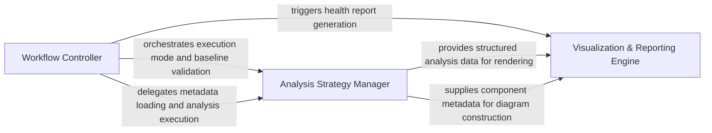

## Details

Acts as the central controller for the action. It validates the environment, manages the transition between full codebase scans and incremental PR analysis, and ensures metadata consistency across runs.

### Workflow Controller
Acts as the primary entry point and state validator for the GitHub Action, interpreting configuration and initializing the environment.

**Related Classes/Methods**:

- `scripts.engine_adapter.main`:519-607
- `scripts.engine_adapter.validate_base_analysis`:183-233
- `scripts.engine_adapter.run_base`:236-246

**Source Files:**

- [`scripts/engine_adapter.py`](https://github.com/CodeBoarding/CodeBoarding-action/blob/main/.codeboardingscripts/engine_adapter.py)
  - `scripts.engine_adapter._is_quota_exhausted` ([L89-L104](https://github.com/CodeBoarding/CodeBoarding-action/blob/main/.codeboardingscripts/engine_adapter.py#L89-L104)) - Function
  - `scripts.engine_adapter._flag_quota_exhausted` ([L107-L116](https://github.com/CodeBoarding/CodeBoarding-action/blob/main/.codeboardingscripts/engine_adapter.py#L107-L116)) - Function
  - `scripts.engine_adapter.validate_base_analysis` ([L183-L233](https://github.com/CodeBoarding/CodeBoarding-action/blob/main/.codeboardingscripts/engine_adapter.py#L183-L233)) - Function
  - `scripts.engine_adapter.run_base` ([L236-L246](https://github.com/CodeBoarding/CodeBoarding-action/blob/main/.codeboardingscripts/engine_adapter.py#L236-L246)) - Function
  - `scripts.engine_adapter.run_seed` ([L249-L272](https://github.com/CodeBoarding/CodeBoarding-action/blob/main/.codeboardingscripts/engine_adapter.py#L249-L272)) - Function
  - `scripts.engine_adapter.run_render` ([L433-L444](https://github.com/CodeBoarding/CodeBoarding-action/blob/main/.codeboardingscripts/engine_adapter.py#L433-L444)) - Function
  - `scripts.engine_adapter.run_concat` ([L447-L460](https://github.com/CodeBoarding/CodeBoarding-action/blob/main/.codeboardingscripts/engine_adapter.py#L447-L460)) - Function
  - `scripts.engine_adapter.main` ([L519-L607](https://github.com/CodeBoarding/CodeBoarding-action/blob/main/.codeboardingscripts/engine_adapter.py#L519-L607)) - Function

### Analysis Strategy Manager
The core logic engine that determines the analysis mode (full vs. incremental) and manages the persistence of analysis metadata.

**Related Classes/Methods**:

- `scripts.engine_adapter.run_analyze`:371-430
- `scripts.engine_adapter._incremental_or_full`:275-322
- `scripts.engine_adapter._load_metadata`:132-142
- `scripts.engine_adapter.baseline_info`:170-180

**Source Files:**

- [`scripts/engine_adapter.py`](https://github.com/CodeBoarding/CodeBoarding-action/blob/main/.codeboardingscripts/engine_adapter.py)
  - `scripts.engine_adapter._log_path` ([L119-L120](https://github.com/CodeBoarding/CodeBoarding-action/blob/main/.codeboardingscripts/engine_adapter.py#L119-L120)) - Function
  - `scripts.engine_adapter._clear_dir` ([L123-L129](https://github.com/CodeBoarding/CodeBoarding-action/blob/main/.codeboardingscripts/engine_adapter.py#L123-L129)) - Function
  - `scripts.engine_adapter._load_metadata` ([L132-L142](https://github.com/CodeBoarding/CodeBoarding-action/blob/main/.codeboardingscripts/engine_adapter.py#L132-L142)) - Function
  - `scripts.engine_adapter._metadata_depth` ([L145-L149](https://github.com/CodeBoarding/CodeBoarding-action/blob/main/.codeboardingscripts/engine_adapter.py#L145-L149)) - Function
  - `scripts.engine_adapter._supported_depth` ([L152-L154](https://github.com/CodeBoarding/CodeBoarding-action/blob/main/.codeboardingscripts/engine_adapter.py#L152-L154)) - Function
  - `scripts.engine_adapter._analysis_depth_or_default` ([L157-L162](https://github.com/CodeBoarding/CodeBoarding-action/blob/main/.codeboardingscripts/engine_adapter.py#L157-L162)) - Function
  - `scripts.engine_adapter._metadata_commit` ([L165-L167](https://github.com/CodeBoarding/CodeBoarding-action/blob/main/.codeboardingscripts/engine_adapter.py#L165-L167)) - Function
  - `scripts.engine_adapter.baseline_info` ([L170-L180](https://github.com/CodeBoarding/CodeBoarding-action/blob/main/.codeboardingscripts/engine_adapter.py#L170-L180)) - Function
  - `scripts.engine_adapter._incremental_or_full` ([L275-L322](https://github.com/CodeBoarding/CodeBoarding-action/blob/main/.codeboardingscripts/engine_adapter.py#L275-L322)) - Function
  - `scripts.engine_adapter.run_head` ([L325-L368](https://github.com/CodeBoarding/CodeBoarding-action/blob/main/.codeboardingscripts/engine_adapter.py#L325-L368)) - Function
  - `scripts.engine_adapter.run_analyze` ([L371-L430](https://github.com/CodeBoarding/CodeBoarding-action/blob/main/.codeboardingscripts/engine_adapter.py#L371-L430)) - Function
  - `scripts.engine_adapter.run_analyze.full` ([L387-L401](https://github.com/CodeBoarding/CodeBoarding-action/blob/main/.codeboardingscripts/engine_adapter.py#L387-L401)) - Function

### Visualization & Reporting Engine
Consumes structured analysis output to generate human-readable artifacts like Mermaid.js diagrams and health reports.

**Related Classes/Methods**:

- `scripts.diff_to_mermaid.render_mermaid`:396-521
- `scripts.engine_adapter.run_health`:490-516
- `scripts.build_component_files.main`:178-213

**Source Files:**

- [`scripts/build_component_files.py`](https://github.com/CodeBoarding/CodeBoarding-action/blob/main/.codeboardingscripts/build_component_files.py)
  - `scripts.build_component_files.main` ([L178-L213](https://github.com/CodeBoarding/CodeBoarding-action/blob/main/.codeboardingscripts/build_component_files.py#L178-L213)) - Function
- [`scripts/diff_to_mermaid.py`](https://github.com/CodeBoarding/CodeBoarding-action/blob/main/.codeboardingscripts/diff_to_mermaid.py)
  - `scripts.diff_to_mermaid.load_analysis` ([L50-L54](https://github.com/CodeBoarding/CodeBoarding-action/blob/main/.codeboardingscripts/diff_to_mermaid.py#L50-L54)) - Function
  - `scripts.diff_to_mermaid._rel_key` ([L96-L99](https://github.com/CodeBoarding/CodeBoarding-action/blob/main/.codeboardingscripts/diff_to_mermaid.py#L96-L99)) - Function
  - `scripts.diff_to_mermaid._diff_relations` ([L102-L148](https://github.com/CodeBoarding/CodeBoarding-action/blob/main/.codeboardingscripts/diff_to_mermaid.py#L102-L148)) - Function
  - `scripts.diff_to_mermaid._has_changes` ([L151-L159](https://github.com/CodeBoarding/CodeBoarding-action/blob/main/.codeboardingscripts/diff_to_mermaid.py#L151-L159)) - Function
  - `scripts.diff_to_mermaid._diff_components` ([L162-L207](https://github.com/CodeBoarding/CodeBoarding-action/blob/main/.codeboardingscripts/diff_to_mermaid.py#L162-L207)) - Function
  - `scripts.diff_to_mermaid.build_diff` ([L210-L217](https://github.com/CodeBoarding/CodeBoarding-action/blob/main/.codeboardingscripts/diff_to_mermaid.py#L210-L217)) - Function
  - `scripts.diff_to_mermaid._esc` ([L247-L253](https://github.com/CodeBoarding/CodeBoarding-action/blob/main/.codeboardingscripts/diff_to_mermaid.py#L247-L253)) - Function
  - `scripts.diff_to_mermaid._truncate` ([L256-L258](https://github.com/CodeBoarding/CodeBoarding-action/blob/main/.codeboardingscripts/diff_to_mermaid.py#L256-L258)) - Function
  - `scripts.diff_to_mermaid._Scope` ([L265-L309](https://github.com/CodeBoarding/CodeBoarding-action/blob/main/.codeboardingscripts/diff_to_mermaid.py#L265-L309)) - Class
  - `scripts.diff_to_mermaid._Scope.resolve` ([L300-L309](https://github.com/CodeBoarding/CodeBoarding-action/blob/main/.codeboardingscripts/diff_to_mermaid.py#L300-L309)) - Method
  - `scripts.diff_to_mermaid._init_directive` ([L357-L376](https://github.com/CodeBoarding/CodeBoarding-action/blob/main/.codeboardingscripts/diff_to_mermaid.py#L357-L376)) - Function
  - `scripts.diff_to_mermaid._has_changed_relations` ([L389-L393](https://github.com/CodeBoarding/CodeBoarding-action/blob/main/.codeboardingscripts/diff_to_mermaid.py#L389-L393)) - Function
  - `scripts.diff_to_mermaid.render_mermaid` ([L396-L521](https://github.com/CodeBoarding/CodeBoarding-action/blob/main/.codeboardingscripts/diff_to_mermaid.py#L396-L521)) - Function
  - `scripts.diff_to_mermaid.render_mermaid.build` ([L424-L497](https://github.com/CodeBoarding/CodeBoarding-action/blob/main/.codeboardingscripts/diff_to_mermaid.py#L424-L497)) - Function
  - `scripts.diff_to_mermaid.render_mermaid.build.emit_edges` ([L435-L447](https://github.com/CodeBoarding/CodeBoarding-action/blob/main/.codeboardingscripts/diff_to_mermaid.py#L435-L447)) - Function
  - `scripts.diff_to_mermaid.render_mermaid.build.emit_level` ([L449-L466](https://github.com/CodeBoarding/CodeBoarding-action/blob/main/.codeboardingscripts/diff_to_mermaid.py#L449-L466)) - Function
  - `scripts.diff_to_mermaid.main` ([L527-L568](https://github.com/CodeBoarding/CodeBoarding-action/blob/main/.codeboardingscripts/diff_to_mermaid.py#L527-L568)) - Function
- [`scripts/engine_adapter.py`](https://github.com/CodeBoarding/CodeBoarding-action/blob/main/.codeboardingscripts/engine_adapter.py)
  - `scripts.engine_adapter._count_report_issues` ([L463-L476](https://github.com/CodeBoarding/CodeBoarding-action/blob/main/.codeboardingscripts/engine_adapter.py#L463-L476)) - Function
  - `scripts.engine_adapter._count_health_report` ([L479-L487](https://github.com/CodeBoarding/CodeBoarding-action/blob/main/.codeboardingscripts/engine_adapter.py#L479-L487)) - Function
  - `scripts.engine_adapter.run_health` ([L490-L516](https://github.com/CodeBoarding/CodeBoarding-action/blob/main/.codeboardingscripts/engine_adapter.py#L490-L516)) - Function

### [FAQ](https://github.com/CodeBoarding/GeneratedOnBoardings/tree/main?tab=readme-ov-file#faq)