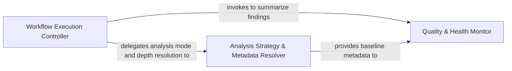

## Details

Acts as the central controller for the GitHub Action lifecycle. It manages environment validation, determines the analysis scope (incremental vs. full), and coordinates the execution of the underlying analysis engine.

### Workflow Execution Controller
Acts as the primary entry point and state machine for the GitHub Action, orchestrating lifecycle phases, managing authentication, and enforcing quota limits.

**Related Classes/Methods**:

- `scripts.engine_adapter.main`:605-711
- `scripts.engine_adapter.run_seed`:325-348
- `scripts.engine_adapter.run_base`:312-322
- `scripts.engine_adapter._is_quota_exhausted`:115-130

**Source Files:**

- [`scripts/engine_adapter.py`](https://github.com/CodeBoarding/CodeBoarding-action/blob/main/.codeboardingscripts/engine_adapter.py)
  - `scripts.engine_adapter._is_quota_exhausted` ([L115-L130](https://github.com/CodeBoarding/CodeBoarding-action/blob/main/.codeboardingscripts/engine_adapter.py#L115-L130)) - Function
  - `scripts.engine_adapter._flag_quota_exhausted` ([L133-L142](https://github.com/CodeBoarding/CodeBoarding-action/blob/main/.codeboardingscripts/engine_adapter.py#L133-L142)) - Function
  - `scripts.engine_adapter.run_base` ([L312-L322](https://github.com/CodeBoarding/CodeBoarding-action/blob/main/.codeboardingscripts/engine_adapter.py#L312-L322)) - Function
  - `scripts.engine_adapter.run_seed` ([L325-L348](https://github.com/CodeBoarding/CodeBoarding-action/blob/main/.codeboardingscripts/engine_adapter.py#L325-L348)) - Function
  - `scripts.engine_adapter.run_render` ([L519-L530](https://github.com/CodeBoarding/CodeBoarding-action/blob/main/.codeboardingscripts/engine_adapter.py#L519-L530)) - Function
  - `scripts.engine_adapter.run_concat` ([L533-L546](https://github.com/CodeBoarding/CodeBoarding-action/blob/main/.codeboardingscripts/engine_adapter.py#L533-L546)) - Function
  - `scripts.engine_adapter.main` ([L605-L711](https://github.com/CodeBoarding/CodeBoarding-action/blob/main/.codeboardingscripts/engine_adapter.py#L605-L711)) - Function

### Analysis Strategy & Metadata Resolver
Determines the technical scope of the analysis by resolving commit depths and deciding between incremental or full analysis modes.

**Related Classes/Methods**:

- `scripts.engine_adapter.run_analyze`:450-516
- `scripts.engine_adapter._incremental_or_full`:351-399
- `scripts.engine_adapter._resolve_depth`:178-207
- `scripts.engine_adapter.validate_base_analysis`:253-309

**Source Files:**

- [`scripts/engine_adapter.py`](https://github.com/CodeBoarding/CodeBoarding-action/blob/main/.codeboardingscripts/engine_adapter.py)
  - `scripts.engine_adapter._max_depth` ([L105-L106](https://github.com/CodeBoarding/CodeBoarding-action/blob/main/.codeboardingscripts/engine_adapter.py#L105-L106)) - Function
  - `scripts.engine_adapter._log_path` ([L145-L146](https://github.com/CodeBoarding/CodeBoarding-action/blob/main/.codeboardingscripts/engine_adapter.py#L145-L146)) - Function
  - `scripts.engine_adapter._clear_dir` ([L149-L155](https://github.com/CodeBoarding/CodeBoarding-action/blob/main/.codeboardingscripts/engine_adapter.py#L149-L155)) - Function
  - `scripts.engine_adapter._load_metadata` ([L158-L168](https://github.com/CodeBoarding/CodeBoarding-action/blob/main/.codeboardingscripts/engine_adapter.py#L158-L168)) - Function
  - `scripts.engine_adapter._metadata_depth` ([L171-L175](https://github.com/CodeBoarding/CodeBoarding-action/blob/main/.codeboardingscripts/engine_adapter.py#L171-L175)) - Function
  - `scripts.engine_adapter._resolve_depth` ([L178-L207](https://github.com/CodeBoarding/CodeBoarding-action/blob/main/.codeboardingscripts/engine_adapter.py#L178-L207)) - Function
  - `scripts.engine_adapter._analysis_depth_or_default` ([L210-L214](https://github.com/CodeBoarding/CodeBoarding-action/blob/main/.codeboardingscripts/engine_adapter.py#L210-L214)) - Function
  - `scripts.engine_adapter._metadata_commit` ([L217-L219](https://github.com/CodeBoarding/CodeBoarding-action/blob/main/.codeboardingscripts/engine_adapter.py#L217-L219)) - Function
  - `scripts.engine_adapter.baseline_info` ([L222-L232](https://github.com/CodeBoarding/CodeBoarding-action/blob/main/.codeboardingscripts/engine_adapter.py#L222-L232)) - Function
  - `scripts.engine_adapter.baseline_depth` ([L235-L250](https://github.com/CodeBoarding/CodeBoarding-action/blob/main/.codeboardingscripts/engine_adapter.py#L235-L250)) - Function
  - `scripts.engine_adapter.validate_base_analysis` ([L253-L309](https://github.com/CodeBoarding/CodeBoarding-action/blob/main/.codeboardingscripts/engine_adapter.py#L253-L309)) - Function
  - `scripts.engine_adapter._incremental_or_full` ([L351-L399](https://github.com/CodeBoarding/CodeBoarding-action/blob/main/.codeboardingscripts/engine_adapter.py#L351-L399)) - Function
  - `scripts.engine_adapter.run_head` ([L402-L447](https://github.com/CodeBoarding/CodeBoarding-action/blob/main/.codeboardingscripts/engine_adapter.py#L402-L447)) - Function
  - `scripts.engine_adapter.run_analyze` ([L450-L516](https://github.com/CodeBoarding/CodeBoarding-action/blob/main/.codeboardingscripts/engine_adapter.py#L450-L516)) - Function
  - `scripts.engine_adapter.run_analyze.full` ([L474-L488](https://github.com/CodeBoarding/CodeBoarding-action/blob/main/.codeboardingscripts/engine_adapter.py#L474-L488)) - Function

### Quality & Health Monitor
Processes raw analysis output to generate actionable governance metrics and health reports.

**Related Classes/Methods**:

- `scripts.engine_adapter.run_health`:576-602
- `scripts.engine_adapter._count_health_report`:565-573
- `scripts.engine_adapter._count_report_issues`:549-562

**Source Files:**

- [`scripts/engine_adapter.py`](https://github.com/CodeBoarding/CodeBoarding-action/blob/main/.codeboardingscripts/engine_adapter.py)
  - `scripts.engine_adapter._count_report_issues` ([L549-L562](https://github.com/CodeBoarding/CodeBoarding-action/blob/main/.codeboardingscripts/engine_adapter.py#L549-L562)) - Function
  - `scripts.engine_adapter._count_health_report` ([L565-L573](https://github.com/CodeBoarding/CodeBoarding-action/blob/main/.codeboardingscripts/engine_adapter.py#L565-L573)) - Function
  - `scripts.engine_adapter.run_health` ([L576-L602](https://github.com/CodeBoarding/CodeBoarding-action/blob/main/.codeboardingscripts/engine_adapter.py#L576-L602)) - Function

### [FAQ](https://github.com/CodeBoarding/GeneratedOnBoardings/tree/main?tab=readme-ov-file#faq)