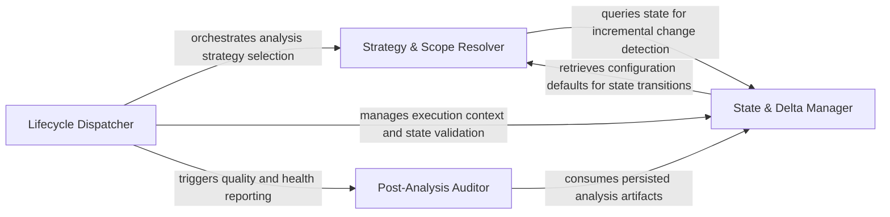

## Details

Acts as the central controller and entry point for the Python execution environment. It manages the analysis lifecycle, determines whether to perform a full or incremental scan based on existing metadata, and coordinates the execution of the static analysis engine.

### Lifecycle Dispatcher
The primary entry point and command-line interface handler that interprets execution modes and manages the high-level sequence of operations.

**Related Classes/Methods**:

- `scripts.engine_adapter.main`:658-764
- `scripts.engine_adapter.run_base`:398-401
- `scripts.engine_adapter.run_seed`:404-433
- `scripts.engine_adapter.run_render`:572-583

**Source Files:**

- [`scripts/engine_adapter.py`](https://github.com/CodeBoarding/CodeBoarding-action/blob/sync-e2e-test/.codeboardingscripts/engine_adapter.py)
  - `scripts.engine_adapter._require_engine` ([L113-L129](https://github.com/CodeBoarding/CodeBoarding-action/blob/sync-e2e-test/.codeboardingscripts/engine_adapter.py#L113-L129)) - Function
  - `scripts.engine_adapter._is_quota_exhausted` ([L156-L171](https://github.com/CodeBoarding/CodeBoarding-action/blob/sync-e2e-test/.codeboardingscripts/engine_adapter.py#L156-L171)) - Function
  - `scripts.engine_adapter._flag_quota_exhausted` ([L174-L183](https://github.com/CodeBoarding/CodeBoarding-action/blob/sync-e2e-test/.codeboardingscripts/engine_adapter.py#L174-L183)) - Function
  - `scripts.engine_adapter._metadata_commit` ([L271-L273](https://github.com/CodeBoarding/CodeBoarding-action/blob/sync-e2e-test/.codeboardingscripts/engine_adapter.py#L271-L273)) - Function
  - `scripts.engine_adapter.baseline_info` ([L299-L309](https://github.com/CodeBoarding/CodeBoarding-action/blob/sync-e2e-test/.codeboardingscripts/engine_adapter.py#L299-L309)) - Function
  - `scripts.engine_adapter.run_base` ([L398-L401](https://github.com/CodeBoarding/CodeBoarding-action/blob/sync-e2e-test/.codeboardingscripts/engine_adapter.py#L398-L401)) - Function
  - `scripts.engine_adapter.run_seed` ([L404-L433](https://github.com/CodeBoarding/CodeBoarding-action/blob/sync-e2e-test/.codeboardingscripts/engine_adapter.py#L404-L433)) - Function
  - `scripts.engine_adapter.run_render` ([L572-L583](https://github.com/CodeBoarding/CodeBoarding-action/blob/sync-e2e-test/.codeboardingscripts/engine_adapter.py#L572-L583)) - Function
  - `scripts.engine_adapter.run_concat` ([L586-L599](https://github.com/CodeBoarding/CodeBoarding-action/blob/sync-e2e-test/.codeboardingscripts/engine_adapter.py#L586-L599)) - Function
  - `scripts.engine_adapter.main` ([L658-L764](https://github.com/CodeBoarding/CodeBoarding-action/blob/sync-e2e-test/.codeboardingscripts/engine_adapter.py#L658-L764)) - Function

### Strategy & Scope Resolver
Responsible for determining technical parameters of the analysis by loading metadata and calculating analysis depth based on configuration and history.

**Related Classes/Methods**:

- `scripts.engine_adapter.run_analyze`:520-569
- `scripts.engine_adapter._load_metadata`:217-222
- `scripts.engine_adapter._resolve_depth`:232-261
- `scripts.engine_adapter.baseline_depth`:312-327

**Source Files:**

- [`scripts/engine_adapter.py`](https://github.com/CodeBoarding/CodeBoarding-action/blob/sync-e2e-test/.codeboardingscripts/engine_adapter.py)
  - `scripts.engine_adapter._max_depth` ([L146-L147](https://github.com/CodeBoarding/CodeBoarding-action/blob/sync-e2e-test/.codeboardingscripts/engine_adapter.py#L146-L147)) - Function
  - `scripts.engine_adapter._load_metadata` ([L217-L222](https://github.com/CodeBoarding/CodeBoarding-action/blob/sync-e2e-test/.codeboardingscripts/engine_adapter.py#L217-L222)) - Function
  - `scripts.engine_adapter._resolve_depth` ([L232-L261](https://github.com/CodeBoarding/CodeBoarding-action/blob/sync-e2e-test/.codeboardingscripts/engine_adapter.py#L232-L261)) - Function
  - `scripts.engine_adapter._analysis_depth_or_default` ([L264-L268](https://github.com/CodeBoarding/CodeBoarding-action/blob/sync-e2e-test/.codeboardingscripts/engine_adapter.py#L264-L268)) - Function
  - `scripts.engine_adapter.baseline_depth` ([L312-L327](https://github.com/CodeBoarding/CodeBoarding-action/blob/sync-e2e-test/.codeboardingscripts/engine_adapter.py#L312-L327)) - Function
  - `scripts.engine_adapter.run_analyze` ([L520-L569](https://github.com/CodeBoarding/CodeBoarding-action/blob/sync-e2e-test/.codeboardingscripts/engine_adapter.py#L520-L569)) - Function

### State & Delta Manager
Manages stateful incremental logic, comparing commits against baselines, validating analysis integrity, and providing filesystem context.

**Related Classes/Methods**:

- `scripts.engine_adapter._incremental_or_full`:436-480
- `scripts.engine_adapter.run_head`:483-517
- `scripts.engine_adapter.validate_base_analysis`:330-395
- `scripts.engine_adapter._run_ctx`:190-195

**Source Files:**

- [`scripts/engine_adapter.py`](https://github.com/CodeBoarding/CodeBoarding-action/blob/sync-e2e-test/.codeboardingscripts/engine_adapter.py)
  - `scripts.engine_adapter._log_path` ([L186-L187](https://github.com/CodeBoarding/CodeBoarding-action/blob/sync-e2e-test/.codeboardingscripts/engine_adapter.py#L186-L187)) - Function
  - `scripts.engine_adapter._run_ctx` ([L190-L195](https://github.com/CodeBoarding/CodeBoarding-action/blob/sync-e2e-test/.codeboardingscripts/engine_adapter.py#L190-L195)) - Function
  - `scripts.engine_adapter._clear_dir` ([L198-L204](https://github.com/CodeBoarding/CodeBoarding-action/blob/sync-e2e-test/.codeboardingscripts/engine_adapter.py#L198-L204)) - Function
  - `scripts.engine_adapter._load_analysis` ([L207-L214](https://github.com/CodeBoarding/CodeBoarding-action/blob/sync-e2e-test/.codeboardingscripts/engine_adapter.py#L207-L214)) - Function
  - `scripts.engine_adapter._metadata_depth` ([L225-L229](https://github.com/CodeBoarding/CodeBoarding-action/blob/sync-e2e-test/.codeboardingscripts/engine_adapter.py#L225-L229)) - Function
  - `scripts.engine_adapter._analysis_model_error` ([L276-L296](https://github.com/CodeBoarding/CodeBoarding-action/blob/sync-e2e-test/.codeboardingscripts/engine_adapter.py#L276-L296)) - Function
  - `scripts.engine_adapter.validate_base_analysis` ([L330-L395](https://github.com/CodeBoarding/CodeBoarding-action/blob/sync-e2e-test/.codeboardingscripts/engine_adapter.py#L330-L395)) - Function
  - `scripts.engine_adapter._incremental_or_full` ([L436-L480](https://github.com/CodeBoarding/CodeBoarding-action/blob/sync-e2e-test/.codeboardingscripts/engine_adapter.py#L436-L480)) - Function
  - `scripts.engine_adapter.run_head` ([L483-L517](https://github.com/CodeBoarding/CodeBoarding-action/blob/sync-e2e-test/.codeboardingscripts/engine_adapter.py#L483-L517)) - Function
  - `scripts.engine_adapter.run_analyze.full` ([L541-L548](https://github.com/CodeBoarding/CodeBoarding-action/blob/sync-e2e-test/.codeboardingscripts/engine_adapter.py#L541-L548)) - Function

### Post-Analysis Auditor
A diagnostic component that parses generated metadata to produce health reports and identify architectural violations.

**Related Classes/Methods**:

- `scripts.engine_adapter.run_health`:629-655
- `scripts.engine_adapter._count_health_report`:618-626
- `scripts.engine_adapter._count_report_issues`:602-615

**Source Files:**

- [`scripts/engine_adapter.py`](https://github.com/CodeBoarding/CodeBoarding-action/blob/sync-e2e-test/.codeboardingscripts/engine_adapter.py)
  - `scripts.engine_adapter._count_report_issues` ([L602-L615](https://github.com/CodeBoarding/CodeBoarding-action/blob/sync-e2e-test/.codeboardingscripts/engine_adapter.py#L602-L615)) - Function
  - `scripts.engine_adapter._count_health_report` ([L618-L626](https://github.com/CodeBoarding/CodeBoarding-action/blob/sync-e2e-test/.codeboardingscripts/engine_adapter.py#L618-L626)) - Function
  - `scripts.engine_adapter.run_health` ([L629-L655](https://github.com/CodeBoarding/CodeBoarding-action/blob/sync-e2e-test/.codeboardingscripts/engine_adapter.py#L629-L655)) - Function

### [FAQ](https://github.com/CodeBoarding/GeneratedOnBoardings/tree/main?tab=readme-ov-file#faq)