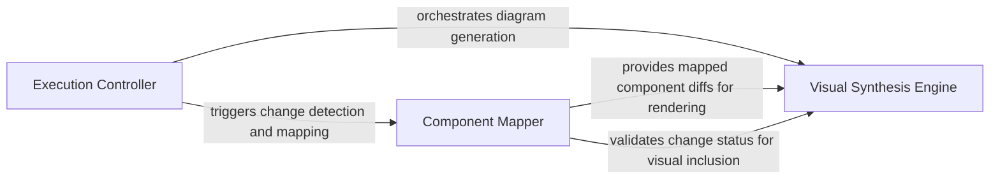

## Details

Acts as the central controller for the action. It validates the environment, manages the transition between full codebase scans and incremental PR analysis, and ensures metadata consistency across runs.

### Execution Controller
Manages the high-level lifecycle of the action, including environment validation, state persistence, and the decision logic for running full codebase scans versus incremental PR analysis.

**Related Classes/Methods**:

- `scripts.engine_adapter.run_analyze`:450-516
- `scripts.engine_adapter.validate_base_analysis`:253-309
- `scripts.engine_adapter._incremental_or_full`:351-399
- `scripts.engine_adapter.run_health`:576-602

**Source Files:**

- [`scripts/engine_adapter.py`](https://github.com/CodeBoarding/CodeBoarding-action/blob/main/.codeboardingscripts/engine_adapter.py)
  - `scripts.engine_adapter._is_quota_exhausted` ([L115-L130](https://github.com/CodeBoarding/CodeBoarding-action/blob/main/.codeboardingscripts/engine_adapter.py#L115-L130)) - Function
  - `scripts.engine_adapter._flag_quota_exhausted` ([L133-L142](https://github.com/CodeBoarding/CodeBoarding-action/blob/main/.codeboardingscripts/engine_adapter.py#L133-L142)) - Function
  - `scripts.engine_adapter._log_path` ([L145-L146](https://github.com/CodeBoarding/CodeBoarding-action/blob/main/.codeboardingscripts/engine_adapter.py#L145-L146)) - Function
  - `scripts.engine_adapter._clear_dir` ([L149-L155](https://github.com/CodeBoarding/CodeBoarding-action/blob/main/.codeboardingscripts/engine_adapter.py#L149-L155)) - Function
  - `scripts.engine_adapter.validate_base_analysis` ([L253-L309](https://github.com/CodeBoarding/CodeBoarding-action/blob/main/.codeboardingscripts/engine_adapter.py#L253-L309)) - Function
  - `scripts.engine_adapter.run_base` ([L312-L322](https://github.com/CodeBoarding/CodeBoarding-action/blob/main/.codeboardingscripts/engine_adapter.py#L312-L322)) - Function
  - `scripts.engine_adapter.run_seed` ([L325-L348](https://github.com/CodeBoarding/CodeBoarding-action/blob/main/.codeboardingscripts/engine_adapter.py#L325-L348)) - Function
  - `scripts.engine_adapter._incremental_or_full` ([L351-L399](https://github.com/CodeBoarding/CodeBoarding-action/blob/main/.codeboardingscripts/engine_adapter.py#L351-L399)) - Function
  - `scripts.engine_adapter.run_head` ([L402-L447](https://github.com/CodeBoarding/CodeBoarding-action/blob/main/.codeboardingscripts/engine_adapter.py#L402-L447)) - Function
  - `scripts.engine_adapter.run_analyze.full` ([L474-L488](https://github.com/CodeBoarding/CodeBoarding-action/blob/main/.codeboardingscripts/engine_adapter.py#L474-L488)) - Function
  - `scripts.engine_adapter.run_render` ([L519-L530](https://github.com/CodeBoarding/CodeBoarding-action/blob/main/.codeboardingscripts/engine_adapter.py#L519-L530)) - Function
  - `scripts.engine_adapter.run_concat` ([L533-L546](https://github.com/CodeBoarding/CodeBoarding-action/blob/main/.codeboardingscripts/engine_adapter.py#L533-L546)) - Function
  - `scripts.engine_adapter._count_report_issues` ([L549-L562](https://github.com/CodeBoarding/CodeBoarding-action/blob/main/.codeboardingscripts/engine_adapter.py#L549-L562)) - Function
  - `scripts.engine_adapter._count_health_report` ([L565-L573](https://github.com/CodeBoarding/CodeBoarding-action/blob/main/.codeboardingscripts/engine_adapter.py#L565-L573)) - Function
  - `scripts.engine_adapter.run_health` ([L576-L602](https://github.com/CodeBoarding/CodeBoarding-action/blob/main/.codeboardingscripts/engine_adapter.py#L576-L602)) - Function
  - `scripts.engine_adapter.main` ([L605-L711](https://github.com/CodeBoarding/CodeBoarding-action/blob/main/.codeboardingscripts/engine_adapter.py#L605-L711)) - Function

### Component Mapper
Bridges the gap between raw file system changes and the logical architecture by aggregating file-level diffs into component-level changes.

**Related Classes/Methods**:

- `scripts.build_component_files.main`:178-213
- `scripts.diff_to_mermaid.load_analysis`:50-54
- `scripts.diff_to_mermaid._diff_components`:162-207

**Source Files:**

- [`scripts/build_component_files.py`](https://github.com/CodeBoarding/CodeBoarding-action/blob/main/.codeboardingscripts/build_component_files.py)
  - `scripts.build_component_files.main` ([L178-L213](https://github.com/CodeBoarding/CodeBoarding-action/blob/main/.codeboardingscripts/build_component_files.py#L178-L213)) - Function
- [`scripts/diff_to_mermaid.py`](https://github.com/CodeBoarding/CodeBoarding-action/blob/main/.codeboardingscripts/diff_to_mermaid.py)
  - `scripts.diff_to_mermaid.load_analysis` ([L50-L54](https://github.com/CodeBoarding/CodeBoarding-action/blob/main/.codeboardingscripts/diff_to_mermaid.py#L50-L54)) - Function
  - `scripts.diff_to_mermaid._rel_key` ([L96-L99](https://github.com/CodeBoarding/CodeBoarding-action/blob/main/.codeboardingscripts/diff_to_mermaid.py#L96-L99)) - Function
  - `scripts.diff_to_mermaid._diff_relations` ([L102-L148](https://github.com/CodeBoarding/CodeBoarding-action/blob/main/.codeboardingscripts/diff_to_mermaid.py#L102-L148)) - Function
  - `scripts.diff_to_mermaid._diff_components` ([L162-L207](https://github.com/CodeBoarding/CodeBoarding-action/blob/main/.codeboardingscripts/diff_to_mermaid.py#L162-L207)) - Function
  - `scripts.diff_to_mermaid.build_diff` ([L210-L217](https://github.com/CodeBoarding/CodeBoarding-action/blob/main/.codeboardingscripts/diff_to_mermaid.py#L210-L217)) - Function
  - `scripts.diff_to_mermaid._Scope.resolve` ([L300-L309](https://github.com/CodeBoarding/CodeBoarding-action/blob/main/.codeboardingscripts/diff_to_mermaid.py#L300-L309)) - Method
  - `scripts.diff_to_mermaid.main` ([L527-L568](https://github.com/CodeBoarding/CodeBoarding-action/blob/main/.codeboardingscripts/diff_to_mermaid.py#L527-L568)) - Function

### Visual Synthesis Engine
Responsible for the deterministic generation of Mermaid.js diagrams, processing mapped component changes to produce hierarchical visualizations.

**Related Classes/Methods**:

- `scripts.diff_to_mermaid.render_mermaid`:396-521
- `scripts.diff_to_mermaid.render_mermaid.build.emit_level`:449-466
- `scripts.diff_to_mermaid._Scope`:265-309
- `scripts.diff_to_mermaid._has_changes`:151-159

**Source Files:**

- [`scripts/diff_to_mermaid.py`](https://github.com/CodeBoarding/CodeBoarding-action/blob/main/.codeboardingscripts/diff_to_mermaid.py)
  - `scripts.diff_to_mermaid._has_changes` ([L151-L159](https://github.com/CodeBoarding/CodeBoarding-action/blob/main/.codeboardingscripts/diff_to_mermaid.py#L151-L159)) - Function
  - `scripts.diff_to_mermaid._esc` ([L247-L253](https://github.com/CodeBoarding/CodeBoarding-action/blob/main/.codeboardingscripts/diff_to_mermaid.py#L247-L253)) - Function
  - `scripts.diff_to_mermaid._truncate` ([L256-L258](https://github.com/CodeBoarding/CodeBoarding-action/blob/main/.codeboardingscripts/diff_to_mermaid.py#L256-L258)) - Function
  - `scripts.diff_to_mermaid._Scope` ([L265-L309](https://github.com/CodeBoarding/CodeBoarding-action/blob/main/.codeboardingscripts/diff_to_mermaid.py#L265-L309)) - Class
  - `scripts.diff_to_mermaid._init_directive` ([L357-L376](https://github.com/CodeBoarding/CodeBoarding-action/blob/main/.codeboardingscripts/diff_to_mermaid.py#L357-L376)) - Function
  - `scripts.diff_to_mermaid._has_changed_relations` ([L389-L393](https://github.com/CodeBoarding/CodeBoarding-action/blob/main/.codeboardingscripts/diff_to_mermaid.py#L389-L393)) - Function
  - `scripts.diff_to_mermaid.render_mermaid` ([L396-L521](https://github.com/CodeBoarding/CodeBoarding-action/blob/main/.codeboardingscripts/diff_to_mermaid.py#L396-L521)) - Function
  - `scripts.diff_to_mermaid.render_mermaid.build` ([L424-L497](https://github.com/CodeBoarding/CodeBoarding-action/blob/main/.codeboardingscripts/diff_to_mermaid.py#L424-L497)) - Function
  - `scripts.diff_to_mermaid.render_mermaid.build.emit_edges` ([L435-L447](https://github.com/CodeBoarding/CodeBoarding-action/blob/main/.codeboardingscripts/diff_to_mermaid.py#L435-L447)) - Function
  - `scripts.diff_to_mermaid.render_mermaid.build.emit_level` ([L449-L466](https://github.com/CodeBoarding/CodeBoarding-action/blob/main/.codeboardingscripts/diff_to_mermaid.py#L449-L466)) - Function

### [FAQ](https://github.com/CodeBoarding/GeneratedOnBoardings/tree/main?tab=readme-ov-file#faq)