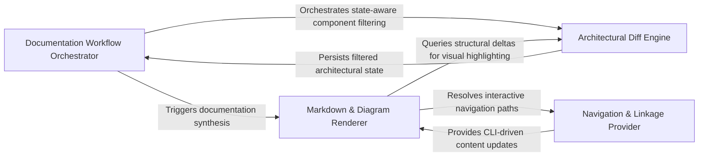

## Details

Maps the analyzed code structure back to the physical file system to generate developer-centric documentation. It creates markdown files for components and "Call-to-Action" (CTA) links that facilitate navigation between the code and the architectural view.

### Documentation Workflow Orchestrator
Manages the end-to-end lifecycle of documentation generation, coordinating analysis artifacts, change detection, and the rendering process.

**Related Classes/Methods**: _None_

**Source Files:**

- [`scripts/build_component_files.py`](https://github.com/CodeBoarding/CodeBoarding-action/blob/sync-e2e-test/.codeboardingscripts/build_component_files.py)
  - `scripts.build_component_files._subtree_files` ([L65-L74](https://github.com/CodeBoarding/CodeBoarding-action/blob/sync-e2e-test/.codeboardingscripts/build_component_files.py#L65-L74)) - Function
  - `scripts.build_component_files._changed_files_for` ([L88-L101](https://github.com/CodeBoarding/CodeBoarding-action/blob/sync-e2e-test/.codeboardingscripts/build_component_files.py#L88-L101)) - Function

### Architectural Diff Engine
Analyzes the delta between architectural states to identify modified components and structural shifts for incremental updates.

**Related Classes/Methods**: _None_

**Source Files:**

- [`scripts/build_component_files.py`](https://github.com/CodeBoarding/CodeBoarding-action/blob/sync-e2e-test/.codeboardingscripts/build_component_files.py)
  - `scripts.build_component_files._walk` ([L56-L62](https://github.com/CodeBoarding/CodeBoarding-action/blob/sync-e2e-test/.codeboardingscripts/build_component_files.py#L56-L62)) - Function
  - `scripts.build_component_files._subtree_methods` ([L77-L85](https://github.com/CodeBoarding/CodeBoarding-action/blob/sync-e2e-test/.codeboardingscripts/build_component_files.py#L77-L85)) - Function
- [`scripts/build_cta.py`](https://github.com/CodeBoarding/CodeBoarding-action/blob/sync-e2e-test/.codeboardingscripts/build_cta.py)
  - `scripts.build_cta._join_or` ([L84-L90](https://github.com/CodeBoarding/CodeBoarding-action/blob/sync-e2e-test/.codeboardingscripts/build_cta.py#L84-L90)) - Function

### Markdown & Diagram Renderer
Translates component tree and diff data into structured Markdown and Mermaid.js diagrams.

**Related Classes/Methods**: _None_

**Source Files:**

- [`scripts/build_cta.py`](https://github.com/CodeBoarding/CodeBoarding-action/blob/sync-e2e-test/.codeboardingscripts/build_cta.py)
  - `scripts.build_cta.detect_editors` ([L37-L49](https://github.com/CodeBoarding/CodeBoarding-action/blob/sync-e2e-test/.codeboardingscripts/build_cta.py#L37-L49)) - Function
  - `scripts.build_cta.build_cta` ([L93-L152](https://github.com/CodeBoarding/CodeBoarding-action/blob/sync-e2e-test/.codeboardingscripts/build_cta.py#L93-L152)) - Function
  - `scripts.build_cta.build_cta.link` ([L126-L127](https://github.com/CodeBoarding/CodeBoarding-action/blob/sync-e2e-test/.codeboardingscripts/build_cta.py#L126-L127)) - Function

### Navigation & Linkage Provider
Generates interactive CTA links and sanitizes identifiers for documentation navigation.

**Related Classes/Methods**: _None_

**Source Files:**

- [`scripts/build_cta.py`](https://github.com/CodeBoarding/CodeBoarding-action/blob/sync-e2e-test/.codeboardingscripts/build_cta.py)
  - `scripts.build_cta.webview_url` ([L63-L81](https://github.com/CodeBoarding/CodeBoarding-action/blob/sync-e2e-test/.codeboardingscripts/build_cta.py#L63-L81)) - Function
  - `scripts.build_cta.main` ([L155-L189](https://github.com/CodeBoarding/CodeBoarding-action/blob/sync-e2e-test/.codeboardingscripts/build_cta.py#L155-L189)) - Function

### [FAQ](https://github.com/CodeBoarding/GeneratedOnBoardings/tree/main?tab=readme-ov-file#faq)