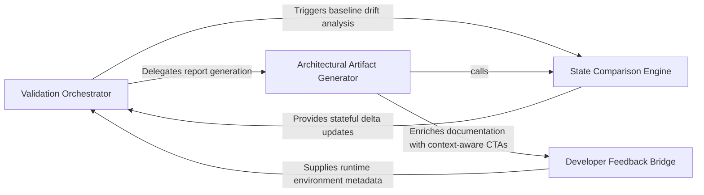

## Details

A diagnostic component designed to verify the integrity of the synchronization process. It performs end-to-end checks to ensure that the generated architectural metadata and documentation accurately reflect the codebase state after a sync operation.

### Validation Orchestrator
The central controller of the diagnostic process that manages the lifecycle of a validation run and produces the final integrity report for CI/CD integration.

**Related Classes/Methods**: _None_

**Source Files:**

- [`scripts/e2e_probe.py`](https://github.com/CodeBoarding/CodeBoarding-action/blob/sync-e2e-test/.codeboardingscripts/e2e_probe.py)
  - `scripts.e2e_probe.SyncE2EProbe.__init__` ([L7-L8](https://github.com/CodeBoarding/CodeBoarding-action/blob/sync-e2e-test/.codeboardingscripts/e2e_probe.py#L7-L8)) - Method

### State Comparison Engine
Responsible for the low-level analysis of changes between the current codebase and the persisted architectural baseline to identify file drift.

**Related Classes/Methods**: _None_

**Source Files:**

- [`scripts/e2e_probe.py`](https://github.com/CodeBoarding/CodeBoarding-action/blob/sync-e2e-test/.codeboardingscripts/e2e_probe.py)
  - `scripts.e2e_probe.SyncE2EProbe.describe` ([L10-L11](https://github.com/CodeBoarding/CodeBoarding-action/blob/sync-e2e-test/.codeboardingscripts/e2e_probe.py#L10-L11)) - Method

### Architectural Artifact Generator
Translates identified code changes into high-level architectural representations, including Mermaid.js diagrams and Markdown documentation.

**Related Classes/Methods**: _None_

**Source Files:**

- [`scripts/e2e_probe.py`](https://github.com/CodeBoarding/CodeBoarding-action/blob/sync-e2e-test/.codeboardingscripts/e2e_probe.py)
  - `scripts.e2e_probe.SyncE2EProbe.summary` ([L13-L15](https://github.com/CodeBoarding/CodeBoarding-action/blob/sync-e2e-test/.codeboardingscripts/e2e_probe.py#L13-L15)) - Method

### Developer Feedback Bridge
Converts validation results into actionable insights by detecting user environments and generating deep links to architectural components.

**Related Classes/Methods**: _None_

**Source Files:**

- [`scripts/e2e_probe.py`](https://github.com/CodeBoarding/CodeBoarding-action/blob/sync-e2e-test/.codeboardingscripts/e2e_probe.py)
  - `scripts.e2e_probe.SyncE2EProbe` ([L4-L15](https://github.com/CodeBoarding/CodeBoarding-action/blob/sync-e2e-test/.codeboardingscripts/e2e_probe.py#L4-L15)) - Class

### [FAQ](https://github.com/CodeBoarding/GeneratedOnBoardings/tree/main?tab=readme-ov-file#faq)