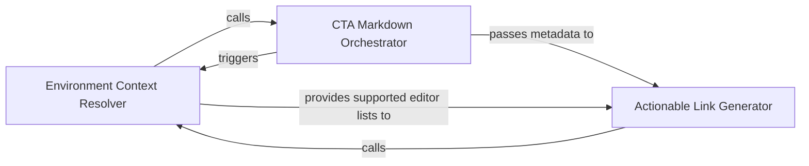

## Details

Enhances the analysis report with actionable metadata. It detects developer environments to generate deep links for IDEs and webviews, ensuring the analysis is accessible and interactive for reviewers.

### Environment Context Resolver
Probes the execution and configuration environment to identify supported IDEs and editor preferences for deep-link protocol selection.

**Related Classes/Methods**:

- `scripts.build_cta.detect_editors`:37-49

**Source Files:**

- [`scripts/build_cta.py`](https://github.com/CodeBoarding/CodeBoarding-action/blob/main/.codeboardingscripts/build_cta.py)
  - `scripts.build_cta._join_or` ([L84-L90](https://github.com/CodeBoarding/CodeBoarding-action/blob/main/.codeboardingscripts/build_cta.py#L84-L90)) - Function
  - `scripts.build_cta.build_cta` ([L93-L152](https://github.com/CodeBoarding/CodeBoarding-action/blob/main/.codeboardingscripts/build_cta.py#L93-L152)) - Function

### Actionable Link Generator
Translates internal file references and line numbers into external URI schemes for various IDEs and web-based visualizations.

**Related Classes/Methods**:

- `scripts.build_cta.webview_url`:63-81

**Source Files:**

- [`scripts/build_cta.py`](https://github.com/CodeBoarding/CodeBoarding-action/blob/main/.codeboardingscripts/build_cta.py)
  - `scripts.build_cta.detect_editors` ([L37-L49](https://github.com/CodeBoarding/CodeBoarding-action/blob/main/.codeboardingscripts/build_cta.py#L37-L49)) - Function
  - `scripts.build_cta.build_cta.link` ([L126-L127](https://github.com/CodeBoarding/CodeBoarding-action/blob/main/.codeboardingscripts/build_cta.py#L126-L127)) - Function
  - `scripts.build_cta.main` ([L155-L189](https://github.com/CodeBoarding/CodeBoarding-action/blob/main/.codeboardingscripts/build_cta.py#L155-L189)) - Function

### CTA Markdown Orchestrator
Coordinates the environment detection and link generation processes to assemble the final formatted Markdown/HTML block for report injection.

**Related Classes/Methods**:

- `scripts.build_cta.main`:155-189

**Source Files:**

- [`scripts/build_cta.py`](https://github.com/CodeBoarding/CodeBoarding-action/blob/main/.codeboardingscripts/build_cta.py)
  - `scripts.build_cta.webview_url` ([L63-L81](https://github.com/CodeBoarding/CodeBoarding-action/blob/main/.codeboardingscripts/build_cta.py#L63-L81)) - Function

### [FAQ](https://github.com/CodeBoarding/GeneratedOnBoardings/tree/main?tab=readme-ov-file#faq)