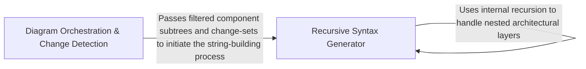

## Details

Translates the structural diff data into Mermaid.js syntax. It handles the recursive rendering of nested components, applies status indicators (added/modified/deleted), and filters noise to ensure diagram readability.

### Diagram Orchestration & Change Detection
Acts as the entry point for the visualization process, identifying components requiring re-rendering by analyzing Git diffs and managing the lifecycle of generated diagram files.

**Related Classes/Methods**:

- `scripts.build_component_files.render_component_files`:124-175

**Source Files:**

- [`scripts/diff_to_mermaid.py`](https://github.com/CodeBoarding/CodeBoarding-action/blob/main/.codeboardingscripts/diff_to_mermaid.py)
  - `scripts.diff_to_mermaid.render_mermaid` ([L396-L521](https://github.com/CodeBoarding/CodeBoarding-action/blob/main/.codeboardingscripts/diff_to_mermaid.py#L396-L521)) - Function
  - `scripts.diff_to_mermaid.render_mermaid.build` ([L424-L497](https://github.com/CodeBoarding/CodeBoarding-action/blob/main/.codeboardingscripts/diff_to_mermaid.py#L424-L497)) - Function
  - `scripts.diff_to_mermaid.render_mermaid.build.emit_edges` ([L435-L447](https://github.com/CodeBoarding/CodeBoarding-action/blob/main/.codeboardingscripts/diff_to_mermaid.py#L435-L447)) - Function
  - `scripts.diff_to_mermaid.render_mermaid.build.emit_level` ([L449-L466](https://github.com/CodeBoarding/CodeBoarding-action/blob/main/.codeboardingscripts/diff_to_mermaid.py#L449-L466)) - Function

### Recursive Syntax Generator
The core logic engine that translates internal component models into Mermaid syntax through recursive traversal of nested structures.

**Related Classes/Methods**:

- `scripts.diff_to_mermaid.render_mermaid`:396-521
- `scripts.diff_to_mermaid.render_mermaid.build.emit_level`:449-466

**Source Files:**

- [`scripts/build_component_files.py`](https://github.com/CodeBoarding/CodeBoarding-action/blob/main/.codeboardingscripts/build_component_files.py)
  - `scripts.build_component_files._block` ([L104-L121](https://github.com/CodeBoarding/CodeBoarding-action/blob/main/.codeboardingscripts/build_component_files.py#L104-L121)) - Function
  - `scripts.build_component_files.render_component_files` ([L124-L175](https://github.com/CodeBoarding/CodeBoarding-action/blob/main/.codeboardingscripts/build_component_files.py#L124-L175)) - Function
- [`scripts/diff_to_mermaid.py`](https://github.com/CodeBoarding/CodeBoarding-action/blob/main/.codeboardingscripts/diff_to_mermaid.py)
  - `scripts.diff_to_mermaid._comp_id` ([L60-L61](https://github.com/CodeBoarding/CodeBoarding-action/blob/main/.codeboardingscripts/diff_to_mermaid.py#L60-L61)) - Function
  - `scripts.diff_to_mermaid._comp_name` ([L64-L65](https://github.com/CodeBoarding/CodeBoarding-action/blob/main/.codeboardingscripts/diff_to_mermaid.py#L64-L65)) - Function
  - `scripts.diff_to_mermaid._has_changes` ([L151-L159](https://github.com/CodeBoarding/CodeBoarding-action/blob/main/.codeboardingscripts/diff_to_mermaid.py#L151-L159)) - Function
  - `scripts.diff_to_mermaid._sanitize` ([L223-L225](https://github.com/CodeBoarding/CodeBoarding-action/blob/main/.codeboardingscripts/diff_to_mermaid.py#L223-L225)) - Function
  - `scripts.diff_to_mermaid._esc` ([L247-L253](https://github.com/CodeBoarding/CodeBoarding-action/blob/main/.codeboardingscripts/diff_to_mermaid.py#L247-L253)) - Function
  - `scripts.diff_to_mermaid._truncate` ([L256-L258](https://github.com/CodeBoarding/CodeBoarding-action/blob/main/.codeboardingscripts/diff_to_mermaid.py#L256-L258)) - Function
  - `scripts.diff_to_mermaid._display_status` ([L261-L262](https://github.com/CodeBoarding/CodeBoarding-action/blob/main/.codeboardingscripts/diff_to_mermaid.py#L261-L262)) - Function
  - `scripts.diff_to_mermaid._Scope` ([L265-L309](https://github.com/CodeBoarding/CodeBoarding-action/blob/main/.codeboardingscripts/diff_to_mermaid.py#L265-L309)) - Class
  - `scripts.diff_to_mermaid._Scope.__init__` ([L276-L298](https://github.com/CodeBoarding/CodeBoarding-action/blob/main/.codeboardingscripts/diff_to_mermaid.py#L276-L298)) - Method
  - `scripts.diff_to_mermaid._filter_changed` ([L312-L354](https://github.com/CodeBoarding/CodeBoarding-action/blob/main/.codeboardingscripts/diff_to_mermaid.py#L312-L354)) - Function
  - `scripts.diff_to_mermaid._filter_changed.touches` ([L345-L347](https://github.com/CodeBoarding/CodeBoarding-action/blob/main/.codeboardingscripts/diff_to_mermaid.py#L345-L347)) - Function
  - `scripts.diff_to_mermaid._init_directive` ([L357-L376](https://github.com/CodeBoarding/CodeBoarding-action/blob/main/.codeboardingscripts/diff_to_mermaid.py#L357-L376)) - Function
  - `scripts.diff_to_mermaid._count_changed_components` ([L379-L386](https://github.com/CodeBoarding/CodeBoarding-action/blob/main/.codeboardingscripts/diff_to_mermaid.py#L379-L386)) - Function
  - `scripts.diff_to_mermaid._has_changed_relations` ([L389-L393](https://github.com/CodeBoarding/CodeBoarding-action/blob/main/.codeboardingscripts/diff_to_mermaid.py#L389-L393)) - Function

### [FAQ](https://github.com/CodeBoarding/GeneratedOnBoardings/tree/main?tab=readme-ov-file#faq)