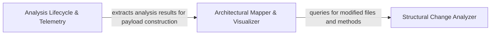

## Details

Analyzes the codebase to identify structural modifications. It maps file-level changes to architectural components and extracts method-level differences to determine the scope of the impact.

### Structural Change Analyzer
Responsible for the low-level detection of modifications within the codebase, traversing the file system and utilizing structural comparison logic to identify changed files and methods.

**Related Classes/Methods**:

- `scripts.build_component_files._changed_files_for`:88-101
- `scripts.build_component_files._subtree_methods`:77-85
- `scripts.diff_to_mermaid._has_structural_changes`:82-85
- `scripts.diff_to_mermaid._has_method_changes`:88-93

**Source Files:**

- [`scripts/build_component_files.py`](https://github.com/CodeBoarding/CodeBoarding-action/blob/main/.codeboardingscripts/build_component_files.py)
  - `scripts.build_component_files._walk` ([L56-L62](https://github.com/CodeBoarding/CodeBoarding-action/blob/main/.codeboardingscripts/build_component_files.py#L56-L62)) - Function
  - `scripts.build_component_files._subtree_files` ([L65-L74](https://github.com/CodeBoarding/CodeBoarding-action/blob/main/.codeboardingscripts/build_component_files.py#L65-L74)) - Function
  - `scripts.build_component_files._subtree_methods` ([L77-L85](https://github.com/CodeBoarding/CodeBoarding-action/blob/main/.codeboardingscripts/build_component_files.py#L77-L85)) - Function
  - `scripts.build_component_files._changed_files_for` ([L88-L101](https://github.com/CodeBoarding/CodeBoarding-action/blob/main/.codeboardingscripts/build_component_files.py#L88-L101)) - Function
- [`scripts/diff_to_mermaid.py`](https://github.com/CodeBoarding/CodeBoarding-action/blob/main/.codeboardingscripts/diff_to_mermaid.py)
  - `scripts.diff_to_mermaid._file_methods` ([L68-L69](https://github.com/CodeBoarding/CodeBoarding-action/blob/main/.codeboardingscripts/diff_to_mermaid.py#L68-L69)) - Function
  - `scripts.diff_to_mermaid._methods_by_file` ([L72-L79](https://github.com/CodeBoarding/CodeBoarding-action/blob/main/.codeboardingscripts/diff_to_mermaid.py#L72-L79)) - Function
  - `scripts.diff_to_mermaid._has_structural_changes` ([L82-L85](https://github.com/CodeBoarding/CodeBoarding-action/blob/main/.codeboardingscripts/diff_to_mermaid.py#L82-L85)) - Function
  - `scripts.diff_to_mermaid._has_method_changes` ([L88-L93](https://github.com/CodeBoarding/CodeBoarding-action/blob/main/.codeboardingscripts/diff_to_mermaid.py#L88-L93)) - Function

### Architectural Mapper & Visualizer
Maps raw structural changes to the project's high-level component architecture and formats the data for Mermaid.js rendering.

**Related Classes/Methods**:

- `scripts.build_component_files.render_component_files`:124-175
- `scripts.diff_to_mermaid._filter_changed`:312-354
- `scripts.diff_to_mermaid._comp_id`:60-61
- `scripts.diff_to_mermaid._Scope`:265-309

**Source Files:**

- [`scripts/build_component_files.py`](https://github.com/CodeBoarding/CodeBoarding-action/blob/main/.codeboardingscripts/build_component_files.py)
  - `scripts.build_component_files._block` ([L104-L121](https://github.com/CodeBoarding/CodeBoarding-action/blob/main/.codeboardingscripts/build_component_files.py#L104-L121)) - Function
  - `scripts.build_component_files.render_component_files` ([L124-L175](https://github.com/CodeBoarding/CodeBoarding-action/blob/main/.codeboardingscripts/build_component_files.py#L124-L175)) - Function
- [`scripts/diff_to_mermaid.py`](https://github.com/CodeBoarding/CodeBoarding-action/blob/main/.codeboardingscripts/diff_to_mermaid.py)
  - `scripts.diff_to_mermaid._comp_id` ([L60-L61](https://github.com/CodeBoarding/CodeBoarding-action/blob/main/.codeboardingscripts/diff_to_mermaid.py#L60-L61)) - Function
  - `scripts.diff_to_mermaid._comp_name` ([L64-L65](https://github.com/CodeBoarding/CodeBoarding-action/blob/main/.codeboardingscripts/diff_to_mermaid.py#L64-L65)) - Function
  - `scripts.diff_to_mermaid._sanitize` ([L223-L225](https://github.com/CodeBoarding/CodeBoarding-action/blob/main/.codeboardingscripts/diff_to_mermaid.py#L223-L225)) - Function
  - `scripts.diff_to_mermaid._display_status` ([L261-L262](https://github.com/CodeBoarding/CodeBoarding-action/blob/main/.codeboardingscripts/diff_to_mermaid.py#L261-L262)) - Function
  - `scripts.diff_to_mermaid._Scope.__init__` ([L276-L298](https://github.com/CodeBoarding/CodeBoarding-action/blob/main/.codeboardingscripts/diff_to_mermaid.py#L276-L298)) - Method
  - `scripts.diff_to_mermaid._filter_changed` ([L312-L354](https://github.com/CodeBoarding/CodeBoarding-action/blob/main/.codeboardingscripts/diff_to_mermaid.py#L312-L354)) - Function
  - `scripts.diff_to_mermaid._filter_changed.touches` ([L345-L347](https://github.com/CodeBoarding/CodeBoarding-action/blob/main/.codeboardingscripts/diff_to_mermaid.py#L345-L347)) - Function
  - `scripts.diff_to_mermaid._count_changed_components` ([L379-L386](https://github.com/CodeBoarding/CodeBoarding-action/blob/main/.codeboardingscripts/diff_to_mermaid.py#L379-L386)) - Function

### Analysis Lifecycle & Telemetry
Manages external communication of findings, constructing telemetry payloads to update the CodeBoarding platform on engine performance and results.

**Related Classes/Methods**:

- `scripts.submit_feedback.build_payload`:119-132
- `scripts.submit_feedback.post`:135-144
- `scripts.submit_feedback.extract_feedback`:55-69

**Source Files:**

- [`scripts/submit_feedback.py`](https://github.com/CodeBoarding/CodeBoarding-action/blob/main/.codeboardingscripts/submit_feedback.py)
  - `scripts.submit_feedback.telemetry_disabled` ([L27-L31](https://github.com/CodeBoarding/CodeBoarding-action/blob/main/.codeboardingscripts/submit_feedback.py#L27-L31)) - Function
  - `scripts.submit_feedback.resolve_key` ([L34-L35](https://github.com/CodeBoarding/CodeBoarding-action/blob/main/.codeboardingscripts/submit_feedback.py#L34-L35)) - Function
  - `scripts.submit_feedback.resolve_host` ([L38-L40](https://github.com/CodeBoarding/CodeBoarding-action/blob/main/.codeboardingscripts/submit_feedback.py#L38-L40)) - Function
  - `scripts.submit_feedback.resolve_command` ([L43-L44](https://github.com/CodeBoarding/CodeBoarding-action/blob/main/.codeboardingscripts/submit_feedback.py#L43-L44)) - Function
  - `scripts.submit_feedback.resolve_max_chars` ([L47-L52](https://github.com/CodeBoarding/CodeBoarding-action/blob/main/.codeboardingscripts/submit_feedback.py#L47-L52)) - Function
  - `scripts.submit_feedback.extract_feedback` ([L55-L69](https://github.com/CodeBoarding/CodeBoarding-action/blob/main/.codeboardingscripts/submit_feedback.py#L55-L69)) - Function
  - `scripts.submit_feedback.cap_feedback` ([L72-L76](https://github.com/CodeBoarding/CodeBoarding-action/blob/main/.codeboardingscripts/submit_feedback.py#L72-L76)) - Function
  - `scripts.submit_feedback._first` ([L79-L84](https://github.com/CodeBoarding/CodeBoarding-action/blob/main/.codeboardingscripts/submit_feedback.py#L79-L84)) - Function
  - `scripts.submit_feedback.distinct_id` ([L87-L91](https://github.com/CodeBoarding/CodeBoarding-action/blob/main/.codeboardingscripts/submit_feedback.py#L87-L91)) - Function
  - `scripts.submit_feedback.build_properties` ([L94-L116](https://github.com/CodeBoarding/CodeBoarding-action/blob/main/.codeboardingscripts/submit_feedback.py#L94-L116)) - Function
  - `scripts.submit_feedback.build_payload` ([L119-L132](https://github.com/CodeBoarding/CodeBoarding-action/blob/main/.codeboardingscripts/submit_feedback.py#L119-L132)) - Function
  - `scripts.submit_feedback.post` ([L135-L144](https://github.com/CodeBoarding/CodeBoarding-action/blob/main/.codeboardingscripts/submit_feedback.py#L135-L144)) - Function
  - `scripts.submit_feedback.main` ([L147-L172](https://github.com/CodeBoarding/CodeBoarding-action/blob/main/.codeboardingscripts/submit_feedback.py#L147-L172)) - Function

### [FAQ](https://github.com/CodeBoarding/GeneratedOnBoardings/tree/main?tab=readme-ov-file#faq)