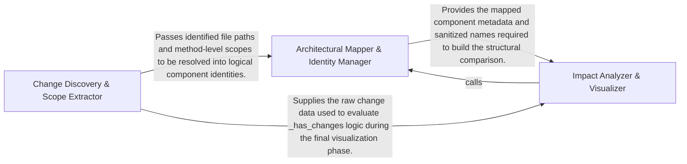

## Details

Analyzes the codebase to identify structural modifications. It maps file-level changes to architectural components and extracts method-level differences to determine the scope of the impact.

### Change Discovery & Scope Extractor
Acts as the entry point for the engine by interfacing with the Git environment to identify modified files and drilling down into the specific code symbols affected within those files.

**Related Classes/Methods**:

- `scripts.build_component_files._changed_files_for`:88-101
- `scripts.build_component_files._subtree_methods`:77-85
- `scripts.build_component_files.main`:178-213

**Source Files:**

- [`scripts/build_component_files.py`](https://github.com/CodeBoarding/CodeBoarding-action/blob/main/.codeboardingscripts/build_component_files.py)
  - `scripts.build_component_files._walk` ([L56-L62](https://github.com/CodeBoarding/CodeBoarding-action/blob/main/.codeboardingscripts/build_component_files.py#L56-L62)) - Function
  - `scripts.build_component_files._subtree_files` ([L65-L74](https://github.com/CodeBoarding/CodeBoarding-action/blob/main/.codeboardingscripts/build_component_files.py#L65-L74)) - Function
  - `scripts.build_component_files._subtree_methods` ([L77-L85](https://github.com/CodeBoarding/CodeBoarding-action/blob/main/.codeboardingscripts/build_component_files.py#L77-L85)) - Function
  - `scripts.build_component_files._changed_files_for` ([L88-L101](https://github.com/CodeBoarding/CodeBoarding-action/blob/main/.codeboardingscripts/build_component_files.py#L88-L101)) - Function
  - `scripts.build_component_files.main` ([L178-L213](https://github.com/CodeBoarding/CodeBoarding-action/blob/main/.codeboardingscripts/build_component_files.py#L178-L213)) - Function

### Architectural Mapper & Identity Manager
Translates physical file paths into logical architectural components, handling normalization, unique ID generation, and metadata management for component-level updates.

**Related Classes/Methods**: _None_

**Source Files:**

- [`scripts/diff_to_mermaid.py`](https://github.com/CodeBoarding/CodeBoarding-action/blob/main/.codeboardingscripts/diff_to_mermaid.py)
  - `scripts.diff_to_mermaid._file_methods` ([L68-L69](https://github.com/CodeBoarding/CodeBoarding-action/blob/main/.codeboardingscripts/diff_to_mermaid.py#L68-L69)) - Function
  - `scripts.diff_to_mermaid._has_structural_changes` ([L82-L85](https://github.com/CodeBoarding/CodeBoarding-action/blob/main/.codeboardingscripts/diff_to_mermaid.py#L82-L85)) - Function
  - `scripts.diff_to_mermaid._has_method_changes` ([L88-L93](https://github.com/CodeBoarding/CodeBoarding-action/blob/main/.codeboardingscripts/diff_to_mermaid.py#L88-L93)) - Function
  - `scripts.diff_to_mermaid._diff_relations` ([L102-L148](https://github.com/CodeBoarding/CodeBoarding-action/blob/main/.codeboardingscripts/diff_to_mermaid.py#L102-L148)) - Function
  - `scripts.diff_to_mermaid._diff_components` ([L162-L207](https://github.com/CodeBoarding/CodeBoarding-action/blob/main/.codeboardingscripts/diff_to_mermaid.py#L162-L207)) - Function

### Impact Analyzer & Visualizer
Compares component states before and after changes to determine modification types and aggregates findings into visual Mermaid.js flow and status reports.

**Related Classes/Methods**:

- `scripts.diff_to_mermaid.build_diff`:210-217
- `scripts.diff_to_mermaid._diff_components`:162-207

**Source Files:**

- [`scripts/diff_to_mermaid.py`](https://github.com/CodeBoarding/CodeBoarding-action/blob/main/.codeboardingscripts/diff_to_mermaid.py)
  - `scripts.diff_to_mermaid.load_analysis` ([L50-L54](https://github.com/CodeBoarding/CodeBoarding-action/blob/main/.codeboardingscripts/diff_to_mermaid.py#L50-L54)) - Function
  - `scripts.diff_to_mermaid._methods_by_file` ([L72-L79](https://github.com/CodeBoarding/CodeBoarding-action/blob/main/.codeboardingscripts/diff_to_mermaid.py#L72-L79)) - Function
  - `scripts.diff_to_mermaid._rel_key` ([L96-L99](https://github.com/CodeBoarding/CodeBoarding-action/blob/main/.codeboardingscripts/diff_to_mermaid.py#L96-L99)) - Function
  - `scripts.diff_to_mermaid.build_diff` ([L210-L217](https://github.com/CodeBoarding/CodeBoarding-action/blob/main/.codeboardingscripts/diff_to_mermaid.py#L210-L217)) - Function
  - `scripts.diff_to_mermaid.main` ([L527-L568](https://github.com/CodeBoarding/CodeBoarding-action/blob/main/.codeboardingscripts/diff_to_mermaid.py#L527-L568)) - Function

### [FAQ](https://github.com/CodeBoarding/GeneratedOnBoardings/tree/main?tab=readme-ov-file#faq)