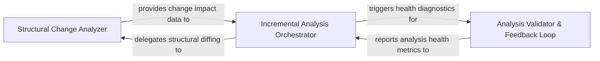

## Details

Analyzes the codebase to identify structural modifications. It maps file-level changes to architectural components and extracts method-level differences to determine the scope of the impact.

### Structural Change Analyzer
Responsible for the low-level inspection of code changes, distinguishing between trivial textual edits and structural modifications to determine the actual impact on the codebase.

**Related Classes/Methods**:

- `scripts.build_component_files._changed_files_for`:88-101
- `scripts.build_component_files._subtree_methods`:77-85
- `scripts.diff_to_mermaid._has_structural_changes`:82-85

**Source Files:**

- [`scripts/build_component_files.py`](https://github.com/CodeBoarding/CodeBoarding-action/blob/main/.codeboardingscripts/build_component_files.py)
  - `scripts.build_component_files._walk` ([L56-L62](https://github.com/CodeBoarding/CodeBoarding-action/blob/main/.codeboardingscripts/build_component_files.py#L56-L62)) - Function
  - `scripts.build_component_files._subtree_files` ([L65-L74](https://github.com/CodeBoarding/CodeBoarding-action/blob/main/.codeboardingscripts/build_component_files.py#L65-L74)) - Function
  - `scripts.build_component_files._subtree_methods` ([L77-L85](https://github.com/CodeBoarding/CodeBoarding-action/blob/main/.codeboardingscripts/build_component_files.py#L77-L85)) - Function
  - `scripts.build_component_files._changed_files_for` ([L88-L101](https://github.com/CodeBoarding/CodeBoarding-action/blob/main/.codeboardingscripts/build_component_files.py#L88-L101)) - Function
  - `scripts.build_component_files._block` ([L104-L121](https://github.com/CodeBoarding/CodeBoarding-action/blob/main/.codeboardingscripts/build_component_files.py#L104-L121)) - Function
  - `scripts.build_component_files.render_component_files` ([L124-L175](https://github.com/CodeBoarding/CodeBoarding-action/blob/main/.codeboardingscripts/build_component_files.py#L124-L175)) - Function
- [`scripts/diff_to_mermaid.py`](https://github.com/CodeBoarding/CodeBoarding-action/blob/main/.codeboardingscripts/diff_to_mermaid.py)
  - `scripts.diff_to_mermaid._comp_id` ([L60-L61](https://github.com/CodeBoarding/CodeBoarding-action/blob/main/.codeboardingscripts/diff_to_mermaid.py#L60-L61)) - Function
  - `scripts.diff_to_mermaid._comp_name` ([L64-L65](https://github.com/CodeBoarding/CodeBoarding-action/blob/main/.codeboardingscripts/diff_to_mermaid.py#L64-L65)) - Function
  - `scripts.diff_to_mermaid._file_methods` ([L68-L69](https://github.com/CodeBoarding/CodeBoarding-action/blob/main/.codeboardingscripts/diff_to_mermaid.py#L68-L69)) - Function
  - `scripts.diff_to_mermaid._methods_by_file` ([L72-L79](https://github.com/CodeBoarding/CodeBoarding-action/blob/main/.codeboardingscripts/diff_to_mermaid.py#L72-L79)) - Function
  - `scripts.diff_to_mermaid._has_structural_changes` ([L82-L85](https://github.com/CodeBoarding/CodeBoarding-action/blob/main/.codeboardingscripts/diff_to_mermaid.py#L82-L85)) - Function
  - `scripts.diff_to_mermaid._has_method_changes` ([L88-L93](https://github.com/CodeBoarding/CodeBoarding-action/blob/main/.codeboardingscripts/diff_to_mermaid.py#L88-L93)) - Function
  - `scripts.diff_to_mermaid._sanitize` ([L223-L225](https://github.com/CodeBoarding/CodeBoarding-action/blob/main/.codeboardingscripts/diff_to_mermaid.py#L223-L225)) - Function
  - `scripts.diff_to_mermaid._display_status` ([L261-L262](https://github.com/CodeBoarding/CodeBoarding-action/blob/main/.codeboardingscripts/diff_to_mermaid.py#L261-L262)) - Function
  - `scripts.diff_to_mermaid._Scope.__init__` ([L276-L298](https://github.com/CodeBoarding/CodeBoarding-action/blob/main/.codeboardingscripts/diff_to_mermaid.py#L276-L298)) - Method
  - `scripts.diff_to_mermaid._filter_changed` ([L312-L354](https://github.com/CodeBoarding/CodeBoarding-action/blob/main/.codeboardingscripts/diff_to_mermaid.py#L312-L354)) - Function
  - `scripts.diff_to_mermaid._filter_changed.touches` ([L345-L347](https://github.com/CodeBoarding/CodeBoarding-action/blob/main/.codeboardingscripts/diff_to_mermaid.py#L345-L347)) - Function
  - `scripts.diff_to_mermaid._count_changed_components` ([L379-L386](https://github.com/CodeBoarding/CodeBoarding-action/blob/main/.codeboardingscripts/diff_to_mermaid.py#L379-L386)) - Function

### Incremental Analysis Orchestrator
Manages the execution lifecycle and state of the engine by comparing current changes against stored metadata to decide between full scans or incremental updates.

**Related Classes/Methods**:

- `scripts.engine_adapter.run_analyze`:450-516
- `scripts.engine_adapter._load_metadata`:158-168
- `scripts.engine_adapter._incremental_or_full`:351-399
- `scripts.engine_adapter.baseline_info`:222-232

**Source Files:**

- [`scripts/engine_adapter.py`](https://github.com/CodeBoarding/CodeBoarding-action/blob/main/.codeboardingscripts/engine_adapter.py)
  - `scripts.engine_adapter._max_depth` ([L105-L106](https://github.com/CodeBoarding/CodeBoarding-action/blob/main/.codeboardingscripts/engine_adapter.py#L105-L106)) - Function
  - `scripts.engine_adapter._is_quota_exhausted` ([L115-L130](https://github.com/CodeBoarding/CodeBoarding-action/blob/main/.codeboardingscripts/engine_adapter.py#L115-L130)) - Function
  - `scripts.engine_adapter._flag_quota_exhausted` ([L133-L142](https://github.com/CodeBoarding/CodeBoarding-action/blob/main/.codeboardingscripts/engine_adapter.py#L133-L142)) - Function
  - `scripts.engine_adapter._log_path` ([L145-L146](https://github.com/CodeBoarding/CodeBoarding-action/blob/main/.codeboardingscripts/engine_adapter.py#L145-L146)) - Function
  - `scripts.engine_adapter._clear_dir` ([L149-L155](https://github.com/CodeBoarding/CodeBoarding-action/blob/main/.codeboardingscripts/engine_adapter.py#L149-L155)) - Function
  - `scripts.engine_adapter._load_metadata` ([L158-L168](https://github.com/CodeBoarding/CodeBoarding-action/blob/main/.codeboardingscripts/engine_adapter.py#L158-L168)) - Function
  - `scripts.engine_adapter._metadata_depth` ([L171-L175](https://github.com/CodeBoarding/CodeBoarding-action/blob/main/.codeboardingscripts/engine_adapter.py#L171-L175)) - Function
  - `scripts.engine_adapter._resolve_depth` ([L178-L207](https://github.com/CodeBoarding/CodeBoarding-action/blob/main/.codeboardingscripts/engine_adapter.py#L178-L207)) - Function
  - `scripts.engine_adapter._analysis_depth_or_default` ([L210-L214](https://github.com/CodeBoarding/CodeBoarding-action/blob/main/.codeboardingscripts/engine_adapter.py#L210-L214)) - Function
  - `scripts.engine_adapter._metadata_commit` ([L217-L219](https://github.com/CodeBoarding/CodeBoarding-action/blob/main/.codeboardingscripts/engine_adapter.py#L217-L219)) - Function
  - `scripts.engine_adapter.baseline_info` ([L222-L232](https://github.com/CodeBoarding/CodeBoarding-action/blob/main/.codeboardingscripts/engine_adapter.py#L222-L232)) - Function
  - `scripts.engine_adapter.baseline_depth` ([L235-L250](https://github.com/CodeBoarding/CodeBoarding-action/blob/main/.codeboardingscripts/engine_adapter.py#L235-L250)) - Function
  - `scripts.engine_adapter.validate_base_analysis` ([L253-L309](https://github.com/CodeBoarding/CodeBoarding-action/blob/main/.codeboardingscripts/engine_adapter.py#L253-L309)) - Function
  - `scripts.engine_adapter.run_base` ([L312-L322](https://github.com/CodeBoarding/CodeBoarding-action/blob/main/.codeboardingscripts/engine_adapter.py#L312-L322)) - Function
  - `scripts.engine_adapter.run_seed` ([L325-L348](https://github.com/CodeBoarding/CodeBoarding-action/blob/main/.codeboardingscripts/engine_adapter.py#L325-L348)) - Function
  - `scripts.engine_adapter._incremental_or_full` ([L351-L399](https://github.com/CodeBoarding/CodeBoarding-action/blob/main/.codeboardingscripts/engine_adapter.py#L351-L399)) - Function
  - `scripts.engine_adapter.run_head` ([L402-L447](https://github.com/CodeBoarding/CodeBoarding-action/blob/main/.codeboardingscripts/engine_adapter.py#L402-L447)) - Function
  - `scripts.engine_adapter.run_analyze` ([L450-L516](https://github.com/CodeBoarding/CodeBoarding-action/blob/main/.codeboardingscripts/engine_adapter.py#L450-L516)) - Function
  - `scripts.engine_adapter.run_analyze.full` ([L474-L488](https://github.com/CodeBoarding/CodeBoarding-action/blob/main/.codeboardingscripts/engine_adapter.py#L474-L488)) - Function
  - `scripts.engine_adapter.run_render` ([L519-L530](https://github.com/CodeBoarding/CodeBoarding-action/blob/main/.codeboardingscripts/engine_adapter.py#L519-L530)) - Function
  - `scripts.engine_adapter.run_concat` ([L533-L546](https://github.com/CodeBoarding/CodeBoarding-action/blob/main/.codeboardingscripts/engine_adapter.py#L533-L546)) - Function
  - `scripts.engine_adapter.main` ([L605-L711](https://github.com/CodeBoarding/CodeBoarding-action/blob/main/.codeboardingscripts/engine_adapter.py#L605-L711)) - Function

### Analysis Validator & Feedback Loop
Ensures the integrity of the diffing process by monitoring analysis health, validating structural mapping accuracy, and processing external feedback.

**Related Classes/Methods**:

- `scripts.engine_adapter.run_health`:576-602
- `scripts.submit_feedback.main`:147-172
- `scripts.engine_adapter._count_report_issues`:549-562
- `scripts.submit_feedback.build_payload`:119-132

**Source Files:**

- [`scripts/engine_adapter.py`](https://github.com/CodeBoarding/CodeBoarding-action/blob/main/.codeboardingscripts/engine_adapter.py)
  - `scripts.engine_adapter._count_report_issues` ([L549-L562](https://github.com/CodeBoarding/CodeBoarding-action/blob/main/.codeboardingscripts/engine_adapter.py#L549-L562)) - Function
  - `scripts.engine_adapter._count_health_report` ([L565-L573](https://github.com/CodeBoarding/CodeBoarding-action/blob/main/.codeboardingscripts/engine_adapter.py#L565-L573)) - Function
  - `scripts.engine_adapter.run_health` ([L576-L602](https://github.com/CodeBoarding/CodeBoarding-action/blob/main/.codeboardingscripts/engine_adapter.py#L576-L602)) - Function
- [`scripts/submit_feedback.py`](https://github.com/CodeBoarding/CodeBoarding-action/blob/main/.codeboardingscripts/submit_feedback.py)
  - `scripts.submit_feedback.telemetry_disabled` ([L27-L31](https://github.com/CodeBoarding/CodeBoarding-action/blob/main/.codeboardingscripts/submit_feedback.py#L27-L31)) - Function
  - `scripts.submit_feedback.resolve_key` ([L34-L35](https://github.com/CodeBoarding/CodeBoarding-action/blob/main/.codeboardingscripts/submit_feedback.py#L34-L35)) - Function
  - `scripts.submit_feedback.resolve_host` ([L38-L40](https://github.com/CodeBoarding/CodeBoarding-action/blob/main/.codeboardingscripts/submit_feedback.py#L38-L40)) - Function
  - `scripts.submit_feedback.resolve_command` ([L43-L44](https://github.com/CodeBoarding/CodeBoarding-action/blob/main/.codeboardingscripts/submit_feedback.py#L43-L44)) - Function
  - `scripts.submit_feedback.resolve_max_chars` ([L47-L52](https://github.com/CodeBoarding/CodeBoarding-action/blob/main/.codeboardingscripts/submit_feedback.py#L47-L52)) - Function
  - `scripts.submit_feedback.extract_feedback` ([L55-L69](https://github.com/CodeBoarding/CodeBoarding-action/blob/main/.codeboardingscripts/submit_feedback.py#L55-L69)) - Function
  - `scripts.submit_feedback.cap_feedback` ([L72-L76](https://github.com/CodeBoarding/CodeBoarding-action/blob/main/.codeboardingscripts/submit_feedback.py#L72-L76)) - Function
  - `scripts.submit_feedback._first` ([L79-L84](https://github.com/CodeBoarding/CodeBoarding-action/blob/main/.codeboardingscripts/submit_feedback.py#L79-L84)) - Function
  - `scripts.submit_feedback.distinct_id` ([L87-L91](https://github.com/CodeBoarding/CodeBoarding-action/blob/main/.codeboardingscripts/submit_feedback.py#L87-L91)) - Function
  - `scripts.submit_feedback.build_properties` ([L94-L116](https://github.com/CodeBoarding/CodeBoarding-action/blob/main/.codeboardingscripts/submit_feedback.py#L94-L116)) - Function
  - `scripts.submit_feedback.build_payload` ([L119-L132](https://github.com/CodeBoarding/CodeBoarding-action/blob/main/.codeboardingscripts/submit_feedback.py#L119-L132)) - Function
  - `scripts.submit_feedback.post` ([L135-L144](https://github.com/CodeBoarding/CodeBoarding-action/blob/main/.codeboardingscripts/submit_feedback.py#L135-L144)) - Function
  - `scripts.submit_feedback.main` ([L147-L172](https://github.com/CodeBoarding/CodeBoarding-action/blob/main/.codeboardingscripts/submit_feedback.py#L147-L172)) - Function

### [FAQ](https://github.com/CodeBoarding/GeneratedOnBoardings/tree/main?tab=readme-ov-file#faq)