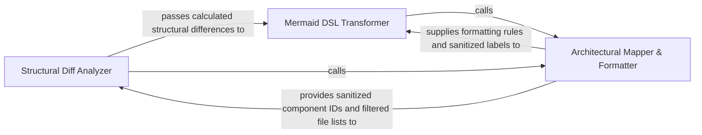

## Details

Processes the raw structural data of the codebase to identify architectural diffs. It transforms these changes into Mermaid.js syntax to provide a visual representation of how the PR affects the system's design.

### Structural Diff Analyzer
The core analytical engine that compares the current state of the codebase against the baseline to identify structural changes at the file and method level.

**Related Classes/Methods**:

- `scripts.diff_to_mermaid.build_diff`:210-217
- `scripts.diff_to_mermaid._has_structural_changes`:82-85
- `scripts.diff_to_mermaid._diff_components`:162-207
- `scripts.diff_to_mermaid._methods_by_file`:72-79

**Source Files:**

- [`scripts/build_component_files.py`](https://github.com/CodeBoarding/CodeBoarding-action/blob/main/.codeboardingscripts/build_component_files.py)
  - `scripts.build_component_files._walk` ([L56-L62](https://github.com/CodeBoarding/CodeBoarding-action/blob/main/.codeboardingscripts/build_component_files.py#L56-L62)) - Function
  - `scripts.build_component_files._subtree_files` ([L65-L74](https://github.com/CodeBoarding/CodeBoarding-action/blob/main/.codeboardingscripts/build_component_files.py#L65-L74)) - Function
  - `scripts.build_component_files._subtree_methods` ([L77-L85](https://github.com/CodeBoarding/CodeBoarding-action/blob/main/.codeboardingscripts/build_component_files.py#L77-L85)) - Function
  - `scripts.build_component_files._changed_files_for` ([L88-L101](https://github.com/CodeBoarding/CodeBoarding-action/blob/main/.codeboardingscripts/build_component_files.py#L88-L101)) - Function
  - `scripts.build_component_files.main` ([L178-L213](https://github.com/CodeBoarding/CodeBoarding-action/blob/main/.codeboardingscripts/build_component_files.py#L178-L213)) - Function
- [`scripts/diff_to_mermaid.py`](https://github.com/CodeBoarding/CodeBoarding-action/blob/main/.codeboardingscripts/diff_to_mermaid.py)
  - `scripts.diff_to_mermaid.load_analysis` ([L50-L54](https://github.com/CodeBoarding/CodeBoarding-action/blob/main/.codeboardingscripts/diff_to_mermaid.py#L50-L54)) - Function
  - `scripts.diff_to_mermaid._file_methods` ([L68-L69](https://github.com/CodeBoarding/CodeBoarding-action/blob/main/.codeboardingscripts/diff_to_mermaid.py#L68-L69)) - Function
  - `scripts.diff_to_mermaid._methods_by_file` ([L72-L79](https://github.com/CodeBoarding/CodeBoarding-action/blob/main/.codeboardingscripts/diff_to_mermaid.py#L72-L79)) - Function
  - `scripts.diff_to_mermaid._has_structural_changes` ([L82-L85](https://github.com/CodeBoarding/CodeBoarding-action/blob/main/.codeboardingscripts/diff_to_mermaid.py#L82-L85)) - Function
  - `scripts.diff_to_mermaid._has_method_changes` ([L88-L93](https://github.com/CodeBoarding/CodeBoarding-action/blob/main/.codeboardingscripts/diff_to_mermaid.py#L88-L93)) - Function
  - `scripts.diff_to_mermaid._rel_key` ([L96-L99](https://github.com/CodeBoarding/CodeBoarding-action/blob/main/.codeboardingscripts/diff_to_mermaid.py#L96-L99)) - Function
  - `scripts.diff_to_mermaid._diff_relations` ([L102-L148](https://github.com/CodeBoarding/CodeBoarding-action/blob/main/.codeboardingscripts/diff_to_mermaid.py#L102-L148)) - Function
  - `scripts.diff_to_mermaid._diff_components` ([L162-L207](https://github.com/CodeBoarding/CodeBoarding-action/blob/main/.codeboardingscripts/diff_to_mermaid.py#L162-L207)) - Function
  - `scripts.diff_to_mermaid.build_diff` ([L210-L217](https://github.com/CodeBoarding/CodeBoarding-action/blob/main/.codeboardingscripts/diff_to_mermaid.py#L210-L217)) - Function
  - `scripts.diff_to_mermaid.main` ([L527-L568](https://github.com/CodeBoarding/CodeBoarding-action/blob/main/.codeboardingscripts/diff_to_mermaid.py#L527-L568)) - Function

### Mermaid DSL Transformer
Responsible for the transformation phase, taking structured diff data and applying visual logic to generate Mermaid.js syntax.

**Related Classes/Methods**:

- `scripts.diff_to_mermaid.render_mermaid`:396-521
- `scripts.diff_to_mermaid.render_mermaid.build.emit_level`:449-466
- `scripts.diff_to_mermaid.render_mermaid.build.emit_edges`:435-447
- `scripts.diff_to_mermaid._has_changes`:151-159

**Source Files:**

- [`scripts/diff_to_mermaid.py`](https://github.com/CodeBoarding/CodeBoarding-action/blob/main/.codeboardingscripts/diff_to_mermaid.py)
  - `scripts.diff_to_mermaid._has_changes` ([L151-L159](https://github.com/CodeBoarding/CodeBoarding-action/blob/main/.codeboardingscripts/diff_to_mermaid.py#L151-L159)) - Function
  - `scripts.diff_to_mermaid._esc` ([L247-L253](https://github.com/CodeBoarding/CodeBoarding-action/blob/main/.codeboardingscripts/diff_to_mermaid.py#L247-L253)) - Function
  - `scripts.diff_to_mermaid._truncate` ([L256-L258](https://github.com/CodeBoarding/CodeBoarding-action/blob/main/.codeboardingscripts/diff_to_mermaid.py#L256-L258)) - Function
  - `scripts.diff_to_mermaid._Scope` ([L265-L309](https://github.com/CodeBoarding/CodeBoarding-action/blob/main/.codeboardingscripts/diff_to_mermaid.py#L265-L309)) - Class
  - `scripts.diff_to_mermaid._init_directive` ([L357-L376](https://github.com/CodeBoarding/CodeBoarding-action/blob/main/.codeboardingscripts/diff_to_mermaid.py#L357-L376)) - Function
  - `scripts.diff_to_mermaid._count_changed_components` ([L379-L386](https://github.com/CodeBoarding/CodeBoarding-action/blob/main/.codeboardingscripts/diff_to_mermaid.py#L379-L386)) - Function
  - `scripts.diff_to_mermaid._has_changed_relations` ([L389-L393](https://github.com/CodeBoarding/CodeBoarding-action/blob/main/.codeboardingscripts/diff_to_mermaid.py#L389-L393)) - Function
  - `scripts.diff_to_mermaid.render_mermaid` ([L396-L521](https://github.com/CodeBoarding/CodeBoarding-action/blob/main/.codeboardingscripts/diff_to_mermaid.py#L396-L521)) - Function
  - `scripts.diff_to_mermaid.render_mermaid.build` ([L424-L497](https://github.com/CodeBoarding/CodeBoarding-action/blob/main/.codeboardingscripts/diff_to_mermaid.py#L424-L497)) - Function
  - `scripts.diff_to_mermaid.render_mermaid.build.emit_edges` ([L435-L447](https://github.com/CodeBoarding/CodeBoarding-action/blob/main/.codeboardingscripts/diff_to_mermaid.py#L435-L447)) - Function
  - `scripts.diff_to_mermaid.render_mermaid.build.emit_level` ([L449-L466](https://github.com/CodeBoarding/CodeBoarding-action/blob/main/.codeboardingscripts/diff_to_mermaid.py#L449-L466)) - Function

### Architectural Mapper & Formatter
Provides the foundational mapping between the physical file system and the logical architectural model, handling component identification and metadata formatting.

**Related Classes/Methods**:

- `scripts.build_component_files.render_component_files`:124-175
- `scripts.diff_to_mermaid._comp_id`:60-61
- `scripts.diff_to_mermaid._sanitize`:223-225
- `scripts.diff_to_mermaid._filter_changed`:312-354

**Source Files:**

- [`scripts/build_component_files.py`](https://github.com/CodeBoarding/CodeBoarding-action/blob/main/.codeboardingscripts/build_component_files.py)
  - `scripts.build_component_files._block` ([L104-L121](https://github.com/CodeBoarding/CodeBoarding-action/blob/main/.codeboardingscripts/build_component_files.py#L104-L121)) - Function
  - `scripts.build_component_files.render_component_files` ([L124-L175](https://github.com/CodeBoarding/CodeBoarding-action/blob/main/.codeboardingscripts/build_component_files.py#L124-L175)) - Function
- [`scripts/diff_to_mermaid.py`](https://github.com/CodeBoarding/CodeBoarding-action/blob/main/.codeboardingscripts/diff_to_mermaid.py)
  - `scripts.diff_to_mermaid._comp_id` ([L60-L61](https://github.com/CodeBoarding/CodeBoarding-action/blob/main/.codeboardingscripts/diff_to_mermaid.py#L60-L61)) - Function
  - `scripts.diff_to_mermaid._comp_name` ([L64-L65](https://github.com/CodeBoarding/CodeBoarding-action/blob/main/.codeboardingscripts/diff_to_mermaid.py#L64-L65)) - Function
  - `scripts.diff_to_mermaid._sanitize` ([L223-L225](https://github.com/CodeBoarding/CodeBoarding-action/blob/main/.codeboardingscripts/diff_to_mermaid.py#L223-L225)) - Function
  - `scripts.diff_to_mermaid._display_status` ([L261-L262](https://github.com/CodeBoarding/CodeBoarding-action/blob/main/.codeboardingscripts/diff_to_mermaid.py#L261-L262)) - Function
  - `scripts.diff_to_mermaid._Scope.__init__` ([L276-L298](https://github.com/CodeBoarding/CodeBoarding-action/blob/main/.codeboardingscripts/diff_to_mermaid.py#L276-L298)) - Method
  - `scripts.diff_to_mermaid._Scope.resolve` ([L300-L309](https://github.com/CodeBoarding/CodeBoarding-action/blob/main/.codeboardingscripts/diff_to_mermaid.py#L300-L309)) - Method
  - `scripts.diff_to_mermaid._filter_changed` ([L312-L354](https://github.com/CodeBoarding/CodeBoarding-action/blob/main/.codeboardingscripts/diff_to_mermaid.py#L312-L354)) - Function
  - `scripts.diff_to_mermaid._filter_changed.touches` ([L345-L347](https://github.com/CodeBoarding/CodeBoarding-action/blob/main/.codeboardingscripts/diff_to_mermaid.py#L345-L347)) - Function

### [FAQ](https://github.com/CodeBoarding/GeneratedOnBoardings/tree/main?tab=readme-ov-file#faq)