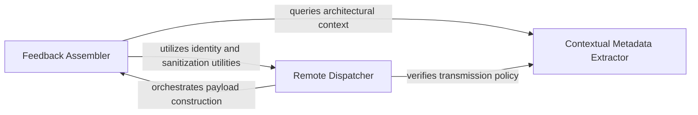

## Details

A specialized component that handles the collection and transmission of execution metrics and user feedback. It ensures data is anonymized and transmitted securely to the remote backend for service improvement.

### Contextual Metadata Extractor
Responsible for mining the results of the architectural analysis to provide context for the telemetry by identifying impacted components and calculating metrics.

**Related Classes/Methods**: _None_

**Source Files:**

- [`scripts/submit_feedback.py`](https://github.com/CodeBoarding/CodeBoarding-action/blob/main/.codeboardingscripts/submit_feedback.py)
  - `scripts.submit_feedback.telemetry_disabled` ([L27-L31](https://github.com/CodeBoarding/CodeBoarding-action/blob/main/.codeboardingscripts/submit_feedback.py#L27-L31)) - Function
  - `scripts.submit_feedback.resolve_key` ([L34-L35](https://github.com/CodeBoarding/CodeBoarding-action/blob/main/.codeboardingscripts/submit_feedback.py#L34-L35)) - Function
  - `scripts.submit_feedback.resolve_host` ([L38-L40](https://github.com/CodeBoarding/CodeBoarding-action/blob/main/.codeboardingscripts/submit_feedback.py#L38-L40)) - Function
  - `scripts.submit_feedback.resolve_command` ([L43-L44](https://github.com/CodeBoarding/CodeBoarding-action/blob/main/.codeboardingscripts/submit_feedback.py#L43-L44)) - Function
  - `scripts.submit_feedback.resolve_max_chars` ([L47-L52](https://github.com/CodeBoarding/CodeBoarding-action/blob/main/.codeboardingscripts/submit_feedback.py#L47-L52)) - Function
  - `scripts.submit_feedback.post` ([L135-L144](https://github.com/CodeBoarding/CodeBoarding-action/blob/main/.codeboardingscripts/submit_feedback.py#L135-L144)) - Function

### Feedback Assembler
Acts as the data transformation layer that aggregates environment variables, user feedback, and architectural context into a standardized JSON schema.

**Related Classes/Methods**:

- `scripts.submit_feedback.build_payload`:119-132

**Source Files:**

- [`scripts/submit_feedback.py`](https://github.com/CodeBoarding/CodeBoarding-action/blob/main/.codeboardingscripts/submit_feedback.py)
  - `scripts.submit_feedback._first` ([L79-L84](https://github.com/CodeBoarding/CodeBoarding-action/blob/main/.codeboardingscripts/submit_feedback.py#L79-L84)) - Function
  - `scripts.submit_feedback.build_properties` ([L94-L116](https://github.com/CodeBoarding/CodeBoarding-action/blob/main/.codeboardingscripts/submit_feedback.py#L94-L116)) - Function
  - `scripts.submit_feedback.build_payload` ([L119-L132](https://github.com/CodeBoarding/CodeBoarding-action/blob/main/.codeboardingscripts/submit_feedback.py#L119-L132)) - Function

### Remote Dispatcher
Manages the egress of data to the external service, handling HTTP authentication, POST requests, and response management.

**Related Classes/Methods**:

- `scripts.submit_feedback.main`:147-172

**Source Files:**

- [`scripts/submit_feedback.py`](https://github.com/CodeBoarding/CodeBoarding-action/blob/main/.codeboardingscripts/submit_feedback.py)
  - `scripts.submit_feedback.extract_feedback` ([L55-L69](https://github.com/CodeBoarding/CodeBoarding-action/blob/main/.codeboardingscripts/submit_feedback.py#L55-L69)) - Function
  - `scripts.submit_feedback.cap_feedback` ([L72-L76](https://github.com/CodeBoarding/CodeBoarding-action/blob/main/.codeboardingscripts/submit_feedback.py#L72-L76)) - Function
  - `scripts.submit_feedback.distinct_id` ([L87-L91](https://github.com/CodeBoarding/CodeBoarding-action/blob/main/.codeboardingscripts/submit_feedback.py#L87-L91)) - Function
  - `scripts.submit_feedback.main` ([L147-L172](https://github.com/CodeBoarding/CodeBoarding-action/blob/main/.codeboardingscripts/submit_feedback.py#L147-L172)) - Function

### [FAQ](https://github.com/CodeBoarding/GeneratedOnBoardings/tree/main?tab=readme-ov-file#faq)