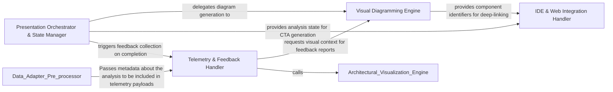

## Details

Manages the final presentation of data to the user, including GitHub comments, feedback loops, and external integrations. It handles telemetry and user feedback via PostHog, closing the feedback loop between the user and the tool. Key class/method: scripts.submit_feedback.py.

### Telemetry & Feedback Handler
Manages the collection and submission of telemetry data and user feedback to external endpoints. Includes logic from scripts.submit_feedback.

**Related Classes/Methods**: _None_

**Source Files:**

- [`scripts/diff_to_mermaid.py`](https://github.com/CodeBoarding/CodeBoarding-action/blob/main/.codeboardingscripts/diff_to_mermaid.py)
  - `scripts.diff_to_mermaid._truncate` ([L256-L258](https://github.com/CodeBoarding/CodeBoarding-action/blob/main/.codeboardingscripts/diff_to_mermaid.py#L256-L258)) - Function
  - `scripts.diff_to_mermaid.render_mermaid` ([L396-L521](https://github.com/CodeBoarding/CodeBoarding-action/blob/main/.codeboardingscripts/diff_to_mermaid.py#L396-L521)) - Function
  - `scripts.diff_to_mermaid.render_mermaid.build` ([L424-L497](https://github.com/CodeBoarding/CodeBoarding-action/blob/main/.codeboardingscripts/diff_to_mermaid.py#L424-L497)) - Function

### Presentation Orchestrator & State Manager
Acts as the primary coordinator for the UX layer, validating analysis state, managing quotas, and ensuring data consistency for visualizers and CTA builders.

**Related Classes/Methods**:

- `scripts.engine_adapter.main`:519-607
- `scripts.engine_adapter.run_analyze`:371-430
- `scripts.engine_adapter.validate_base_analysis`:183-233

**Source Files:**

- [`scripts/engine_adapter.py`](https://github.com/CodeBoarding/CodeBoarding-action/blob/main/.codeboardingscripts/engine_adapter.py)
  - `scripts.engine_adapter._is_quota_exhausted` ([L115-L130](https://github.com/CodeBoarding/CodeBoarding-action/blob/main/.codeboardingscripts/engine_adapter.py#L115-L130)) - Function
  - `scripts.engine_adapter._flag_quota_exhausted` ([L133-L142](https://github.com/CodeBoarding/CodeBoarding-action/blob/main/.codeboardingscripts/engine_adapter.py#L133-L142)) - Function
  - `scripts.engine_adapter._log_path` ([L145-L146](https://github.com/CodeBoarding/CodeBoarding-action/blob/main/.codeboardingscripts/engine_adapter.py#L145-L146)) - Function
  - `scripts.engine_adapter._clear_dir` ([L149-L155](https://github.com/CodeBoarding/CodeBoarding-action/blob/main/.codeboardingscripts/engine_adapter.py#L149-L155)) - Function
  - `scripts.engine_adapter._supported_depth` ([L152-L154](https://github.com/CodeBoarding/CodeBoarding-action/blob/main/.codeboardingscripts/engine_adapter.py#L152-L154)) - Function
  - `scripts.engine_adapter._load_metadata` ([L158-L168](https://github.com/CodeBoarding/CodeBoarding-action/blob/main/.codeboardingscripts/engine_adapter.py#L158-L168)) - Function
  - `scripts.engine_adapter._metadata_depth` ([L171-L175](https://github.com/CodeBoarding/CodeBoarding-action/blob/main/.codeboardingscripts/engine_adapter.py#L171-L175)) - Function
  - `scripts.engine_adapter._analysis_depth_or_default` ([L210-L214](https://github.com/CodeBoarding/CodeBoarding-action/blob/main/.codeboardingscripts/engine_adapter.py#L210-L214)) - Function
  - `scripts.engine_adapter._metadata_commit` ([L217-L219](https://github.com/CodeBoarding/CodeBoarding-action/blob/main/.codeboardingscripts/engine_adapter.py#L217-L219)) - Function
  - `scripts.engine_adapter.baseline_info` ([L222-L232](https://github.com/CodeBoarding/CodeBoarding-action/blob/main/.codeboardingscripts/engine_adapter.py#L222-L232)) - Function
  - `scripts.engine_adapter.validate_base_analysis` ([L253-L309](https://github.com/CodeBoarding/CodeBoarding-action/blob/main/.codeboardingscripts/engine_adapter.py#L253-L309)) - Function
  - `scripts.engine_adapter.run_base` ([L312-L322](https://github.com/CodeBoarding/CodeBoarding-action/blob/main/.codeboardingscripts/engine_adapter.py#L312-L322)) - Function
  - `scripts.engine_adapter.run_seed` ([L325-L348](https://github.com/CodeBoarding/CodeBoarding-action/blob/main/.codeboardingscripts/engine_adapter.py#L325-L348)) - Function
  - `scripts.engine_adapter._incremental_or_full` ([L351-L399](https://github.com/CodeBoarding/CodeBoarding-action/blob/main/.codeboardingscripts/engine_adapter.py#L351-L399)) - Function
  - `scripts.engine_adapter.run_head` ([L402-L447](https://github.com/CodeBoarding/CodeBoarding-action/blob/main/.codeboardingscripts/engine_adapter.py#L402-L447)) - Function
  - `scripts.engine_adapter.run_analyze` ([L450-L516](https://github.com/CodeBoarding/CodeBoarding-action/blob/main/.codeboardingscripts/engine_adapter.py#L450-L516)) - Function
  - `scripts.engine_adapter.run_analyze.full` ([L474-L488](https://github.com/CodeBoarding/CodeBoarding-action/blob/main/.codeboardingscripts/engine_adapter.py#L474-L488)) - Function
  - `scripts.engine_adapter.run_render` ([L519-L530](https://github.com/CodeBoarding/CodeBoarding-action/blob/main/.codeboardingscripts/engine_adapter.py#L519-L530)) - Function
  - `scripts.engine_adapter.run_concat` ([L533-L546](https://github.com/CodeBoarding/CodeBoarding-action/blob/main/.codeboardingscripts/engine_adapter.py#L533-L546)) - Function
  - `scripts.engine_adapter.main` ([L605-L711](https://github.com/CodeBoarding/CodeBoarding-action/blob/main/.codeboardingscripts/engine_adapter.py#L605-L711)) - Function

### Visual Diagramming Engine
Translates internal diff data and component relationships into Mermaid.js syntax, managing scope and label truncation for GitHub UI readability.

**Related Classes/Methods**:

- `scripts.diff_to_mermaid.render_mermaid.build`:424-497
- `scripts.diff_to_mermaid._Scope`:265-309
- `scripts.diff_to_mermaid._truncate`:256-258

**Source Files:**

- [`scripts/diff_to_mermaid.py`](https://github.com/CodeBoarding/CodeBoarding-action/blob/main/.codeboardingscripts/diff_to_mermaid.py)
  - `scripts.diff_to_mermaid._esc` ([L247-L253](https://github.com/CodeBoarding/CodeBoarding-action/blob/main/.codeboardingscripts/diff_to_mermaid.py#L247-L253)) - Function
  - `scripts.diff_to_mermaid._truncate` ([L256-L258](https://github.com/CodeBoarding/CodeBoarding-action/blob/main/.codeboardingscripts/diff_to_mermaid.py#L256-L258)) - Function
  - `scripts.diff_to_mermaid._Scope` ([L265-L309](https://github.com/CodeBoarding/CodeBoarding-action/blob/main/.codeboardingscripts/diff_to_mermaid.py#L265-L309)) - Class
  - `scripts.diff_to_mermaid.render_mermaid.build` ([L424-L497](https://github.com/CodeBoarding/CodeBoarding-action/blob/main/.codeboardingscripts/diff_to_mermaid.py#L424-L497)) - Function
  - `scripts.diff_to_mermaid.render_mermaid.build.emit_edges` ([L435-L447](https://github.com/CodeBoarding/CodeBoarding-action/blob/main/.codeboardingscripts/diff_to_mermaid.py#L435-L447)) - Function
  - `scripts.diff_to_mermaid.render_mermaid.build.emit_level` ([L449-L466](https://github.com/CodeBoarding/CodeBoarding-action/blob/main/.codeboardingscripts/diff_to_mermaid.py#L449-L466)) - Function

### IDE & Web Integration Handler
Detects user environments and generates specialized URLs to enable direct navigation from GitHub comments to local IDEs or webviews.

**Related Classes/Methods**:

- `scripts.build_cta.main`:181-223
- `scripts.build_cta.detect_editors`:36-48
- `scripts.build_cta.webview_url`:62-94

**Source Files:**

- [`scripts/build_cta.py`](https://github.com/CodeBoarding/CodeBoarding-action/blob/main/.codeboardingscripts/build_cta.py)
  - `scripts.build_cta.detect_editors` ([L36-L48](https://github.com/CodeBoarding/CodeBoarding-action/blob/main/.codeboardingscripts/build_cta.py#L36-L48)) - Function
  - `scripts.build_cta.webview_url` ([L62-L94](https://github.com/CodeBoarding/CodeBoarding-action/blob/main/.codeboardingscripts/build_cta.py#L62-L94)) - Function
  - `scripts.build_cta._join_or` ([L97-L103](https://github.com/CodeBoarding/CodeBoarding-action/blob/main/.codeboardingscripts/build_cta.py#L97-L103)) - Function
  - `scripts.build_cta.build_cta` ([L106-L178](https://github.com/CodeBoarding/CodeBoarding-action/blob/main/.codeboardingscripts/build_cta.py#L106-L178)) - Function
  - `scripts.build_cta.build_cta.link` ([L142-L143](https://github.com/CodeBoarding/CodeBoarding-action/blob/main/.codeboardingscripts/build_cta.py#L142-L143)) - Function
  - `scripts.build_cta.main` ([L181-L223](https://github.com/CodeBoarding/CodeBoarding-action/blob/main/.codeboardingscripts/build_cta.py#L181-L223)) - Function

### [FAQ](https://github.com/CodeBoarding/GeneratedOnBoardings/tree/main?tab=readme-ov-file#faq)