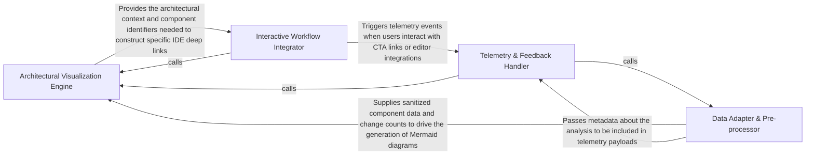

## Details

Manages the final presentation of data to the user, including GitHub comments, feedback loops, and external integrations. It handles telemetry and user feedback via PostHog, closing the feedback loop between the user and the tool. Key class/method: scripts.submit_feedback.py.

### Architectural Visualization Engine
Responsible for converting complex structural diffs and component analysis into human-readable formats, primarily generating Mermaid.js diagrams and Markdown summaries.

**Related Classes/Methods**: _None_

**Source Files:**

- [`scripts/build_cta.py`](https://github.com/CodeBoarding/CodeBoarding-action/blob/main/.codeboardingscripts/build_cta.py)
  - `scripts.build_cta.detect_editors` ([L36-L48](https://github.com/CodeBoarding/CodeBoarding-action/blob/main/.codeboardingscripts/build_cta.py#L36-L48)) - Function
  - `scripts.build_cta.webview_url` ([L62-L94](https://github.com/CodeBoarding/CodeBoarding-action/blob/main/.codeboardingscripts/build_cta.py#L62-L94)) - Function
  - `scripts.build_cta.main` ([L181-L223](https://github.com/CodeBoarding/CodeBoarding-action/blob/main/.codeboardingscripts/build_cta.py#L181-L223)) - Function
- [`scripts/diff_to_mermaid.py`](https://github.com/CodeBoarding/CodeBoarding-action/blob/main/.codeboardingscripts/diff_to_mermaid.py)
  - `scripts.diff_to_mermaid._has_changes` ([L151-L159](https://github.com/CodeBoarding/CodeBoarding-action/blob/main/.codeboardingscripts/diff_to_mermaid.py#L151-L159)) - Function
  - `scripts.diff_to_mermaid._esc` ([L247-L253](https://github.com/CodeBoarding/CodeBoarding-action/blob/main/.codeboardingscripts/diff_to_mermaid.py#L247-L253)) - Function
  - `scripts.diff_to_mermaid._Scope` ([L265-L309](https://github.com/CodeBoarding/CodeBoarding-action/blob/main/.codeboardingscripts/diff_to_mermaid.py#L265-L309)) - Class
  - `scripts.diff_to_mermaid._init_directive` ([L357-L376](https://github.com/CodeBoarding/CodeBoarding-action/blob/main/.codeboardingscripts/diff_to_mermaid.py#L357-L376)) - Function
  - `scripts.diff_to_mermaid._count_changed_components` ([L379-L386](https://github.com/CodeBoarding/CodeBoarding-action/blob/main/.codeboardingscripts/diff_to_mermaid.py#L379-L386)) - Function
  - `scripts.diff_to_mermaid._has_changed_relations` ([L389-L393](https://github.com/CodeBoarding/CodeBoarding-action/blob/main/.codeboardingscripts/diff_to_mermaid.py#L389-L393)) - Function

### Data Adapter & Pre-processor
Acts as the ingestion layer for the UX subsystem, loading state persistence files and performing transformations and metrics calculations.

**Related Classes/Methods**:

- `scripts.diff_to_mermaid._count_changed_components`:379-386

**Source Files:**

- [`scripts/diff_to_mermaid.py`](https://github.com/CodeBoarding/CodeBoarding-action/blob/main/.codeboardingscripts/diff_to_mermaid.py)
  - `scripts.diff_to_mermaid.render_mermaid.build.emit_edges` ([L435-L447](https://github.com/CodeBoarding/CodeBoarding-action/blob/main/.codeboardingscripts/diff_to_mermaid.py#L435-L447)) - Function
  - `scripts.diff_to_mermaid.render_mermaid.build.emit_level` ([L449-L466](https://github.com/CodeBoarding/CodeBoarding-action/blob/main/.codeboardingscripts/diff_to_mermaid.py#L449-L466)) - Function
- [`scripts/engine_adapter.py`](https://github.com/CodeBoarding/CodeBoarding-action/blob/main/.codeboardingscripts/engine_adapter.py)
  - `scripts.engine_adapter._count_report_issues` ([L464-L477](https://github.com/CodeBoarding/CodeBoarding-action/blob/main/.codeboardingscripts/engine_adapter.py#L464-L477)) - Function
  - `scripts.engine_adapter._count_health_report` ([L480-L488](https://github.com/CodeBoarding/CodeBoarding-action/blob/main/.codeboardingscripts/engine_adapter.py#L480-L488)) - Function
  - `scripts.engine_adapter.run_health` ([L491-L520](https://github.com/CodeBoarding/CodeBoarding-action/blob/main/.codeboardingscripts/engine_adapter.py#L491-L520)) - Function

### Interactive Workflow Integrator
Enhances the GitHub PR experience by detecting development environments and providing deep links to IDEs.

**Related Classes/Methods**:

- `scripts.build_cta.main`:181-223
- `scripts.build_cta.detect_editors`:36-48
- `scripts.build_cta.webview_url`:62-94

**Source Files:**

- [`scripts/build_cta.py`](https://github.com/CodeBoarding/CodeBoarding-action/blob/main/.codeboardingscripts/build_cta.py)
  - `scripts.build_cta._join_or` ([L97-L103](https://github.com/CodeBoarding/CodeBoarding-action/blob/main/.codeboardingscripts/build_cta.py#L97-L103)) - Function
  - `scripts.build_cta.build_cta` ([L106-L178](https://github.com/CodeBoarding/CodeBoarding-action/blob/main/.codeboardingscripts/build_cta.py#L106-L178)) - Function
  - `scripts.build_cta.build_cta.link` ([L142-L143](https://github.com/CodeBoarding/CodeBoarding-action/blob/main/.codeboardingscripts/build_cta.py#L142-L143)) - Function

### Telemetry & Feedback Handler
Manages outbound communication of user sentiment and tool performance, capturing feedback and transmitting telemetry data.

**Related Classes/Methods**: _None_

**Source Files:**

- [`scripts/diff_to_mermaid.py`](https://github.com/CodeBoarding/CodeBoarding-action/blob/main/.codeboardingscripts/diff_to_mermaid.py)
  - `scripts.diff_to_mermaid._truncate` ([L256-L258](https://github.com/CodeBoarding/CodeBoarding-action/blob/main/.codeboardingscripts/diff_to_mermaid.py#L256-L258)) - Function
  - `scripts.diff_to_mermaid.render_mermaid` ([L396-L521](https://github.com/CodeBoarding/CodeBoarding-action/blob/main/.codeboardingscripts/diff_to_mermaid.py#L396-L521)) - Function
  - `scripts.diff_to_mermaid.render_mermaid.build` ([L424-L497](https://github.com/CodeBoarding/CodeBoarding-action/blob/main/.codeboardingscripts/diff_to_mermaid.py#L424-L497)) - Function

### [FAQ](https://github.com/CodeBoarding/GeneratedOnBoardings/tree/main?tab=readme-ov-file#faq)