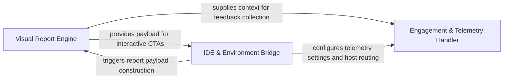

## Details

Manages the final presentation of data to the user, including GitHub comments, feedback loops, and external integrations. It handles telemetry and user feedback via PostHog, closing the feedback loop between the user and the tool. Key class/method: scripts.submit_feedback.py.

### Visual Report Engine
Translates structural analysis and diff data into human-readable formats, primarily Mermaid.js diagrams and component-level documentation.

**Related Classes/Methods**: _None_

**Source Files:**

- [`scripts/build_cta.py`](https://github.com/CodeBoarding/CodeBoarding-action/blob/main/.codeboardingscripts/build_cta.py)
  - `scripts.build_cta.detect_editors` ([L38-L50](https://github.com/CodeBoarding/CodeBoarding-action/blob/main/.codeboardingscripts/build_cta.py#L38-L50)) - Function
  - `scripts.build_cta.webview_url` ([L64-L79](https://github.com/CodeBoarding/CodeBoarding-action/blob/main/.codeboardingscripts/build_cta.py#L64-L79)) - Function
  - `scripts.build_cta._join_or` ([L82-L88](https://github.com/CodeBoarding/CodeBoarding-action/blob/main/.codeboardingscripts/build_cta.py#L82-L88)) - Function
  - `scripts.build_cta.build_cta` ([L91-L153](https://github.com/CodeBoarding/CodeBoarding-action/blob/main/.codeboardingscripts/build_cta.py#L91-L153)) - Function
  - `scripts.build_cta.build_cta.link` ([L126-L127](https://github.com/CodeBoarding/CodeBoarding-action/blob/main/.codeboardingscripts/build_cta.py#L126-L127)) - Function
  - `scripts.build_cta.main` ([L156-L192](https://github.com/CodeBoarding/CodeBoarding-action/blob/main/.codeboardingscripts/build_cta.py#L156-L192)) - Function
- [`scripts/submit_feedback.py`](https://github.com/CodeBoarding/CodeBoarding-action/blob/main/.codeboardingscripts/submit_feedback.py)
  - `scripts.submit_feedback.cap_feedback` ([L72-L76](https://github.com/CodeBoarding/CodeBoarding-action/blob/main/.codeboardingscripts/submit_feedback.py#L72-L76)) - Function
  - `scripts.submit_feedback._first` ([L79-L84](https://github.com/CodeBoarding/CodeBoarding-action/blob/main/.codeboardingscripts/submit_feedback.py#L79-L84)) - Function
  - `scripts.submit_feedback.build_properties` ([L94-L116](https://github.com/CodeBoarding/CodeBoarding-action/blob/main/.codeboardingscripts/submit_feedback.py#L94-L116)) - Function
  - `scripts.submit_feedback.build_payload` ([L119-L132](https://github.com/CodeBoarding/CodeBoarding-action/blob/main/.codeboardingscripts/submit_feedback.py#L119-L132)) - Function

### IDE & Environment Bridge
Enhances generated reports with interactive Call-to-Action elements and generates deep links for local editor navigation.

**Related Classes/Methods**:

- `scripts.build_cta.main`:156-192
- `scripts.build_cta.detect_editors`:38-50
- `scripts.build_cta.webview_url`:64-79

**Source Files:**

- [`scripts/submit_feedback.py`](https://github.com/CodeBoarding/CodeBoarding-action/blob/main/.codeboardingscripts/submit_feedback.py)
  - `scripts.submit_feedback.resolve_command` ([L43-L44](https://github.com/CodeBoarding/CodeBoarding-action/blob/main/.codeboardingscripts/submit_feedback.py#L43-L44)) - Function
  - `scripts.submit_feedback.extract_feedback` ([L55-L69](https://github.com/CodeBoarding/CodeBoarding-action/blob/main/.codeboardingscripts/submit_feedback.py#L55-L69)) - Function
  - `scripts.submit_feedback.distinct_id` ([L87-L91](https://github.com/CodeBoarding/CodeBoarding-action/blob/main/.codeboardingscripts/submit_feedback.py#L87-L91)) - Function
  - `scripts.submit_feedback.post` ([L135-L144](https://github.com/CodeBoarding/CodeBoarding-action/blob/main/.codeboardingscripts/submit_feedback.py#L135-L144)) - Function
  - `scripts.submit_feedback.main` ([L147-L172](https://github.com/CodeBoarding/CodeBoarding-action/blob/main/.codeboardingscripts/submit_feedback.py#L147-L172)) - Function

### Engagement & Telemetry Handler
Manages the outbound feedback loop by collecting user interactions and submitting telemetry data to PostHog.

**Related Classes/Methods**:

- `scripts.submit_feedback.main`:147-172

**Source Files:**

- [`scripts/submit_feedback.py`](https://github.com/CodeBoarding/CodeBoarding-action/blob/main/.codeboardingscripts/submit_feedback.py)
  - `scripts.submit_feedback.telemetry_disabled` ([L27-L31](https://github.com/CodeBoarding/CodeBoarding-action/blob/main/.codeboardingscripts/submit_feedback.py#L27-L31)) - Function
  - `scripts.submit_feedback.resolve_key` ([L34-L35](https://github.com/CodeBoarding/CodeBoarding-action/blob/main/.codeboardingscripts/submit_feedback.py#L34-L35)) - Function
  - `scripts.submit_feedback.resolve_host` ([L38-L40](https://github.com/CodeBoarding/CodeBoarding-action/blob/main/.codeboardingscripts/submit_feedback.py#L38-L40)) - Function
  - `scripts.submit_feedback.resolve_max_chars` ([L47-L52](https://github.com/CodeBoarding/CodeBoarding-action/blob/main/.codeboardingscripts/submit_feedback.py#L47-L52)) - Function

### [FAQ](https://github.com/CodeBoarding/GeneratedOnBoardings/tree/main?tab=readme-ov-file#faq)