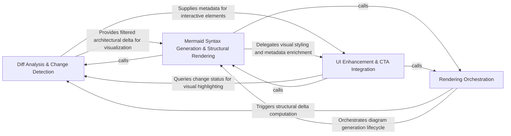

## Details

Responsible for the structural comparison between the current code state and the baseline. It identifies modified components, relations, and methods, then transforms these differences into Mermaid.js syntax for visual representation within GitHub.

### Diff Analysis & Change Detection
Identifies the structural delta between the current code state and the baseline, filtering for architecturally significant modifications.

**Related Classes/Methods**: _None_

**Source Files:**

- [`scripts/build_component_files.py`](https://github.com/CodeBoarding/CodeBoarding-action/blob/sync-e2e-test/.codeboardingscripts/build_component_files.py)
  - `scripts.build_component_files._block` ([L104-L121](https://github.com/CodeBoarding/CodeBoarding-action/blob/sync-e2e-test/.codeboardingscripts/build_component_files.py#L104-L121)) - Function
  - `scripts.build_component_files.render_component_files` ([L124-L175](https://github.com/CodeBoarding/CodeBoarding-action/blob/sync-e2e-test/.codeboardingscripts/build_component_files.py#L124-L175)) - Function
  - `scripts.build_component_files.main` ([L178-L216](https://github.com/CodeBoarding/CodeBoarding-action/blob/sync-e2e-test/.codeboardingscripts/build_component_files.py#L178-L216)) - Function
- [`scripts/diff_to_mermaid.py`](https://github.com/CodeBoarding/CodeBoarding-action/blob/sync-e2e-test/.codeboardingscripts/diff_to_mermaid.py)
  - `scripts.diff_to_mermaid._comp_id` ([L111-L112](https://github.com/CodeBoarding/CodeBoarding-action/blob/sync-e2e-test/.codeboardingscripts/diff_to_mermaid.py#L111-L112)) - Function
  - `scripts.diff_to_mermaid._Scope` ([L316-L360](https://github.com/CodeBoarding/CodeBoarding-action/blob/sync-e2e-test/.codeboardingscripts/diff_to_mermaid.py#L316-L360)) - Class
  - `scripts.diff_to_mermaid._Scope.__init__` ([L327-L349](https://github.com/CodeBoarding/CodeBoarding-action/blob/sync-e2e-test/.codeboardingscripts/diff_to_mermaid.py#L327-L349)) - Method
  - `scripts.diff_to_mermaid._Scope.resolve` ([L351-L360](https://github.com/CodeBoarding/CodeBoarding-action/blob/sync-e2e-test/.codeboardingscripts/diff_to_mermaid.py#L351-L360)) - Method

### Mermaid Syntax Generation & Structural Rendering
Maps architectural entities and their relationships to Mermaid.js syntax, managing hierarchical scoping and visual styling.

**Related Classes/Methods**: _None_

**Source Files:**

- [`scripts/diff_to_mermaid.py`](https://github.com/CodeBoarding/CodeBoarding-action/blob/sync-e2e-test/.codeboardingscripts/diff_to_mermaid.py)
  - `scripts.diff_to_mermaid._comp_name` ([L115-L116](https://github.com/CodeBoarding/CodeBoarding-action/blob/sync-e2e-test/.codeboardingscripts/diff_to_mermaid.py#L115-L116)) - Function
  - `scripts.diff_to_mermaid._file_methods` ([L119-L120](https://github.com/CodeBoarding/CodeBoarding-action/blob/sync-e2e-test/.codeboardingscripts/diff_to_mermaid.py#L119-L120)) - Function
  - `scripts.diff_to_mermaid._diff_relations` ([L153-L199](https://github.com/CodeBoarding/CodeBoarding-action/blob/sync-e2e-test/.codeboardingscripts/diff_to_mermaid.py#L153-L199)) - Function
  - `scripts.diff_to_mermaid._diff_components` ([L213-L258](https://github.com/CodeBoarding/CodeBoarding-action/blob/sync-e2e-test/.codeboardingscripts/diff_to_mermaid.py#L213-L258)) - Function
  - `scripts.diff_to_mermaid._esc` ([L298-L304](https://github.com/CodeBoarding/CodeBoarding-action/blob/sync-e2e-test/.codeboardingscripts/diff_to_mermaid.py#L298-L304)) - Function
  - `scripts.diff_to_mermaid._display_status` ([L312-L313](https://github.com/CodeBoarding/CodeBoarding-action/blob/sync-e2e-test/.codeboardingscripts/diff_to_mermaid.py#L312-L313)) - Function
  - `scripts.diff_to_mermaid._filter_changed` ([L363-L405](https://github.com/CodeBoarding/CodeBoarding-action/blob/sync-e2e-test/.codeboardingscripts/diff_to_mermaid.py#L363-L405)) - Function
  - `scripts.diff_to_mermaid._filter_changed.touches` ([L396-L398](https://github.com/CodeBoarding/CodeBoarding-action/blob/sync-e2e-test/.codeboardingscripts/diff_to_mermaid.py#L396-L398)) - Function
  - `scripts.diff_to_mermaid._count_changed_components` ([L430-L437](https://github.com/CodeBoarding/CodeBoarding-action/blob/sync-e2e-test/.codeboardingscripts/diff_to_mermaid.py#L430-L437)) - Function
  - `scripts.diff_to_mermaid._has_changed_relations` ([L440-L444](https://github.com/CodeBoarding/CodeBoarding-action/blob/sync-e2e-test/.codeboardingscripts/diff_to_mermaid.py#L440-L444)) - Function

### UI Enhancement & CTA Integration
Enriches rendered diagrams with interactive elements, generating deep links for IDEs and webview URLs.

**Related Classes/Methods**: _None_

**Source Files:**

- [`scripts/diff_to_mermaid.py`](https://github.com/CodeBoarding/CodeBoarding-action/blob/sync-e2e-test/.codeboardingscripts/diff_to_mermaid.py)
  - `scripts.diff_to_mermaid.load_analysis` ([L87-L105](https://github.com/CodeBoarding/CodeBoarding-action/blob/sync-e2e-test/.codeboardingscripts/diff_to_mermaid.py#L87-L105)) - Function
  - `scripts.diff_to_mermaid._rel_key` ([L147-L150](https://github.com/CodeBoarding/CodeBoarding-action/blob/sync-e2e-test/.codeboardingscripts/diff_to_mermaid.py#L147-L150)) - Function
  - `scripts.diff_to_mermaid.build_diff` ([L261-L268](https://github.com/CodeBoarding/CodeBoarding-action/blob/sync-e2e-test/.codeboardingscripts/diff_to_mermaid.py#L261-L268)) - Function
  - `scripts.diff_to_mermaid._sanitize` ([L274-L276](https://github.com/CodeBoarding/CodeBoarding-action/blob/sync-e2e-test/.codeboardingscripts/diff_to_mermaid.py#L274-L276)) - Function
  - `scripts.diff_to_mermaid._truncate` ([L307-L309](https://github.com/CodeBoarding/CodeBoarding-action/blob/sync-e2e-test/.codeboardingscripts/diff_to_mermaid.py#L307-L309)) - Function
  - `scripts.diff_to_mermaid.render_mermaid` ([L447-L572](https://github.com/CodeBoarding/CodeBoarding-action/blob/sync-e2e-test/.codeboardingscripts/diff_to_mermaid.py#L447-L572)) - Function
  - `scripts.diff_to_mermaid.render_mermaid.build` ([L475-L548](https://github.com/CodeBoarding/CodeBoarding-action/blob/sync-e2e-test/.codeboardingscripts/diff_to_mermaid.py#L475-L548)) - Function
  - `scripts.diff_to_mermaid.render_mermaid.build.emit_edges` ([L486-L498](https://github.com/CodeBoarding/CodeBoarding-action/blob/sync-e2e-test/.codeboardingscripts/diff_to_mermaid.py#L486-L498)) - Function
  - `scripts.diff_to_mermaid.render_mermaid.build.emit_level` ([L500-L517](https://github.com/CodeBoarding/CodeBoarding-action/blob/sync-e2e-test/.codeboardingscripts/diff_to_mermaid.py#L500-L517)) - Function
  - `scripts.diff_to_mermaid.main` ([L578-L619](https://github.com/CodeBoarding/CodeBoarding-action/blob/sync-e2e-test/.codeboardingscripts/diff_to_mermaid.py#L578-L619)) - Function

### Rendering Orchestration
Acts as the controller for the subsystem, managing the execution lifecycle and sequencing the flow from diff detection to final output.

**Related Classes/Methods**: _None_

**Source Files:**

- [`scripts/diff_to_mermaid.py`](https://github.com/CodeBoarding/CodeBoarding-action/blob/sync-e2e-test/.codeboardingscripts/diff_to_mermaid.py)
  - `scripts.diff_to_mermaid._methods_by_file` ([L123-L130](https://github.com/CodeBoarding/CodeBoarding-action/blob/sync-e2e-test/.codeboardingscripts/diff_to_mermaid.py#L123-L130)) - Function
  - `scripts.diff_to_mermaid._has_structural_changes` ([L133-L136](https://github.com/CodeBoarding/CodeBoarding-action/blob/sync-e2e-test/.codeboardingscripts/diff_to_mermaid.py#L133-L136)) - Function
  - `scripts.diff_to_mermaid._has_method_changes` ([L139-L144](https://github.com/CodeBoarding/CodeBoarding-action/blob/sync-e2e-test/.codeboardingscripts/diff_to_mermaid.py#L139-L144)) - Function
  - `scripts.diff_to_mermaid._has_changes` ([L202-L210](https://github.com/CodeBoarding/CodeBoarding-action/blob/sync-e2e-test/.codeboardingscripts/diff_to_mermaid.py#L202-L210)) - Function
  - `scripts.diff_to_mermaid._init_directive` ([L408-L427](https://github.com/CodeBoarding/CodeBoarding-action/blob/sync-e2e-test/.codeboardingscripts/diff_to_mermaid.py#L408-L427)) - Function

### [FAQ](https://github.com/CodeBoarding/GeneratedOnBoardings/tree/main?tab=readme-ov-file#faq)