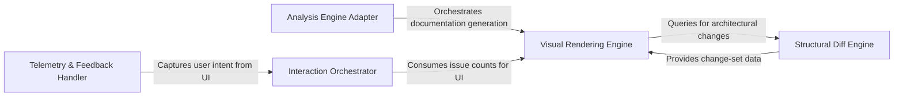

## Details

The CodeBoarding-action is a CI/CD integration tool designed to automate the analysis of code changes and visualize their architectural impact within GitHub Pull Requests. The system operates as a pipeline: it first interfaces with an external analysis engine to retrieve structural metadata, then performs a differential analysis between the current state and the base branch. This diff is then transformed into visual representations (Mermaid.js diagrams) and interactive Call-to-Action (CTA) elements. Finally, the system handles telemetry and feedback loops to refine the analysis quality, ensuring that developers receive a concise, visual summary of how their changes affect the broader system architecture.

### Analysis Engine Adapter
Manages the lifecycle of architectural analysis by interfacing with the core engine to load metadata, handle quotas, and manage incremental vs. full analysis states.

**Related Classes/Methods**:

- `scripts.engine_adapter._load_analysis`:207-214
- `scripts.engine_adapter._incremental_or_full`:436-480
- `scripts.engine_adapter._flag_quota_exhausted`:174-183
- `scripts.engine_adapter._count_health_report`:618-626

**Source Files:**

- [`scripts/engine_adapter.py`](https://github.com/CodeBoarding/CodeBoarding-action/blob/main/.codeboardingscripts/engine_adapter.py)
  - `scripts.engine_adapter._require_engine` ([L113-L129](https://github.com/CodeBoarding/CodeBoarding-action/blob/main/.codeboardingscripts/engine_adapter.py#L113-L129)) - Function
  - `scripts.engine_adapter._max_depth` ([L146-L147](https://github.com/CodeBoarding/CodeBoarding-action/blob/main/.codeboardingscripts/engine_adapter.py#L146-L147)) - Function
  - `scripts.engine_adapter._is_quota_exhausted` ([L156-L171](https://github.com/CodeBoarding/CodeBoarding-action/blob/main/.codeboardingscripts/engine_adapter.py#L156-L171)) - Function
  - `scripts.engine_adapter._flag_quota_exhausted` ([L174-L183](https://github.com/CodeBoarding/CodeBoarding-action/blob/main/.codeboardingscripts/engine_adapter.py#L174-L183)) - Function
  - `scripts.engine_adapter._log_path` ([L186-L187](https://github.com/CodeBoarding/CodeBoarding-action/blob/main/.codeboardingscripts/engine_adapter.py#L186-L187)) - Function
  - `scripts.engine_adapter._run_ctx` ([L190-L195](https://github.com/CodeBoarding/CodeBoarding-action/blob/main/.codeboardingscripts/engine_adapter.py#L190-L195)) - Function
  - `scripts.engine_adapter._clear_dir` ([L198-L204](https://github.com/CodeBoarding/CodeBoarding-action/blob/main/.codeboardingscripts/engine_adapter.py#L198-L204)) - Function
  - `scripts.engine_adapter._load_analysis` ([L207-L214](https://github.com/CodeBoarding/CodeBoarding-action/blob/main/.codeboardingscripts/engine_adapter.py#L207-L214)) - Function
  - `scripts.engine_adapter._load_metadata` ([L217-L222](https://github.com/CodeBoarding/CodeBoarding-action/blob/main/.codeboardingscripts/engine_adapter.py#L217-L222)) - Function
  - `scripts.engine_adapter._metadata_depth` ([L225-L229](https://github.com/CodeBoarding/CodeBoarding-action/blob/main/.codeboardingscripts/engine_adapter.py#L225-L229)) - Function
  - `scripts.engine_adapter._resolve_depth` ([L232-L261](https://github.com/CodeBoarding/CodeBoarding-action/blob/main/.codeboardingscripts/engine_adapter.py#L232-L261)) - Function
  - `scripts.engine_adapter._analysis_depth_or_default` ([L264-L268](https://github.com/CodeBoarding/CodeBoarding-action/blob/main/.codeboardingscripts/engine_adapter.py#L264-L268)) - Function
  - `scripts.engine_adapter._metadata_commit` ([L271-L273](https://github.com/CodeBoarding/CodeBoarding-action/blob/main/.codeboardingscripts/engine_adapter.py#L271-L273)) - Function
  - `scripts.engine_adapter._analysis_model_error` ([L276-L296](https://github.com/CodeBoarding/CodeBoarding-action/blob/main/.codeboardingscripts/engine_adapter.py#L276-L296)) - Function
  - `scripts.engine_adapter.baseline_info` ([L299-L309](https://github.com/CodeBoarding/CodeBoarding-action/blob/main/.codeboardingscripts/engine_adapter.py#L299-L309)) - Function
  - `scripts.engine_adapter.baseline_depth` ([L312-L327](https://github.com/CodeBoarding/CodeBoarding-action/blob/main/.codeboardingscripts/engine_adapter.py#L312-L327)) - Function
  - `scripts.engine_adapter.validate_base_analysis` ([L330-L395](https://github.com/CodeBoarding/CodeBoarding-action/blob/main/.codeboardingscripts/engine_adapter.py#L330-L395)) - Function
  - `scripts.engine_adapter.run_base` ([L398-L401](https://github.com/CodeBoarding/CodeBoarding-action/blob/main/.codeboardingscripts/engine_adapter.py#L398-L401)) - Function
  - `scripts.engine_adapter.run_seed` ([L404-L433](https://github.com/CodeBoarding/CodeBoarding-action/blob/main/.codeboardingscripts/engine_adapter.py#L404-L433)) - Function
  - `scripts.engine_adapter._incremental_or_full` ([L436-L480](https://github.com/CodeBoarding/CodeBoarding-action/blob/main/.codeboardingscripts/engine_adapter.py#L436-L480)) - Function
  - `scripts.engine_adapter.run_head` ([L483-L517](https://github.com/CodeBoarding/CodeBoarding-action/blob/main/.codeboardingscripts/engine_adapter.py#L483-L517)) - Function
  - `scripts.engine_adapter.run_analyze` ([L520-L569](https://github.com/CodeBoarding/CodeBoarding-action/blob/main/.codeboardingscripts/engine_adapter.py#L520-L569)) - Function
  - `scripts.engine_adapter.run_analyze.full` ([L541-L548](https://github.com/CodeBoarding/CodeBoarding-action/blob/main/.codeboardingscripts/engine_adapter.py#L541-L548)) - Function
  - `scripts.engine_adapter.run_render` ([L572-L583](https://github.com/CodeBoarding/CodeBoarding-action/blob/main/.codeboardingscripts/engine_adapter.py#L572-L583)) - Function
  - `scripts.engine_adapter.run_concat` ([L586-L599](https://github.com/CodeBoarding/CodeBoarding-action/blob/main/.codeboardingscripts/engine_adapter.py#L586-L599)) - Function
  - `scripts.engine_adapter._count_report_issues` ([L602-L615](https://github.com/CodeBoarding/CodeBoarding-action/blob/main/.codeboardingscripts/engine_adapter.py#L602-L615)) - Function
  - `scripts.engine_adapter._count_health_report` ([L618-L626](https://github.com/CodeBoarding/CodeBoarding-action/blob/main/.codeboardingscripts/engine_adapter.py#L618-L626)) - Function
  - `scripts.engine_adapter.run_health` ([L629-L655](https://github.com/CodeBoarding/CodeBoarding-action/blob/main/.codeboardingscripts/engine_adapter.py#L629-L655)) - Function
  - `scripts.engine_adapter.main` ([L658-L764](https://github.com/CodeBoarding/CodeBoarding-action/blob/main/.codeboardingscripts/engine_adapter.py#L658-L764)) - Function

### Visual Rendering Engine
Transforms raw architectural data and component definitions into formatted Mermaid.js diagrams and structured file representations for UI display.

**Related Classes/Methods**:

- `scripts.diff_to_mermaid.render_mermaid`:447-572
- `scripts.build_component_files.render_component_files`:124-175
- `scripts.diff_to_mermaid._display_status`:312-313
- `scripts.diff_to_mermaid._init_directive`:408-427

**Source Files:**

- [`scripts/build_component_files.py`](https://github.com/CodeBoarding/CodeBoarding-action/blob/main/.codeboardingscripts/build_component_files.py)
  - `scripts.build_component_files._block` ([L104-L121](https://github.com/CodeBoarding/CodeBoarding-action/blob/main/.codeboardingscripts/build_component_files.py#L104-L121)) - Function
  - `scripts.build_component_files.render_component_files` ([L124-L175](https://github.com/CodeBoarding/CodeBoarding-action/blob/main/.codeboardingscripts/build_component_files.py#L124-L175)) - Function
- [`scripts/diff_to_mermaid.py`](https://github.com/CodeBoarding/CodeBoarding-action/blob/main/.codeboardingscripts/diff_to_mermaid.py)
  - `scripts.diff_to_mermaid._comp_id` ([L111-L112](https://github.com/CodeBoarding/CodeBoarding-action/blob/main/.codeboardingscripts/diff_to_mermaid.py#L111-L112)) - Function
  - `scripts.diff_to_mermaid._comp_name` ([L115-L116](https://github.com/CodeBoarding/CodeBoarding-action/blob/main/.codeboardingscripts/diff_to_mermaid.py#L115-L116)) - Function
  - `scripts.diff_to_mermaid._has_changes` ([L202-L210](https://github.com/CodeBoarding/CodeBoarding-action/blob/main/.codeboardingscripts/diff_to_mermaid.py#L202-L210)) - Function
  - `scripts.diff_to_mermaid._sanitize` ([L274-L276](https://github.com/CodeBoarding/CodeBoarding-action/blob/main/.codeboardingscripts/diff_to_mermaid.py#L274-L276)) - Function
  - `scripts.diff_to_mermaid._esc` ([L298-L304](https://github.com/CodeBoarding/CodeBoarding-action/blob/main/.codeboardingscripts/diff_to_mermaid.py#L298-L304)) - Function
  - `scripts.diff_to_mermaid._truncate` ([L307-L309](https://github.com/CodeBoarding/CodeBoarding-action/blob/main/.codeboardingscripts/diff_to_mermaid.py#L307-L309)) - Function
  - `scripts.diff_to_mermaid._display_status` ([L312-L313](https://github.com/CodeBoarding/CodeBoarding-action/blob/main/.codeboardingscripts/diff_to_mermaid.py#L312-L313)) - Function
  - `scripts.diff_to_mermaid._Scope` ([L316-L360](https://github.com/CodeBoarding/CodeBoarding-action/blob/main/.codeboardingscripts/diff_to_mermaid.py#L316-L360)) - Class
  - `scripts.diff_to_mermaid._Scope.__init__` ([L327-L349](https://github.com/CodeBoarding/CodeBoarding-action/blob/main/.codeboardingscripts/diff_to_mermaid.py#L327-L349)) - Method
  - `scripts.diff_to_mermaid._Scope.resolve` ([L351-L360](https://github.com/CodeBoarding/CodeBoarding-action/blob/main/.codeboardingscripts/diff_to_mermaid.py#L351-L360)) - Method
  - `scripts.diff_to_mermaid._filter_changed` ([L363-L405](https://github.com/CodeBoarding/CodeBoarding-action/blob/main/.codeboardingscripts/diff_to_mermaid.py#L363-L405)) - Function
  - `scripts.diff_to_mermaid._filter_changed.touches` ([L396-L398](https://github.com/CodeBoarding/CodeBoarding-action/blob/main/.codeboardingscripts/diff_to_mermaid.py#L396-L398)) - Function
  - `scripts.diff_to_mermaid._init_directive` ([L408-L427](https://github.com/CodeBoarding/CodeBoarding-action/blob/main/.codeboardingscripts/diff_to_mermaid.py#L408-L427)) - Function
  - `scripts.diff_to_mermaid._count_changed_components` ([L430-L437](https://github.com/CodeBoarding/CodeBoarding-action/blob/main/.codeboardingscripts/diff_to_mermaid.py#L430-L437)) - Function
  - `scripts.diff_to_mermaid._has_changed_relations` ([L440-L444](https://github.com/CodeBoarding/CodeBoarding-action/blob/main/.codeboardingscripts/diff_to_mermaid.py#L440-L444)) - Function
  - `scripts.diff_to_mermaid.render_mermaid` ([L447-L572](https://github.com/CodeBoarding/CodeBoarding-action/blob/main/.codeboardingscripts/diff_to_mermaid.py#L447-L572)) - Function
  - `scripts.diff_to_mermaid.render_mermaid.build` ([L475-L548](https://github.com/CodeBoarding/CodeBoarding-action/blob/main/.codeboardingscripts/diff_to_mermaid.py#L475-L548)) - Function
  - `scripts.diff_to_mermaid.render_mermaid.build.emit_edges` ([L486-L498](https://github.com/CodeBoarding/CodeBoarding-action/blob/main/.codeboardingscripts/diff_to_mermaid.py#L486-L498)) - Function
  - `scripts.diff_to_mermaid.render_mermaid.build.emit_level` ([L500-L517](https://github.com/CodeBoarding/CodeBoarding-action/blob/main/.codeboardingscripts/diff_to_mermaid.py#L500-L517)) - Function

### Structural Diff Engine
Compares project analysis states to identify structural changes in methods, files, and component relationships across different git refs.

**Related Classes/Methods**:

- `scripts.diff_to_mermaid._diff_components`:213-258
- `scripts.diff_to_mermaid._has_structural_changes`:133-136
- `scripts.build_component_files._changed_files_for`:88-101
- `scripts.build_component_files._subtree_methods`:77-85

**Source Files:**

- [`scripts/build_component_files.py`](https://github.com/CodeBoarding/CodeBoarding-action/blob/main/.codeboardingscripts/build_component_files.py)
  - `scripts.build_component_files._walk` ([L56-L62](https://github.com/CodeBoarding/CodeBoarding-action/blob/main/.codeboardingscripts/build_component_files.py#L56-L62)) - Function
  - `scripts.build_component_files._subtree_files` ([L65-L74](https://github.com/CodeBoarding/CodeBoarding-action/blob/main/.codeboardingscripts/build_component_files.py#L65-L74)) - Function
  - `scripts.build_component_files._subtree_methods` ([L77-L85](https://github.com/CodeBoarding/CodeBoarding-action/blob/main/.codeboardingscripts/build_component_files.py#L77-L85)) - Function
  - `scripts.build_component_files._changed_files_for` ([L88-L101](https://github.com/CodeBoarding/CodeBoarding-action/blob/main/.codeboardingscripts/build_component_files.py#L88-L101)) - Function
  - `scripts.build_component_files.main` ([L178-L216](https://github.com/CodeBoarding/CodeBoarding-action/blob/main/.codeboardingscripts/build_component_files.py#L178-L216)) - Function
- [`scripts/diff_to_mermaid.py`](https://github.com/CodeBoarding/CodeBoarding-action/blob/main/.codeboardingscripts/diff_to_mermaid.py)
  - `scripts.diff_to_mermaid._relation_dict` ([L50-L58](https://github.com/CodeBoarding/CodeBoarding-action/blob/main/.codeboardingscripts/diff_to_mermaid.py#L50-L58)) - Function
  - `scripts.diff_to_mermaid._project_analysis` ([L61-L77](https://github.com/CodeBoarding/CodeBoarding-action/blob/main/.codeboardingscripts/diff_to_mermaid.py#L61-L77)) - Function
  - `scripts.diff_to_mermaid._project_analysis.project_level` ([L65-L74](https://github.com/CodeBoarding/CodeBoarding-action/blob/main/.codeboardingscripts/diff_to_mermaid.py#L65-L74)) - Function
  - `scripts.diff_to_mermaid.read_analysis_json` ([L80-L84](https://github.com/CodeBoarding/CodeBoarding-action/blob/main/.codeboardingscripts/diff_to_mermaid.py#L80-L84)) - Function
  - `scripts.diff_to_mermaid.load_analysis` ([L87-L105](https://github.com/CodeBoarding/CodeBoarding-action/blob/main/.codeboardingscripts/diff_to_mermaid.py#L87-L105)) - Function
  - `scripts.diff_to_mermaid._file_methods` ([L119-L120](https://github.com/CodeBoarding/CodeBoarding-action/blob/main/.codeboardingscripts/diff_to_mermaid.py#L119-L120)) - Function
  - `scripts.diff_to_mermaid._methods_by_file` ([L123-L130](https://github.com/CodeBoarding/CodeBoarding-action/blob/main/.codeboardingscripts/diff_to_mermaid.py#L123-L130)) - Function
  - `scripts.diff_to_mermaid._has_structural_changes` ([L133-L136](https://github.com/CodeBoarding/CodeBoarding-action/blob/main/.codeboardingscripts/diff_to_mermaid.py#L133-L136)) - Function
  - `scripts.diff_to_mermaid._has_method_changes` ([L139-L144](https://github.com/CodeBoarding/CodeBoarding-action/blob/main/.codeboardingscripts/diff_to_mermaid.py#L139-L144)) - Function
  - `scripts.diff_to_mermaid._rel_key` ([L147-L150](https://github.com/CodeBoarding/CodeBoarding-action/blob/main/.codeboardingscripts/diff_to_mermaid.py#L147-L150)) - Function
  - `scripts.diff_to_mermaid._diff_relations` ([L153-L199](https://github.com/CodeBoarding/CodeBoarding-action/blob/main/.codeboardingscripts/diff_to_mermaid.py#L153-L199)) - Function
  - `scripts.diff_to_mermaid._diff_components` ([L213-L258](https://github.com/CodeBoarding/CodeBoarding-action/blob/main/.codeboardingscripts/diff_to_mermaid.py#L213-L258)) - Function
  - `scripts.diff_to_mermaid.build_diff` ([L261-L268](https://github.com/CodeBoarding/CodeBoarding-action/blob/main/.codeboardingscripts/diff_to_mermaid.py#L261-L268)) - Function
  - `scripts.diff_to_mermaid.main` ([L578-L619](https://github.com/CodeBoarding/CodeBoarding-action/blob/main/.codeboardingscripts/diff_to_mermaid.py#L578-L619)) - Function

### Telemetry & Feedback Handler
Collects execution metadata and user feedback to submit diagnostic payloads to a remote tracking service.

**Related Classes/Methods**:

- `scripts.submit_feedback.build_payload`:119-132
- `scripts.submit_feedback.post`:135-144
- `scripts.submit_feedback.extract_feedback`:55-69
- `scripts.submit_feedback.resolve_command`:43-44

**Source Files:**

- [`scripts/submit_feedback.py`](https://github.com/CodeBoarding/CodeBoarding-action/blob/main/.codeboardingscripts/submit_feedback.py)
  - `scripts.submit_feedback.telemetry_disabled` ([L27-L31](https://github.com/CodeBoarding/CodeBoarding-action/blob/main/.codeboardingscripts/submit_feedback.py#L27-L31)) - Function
  - `scripts.submit_feedback.resolve_key` ([L34-L35](https://github.com/CodeBoarding/CodeBoarding-action/blob/main/.codeboardingscripts/submit_feedback.py#L34-L35)) - Function
  - `scripts.submit_feedback.resolve_host` ([L38-L40](https://github.com/CodeBoarding/CodeBoarding-action/blob/main/.codeboardingscripts/submit_feedback.py#L38-L40)) - Function
  - `scripts.submit_feedback.resolve_command` ([L43-L44](https://github.com/CodeBoarding/CodeBoarding-action/blob/main/.codeboardingscripts/submit_feedback.py#L43-L44)) - Function
  - `scripts.submit_feedback.resolve_max_chars` ([L47-L52](https://github.com/CodeBoarding/CodeBoarding-action/blob/main/.codeboardingscripts/submit_feedback.py#L47-L52)) - Function
  - `scripts.submit_feedback.extract_feedback` ([L55-L69](https://github.com/CodeBoarding/CodeBoarding-action/blob/main/.codeboardingscripts/submit_feedback.py#L55-L69)) - Function
  - `scripts.submit_feedback.cap_feedback` ([L72-L76](https://github.com/CodeBoarding/CodeBoarding-action/blob/main/.codeboardingscripts/submit_feedback.py#L72-L76)) - Function
  - `scripts.submit_feedback._first` ([L79-L84](https://github.com/CodeBoarding/CodeBoarding-action/blob/main/.codeboardingscripts/submit_feedback.py#L79-L84)) - Function
  - `scripts.submit_feedback.distinct_id` ([L87-L91](https://github.com/CodeBoarding/CodeBoarding-action/blob/main/.codeboardingscripts/submit_feedback.py#L87-L91)) - Function
  - `scripts.submit_feedback.build_properties` ([L94-L116](https://github.com/CodeBoarding/CodeBoarding-action/blob/main/.codeboardingscripts/submit_feedback.py#L94-L116)) - Function
  - `scripts.submit_feedback.build_payload` ([L119-L132](https://github.com/CodeBoarding/CodeBoarding-action/blob/main/.codeboardingscripts/submit_feedback.py#L119-L132)) - Function
  - `scripts.submit_feedback.post` ([L135-L144](https://github.com/CodeBoarding/CodeBoarding-action/blob/main/.codeboardingscripts/submit_feedback.py#L135-L144)) - Function
  - `scripts.submit_feedback.main` ([L147-L172](https://github.com/CodeBoarding/CodeBoarding-action/blob/main/.codeboardingscripts/submit_feedback.py#L147-L172)) - Function

### Interaction Orchestrator
Generates interactive Call-to-Action (CTA) links and webview URLs to facilitate developer engagement with the analysis results.

**Related Classes/Methods**:

- `scripts.build_cta.build_cta`:93-152
- `scripts.build_cta.webview_url`:63-81
- `scripts.build_cta.detect_editors`:37-49
- `scripts.build_cta.main`:155-189

**Source Files:**

- [`scripts/build_cta.py`](https://github.com/CodeBoarding/CodeBoarding-action/blob/main/.codeboardingscripts/build_cta.py)
  - `scripts.build_cta.detect_editors` ([L37-L49](https://github.com/CodeBoarding/CodeBoarding-action/blob/main/.codeboardingscripts/build_cta.py#L37-L49)) - Function
  - `scripts.build_cta.webview_url` ([L63-L81](https://github.com/CodeBoarding/CodeBoarding-action/blob/main/.codeboardingscripts/build_cta.py#L63-L81)) - Function
  - `scripts.build_cta._join_or` ([L84-L90](https://github.com/CodeBoarding/CodeBoarding-action/blob/main/.codeboardingscripts/build_cta.py#L84-L90)) - Function
  - `scripts.build_cta.build_cta` ([L93-L152](https://github.com/CodeBoarding/CodeBoarding-action/blob/main/.codeboardingscripts/build_cta.py#L93-L152)) - Function
  - `scripts.build_cta.build_cta.link` ([L126-L127](https://github.com/CodeBoarding/CodeBoarding-action/blob/main/.codeboardingscripts/build_cta.py#L126-L127)) - Function
  - `scripts.build_cta.main` ([L155-L189](https://github.com/CodeBoarding/CodeBoarding-action/blob/main/.codeboardingscripts/build_cta.py#L155-L189)) - Function

### [FAQ](https://github.com/CodeBoarding/GeneratedOnBoardings/tree/main?tab=readme-ov-file#faq)