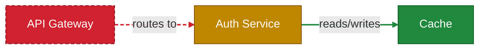

<div align="center">
  

  # CodeBoarding Visual Architecture Review

  Visual system-design review for pull requests. CodeBoarding analyzes the architecture before and after a change, then comments on the PR with an inline Mermaid diagram showing what changed.
</div>

## What It Does

- Builds or reuses a baseline architecture analysis for the PR base.
- Runs incremental analysis on the PR head, then diffs components and relationships.
- Posts a sticky PR comment with an inline Mermaid map — 🟩 added · 🟨 modified · 🟥 deleted (dashed), for both nodes and edges.

A PR comment looks like this:



## Usage

Create `.github/workflows/codeboarding.yml`:

```yaml
name: CodeBoarding review

on:
  pull_request:
    # Generate ONCE, when the PR becomes reviewable — not on every push, so you
    # don't spend an LLM job per commit. Use [opened] for strictly creation-only,
    # or add `synchronize` to re-run on each push. Refresh anytime with /codeboarding.
    types: [opened, reopened, ready_for_review]
  issue_comment:
    types: [created]

permissions:
  contents: read
  pull-requests: write
  issues: write

concurrency:
  group: codeboarding-${{ github.event.pull_request.number || github.event.issue.number }}
  cancel-in-progress: true

jobs:
  review:
    runs-on: ubuntu-latest
    timeout-minutes: 60
    if: >
      (github.event_name == 'pull_request' && github.event.pull_request.draft == false) ||
      (github.event_name == 'issue_comment' && github.event.issue.pull_request != null &&
       contains(fromJSON('["OWNER","MEMBER","COLLABORATOR"]'), github.event.comment.author_association))
    steps:
      - uses: CodeBoarding/CodeBoarding-action@v1
        with:
          llm_api_key: ${{ secrets.OPENROUTER_API_KEY }}
```

Add the API key as a repository secret (**Settings → Secrets and variables → Actions**):

```text
OPENROUTER_API_KEY = sk-or-...
```

That's the only required setup — it's passed via `llm_api_key` above. (For local runs with `scripts/run_local.sh`, export `OPENROUTER_API_KEY` as an env var instead.)

**Models are optional.** Omit `agent_model` / `parsing_model` to use the engine's default for your provider, or pin them — inline or from a repository **variable** (a model name isn't a secret, so use `vars.`, not `secrets.`):

```yaml
        with:
          llm_api_key:   ${{ secrets.OPENROUTER_API_KEY }}  # secret
          agent_model:   anthropic/claude-sonnet-4          # optional; or ${{ vars.AGENT_MODEL }}
          parsing_model: google/gemini-3-flash-preview      # optional
```

**Model format (OpenRouter):** a bare OpenRouter slug (e.g. `anthropic/claude-sonnet-4`) — exactly one `/`, **no `openrouter/` prefix** (that's the LiteLLM form; the action rejects it early). Other providers use their own native model ids.

## Bring your own LLM provider

OpenRouter is the default, but you can use any provider the engine supports — set `llm_provider` and pass that provider's key:

```yaml
        with:
          llm_provider: anthropic                  # omit for OpenRouter (default)
          llm_api_key:  ${{ secrets.ANTHROPIC_API_KEY }}
```

`llm_provider: <name>` hands your key to the engine as `<NAME>_API_KEY`, and the engine auto-selects that provider. Set **exactly one** key per run.

<details><summary><strong>Supported providers</strong></summary>

| `llm_provider` | env var the engine reads |
|---|---|
| `openrouter` *(default)* | `OPENROUTER_API_KEY` |
| `openai` | `OPENAI_API_KEY` |
| `anthropic` | `ANTHROPIC_API_KEY` |
| `google` | `GOOGLE_API_KEY` |
| `vercel` | `VERCEL_API_KEY` |
| `deepseek` | `DEEPSEEK_API_KEY` |
| `cerebras` | `CEREBRAS_API_KEY` |
| `glm` / `kimi` | `GLM_API_KEY` / `KIMI_API_KEY` |
| `aws_bedrock` | `AWS_BEARER_TOKEN_BEDROCK` |
| `ollama` | `OLLAMA_BASE_URL` |

This table mirrors the engine and may lag it — the source of truth is the engine's provider registry ([`agents/llm_config.py`](https://github.com/CodeBoarding/CodeBoarding/blob/main/agents/llm_config.py)). Any provider it adds that follows the `<NAME>_API_KEY` convention works here with no action change.

</details>

## When it runs

- **PR opened / reopened / marked ready** — generated once (per the `on:` triggers above). It does **not** re-run on every push, so you never spend an LLM job per commit; the comment reflects that point until refreshed.
- **`/codeboarding` comment** — a trusted collaborator (`OWNER`/`MEMBER`/`COLLABORATOR`) regenerates the diagram against the **current** PR head, even if one already exists. It re-runs and updates the same comment in place (the action reacts with 👀). Change the keyword via `trigger_command`.

The command needs the `issue_comment` trigger and runs from your **default branch** (GitHub's rule), so it only works once the workflow is merged there. On-demand runs on fork PRs are refused, so fork code is never analyzed with your secrets.

## Inputs

| Input | Default | Description |
|---|---|---|
| `llm_api_key` | required | Your LLM provider API key (see `llm_provider`). |
| `llm_provider` | `openrouter` | Provider for the key — mapped to `<NAME>_API_KEY` (e.g. `anthropic`, `openai`, `google`). |
| `github_token` | `${{ github.token }}` | Token used to post/update the PR comment. |
| `engine_ref` | `v0.12.0` | CodeBoarding engine ref. Pin for reproducibility. |
| `depth_level` | `1` | Analysis depth, 1 to 3. Higher is slower and richer. |
| `render_depth` | `1` | Display depth for the PR diagram. Keep `1` for a clean top-level view. |
| `diagram_direction` | `LR` | Mermaid direction: `LR`, `TD`, `TB`, `RL`, or `BT`. |
| `changed_only` | `false` | Render only changed components and incident edges. |
| `agent_model` | engine default | Analysis model. Bare OpenRouter slug (e.g. `anthropic/claude-sonnet-4`); empty = engine's per-provider default. |
| `parsing_model` | engine default | Parsing model. Bare OpenRouter slug; empty = engine's per-provider default. |
| `comment_header` | `Architecture review` | Heading for the PR comment. |
| `trigger_command` | `/codeboarding` | Slash command for trusted on-demand runs. |
| `cta_base_url` | empty | Optional click-proxy base URL for editor and extension links. |

## Outputs

| Output | Description |
|---|---|
| `diagram_md` | Path to the generated Mermaid markdown block on the runner. |
| `n_changed` | Number of changed components, counted recursively. |
| `truncated` | `true` when the graph was reduced to fit GitHub Mermaid limits. |

## Notes

- No checkout step is required in your workflow. This action checks out the target PR and the CodeBoarding engine internally.
- GitHub withholds secrets from fork PRs on `pull_request`, so fork runs fail early if an LLM key is unavailable.
- Do not use `pull_request_target` for this action. It can expose secrets to PR-head code.
- GitHub renders Mermaid in strict mode, so node click-through links are not supported in the PR diagram.

## Local Testing

Fast path, no LLM calls:

```bash
scripts/run_local.sh --base-json /tmp/base.json --head-json /tmp/head.json
```

Full local pipeline:

```bash
export OPENROUTER_API_KEY=sk-or-...
scripts/run_local.sh --repo /path/to/repo --base <base-ref> --head <head-ref> \
  --engine /path/to/CodeBoarding
```

Useful flags:

```text
--depth N
--render-depth N
--direction LR|TD|TB|RL|BT
--changed-only
--no-edge-labels
--out DIR
--no-open
```

## License

MIT. See [LICENSE](LICENSE).
