# CodeBoarding Action

One action, two modes: architecture review on every pull request, and a versioned, always-current architecture baseline on your main branch.

- **`mode: review`** (the default) — CodeBoarding analyzes your architecture on the target branch and PR branch, comments on the PR with an inline Mermaid diagram and hosted webview link, and uploads the PR-head `analysis.json` plus target-branch metadata as a GitHub Actions artifact. It never commits generated files to the PR branch. Runs on `pull_request` and `issue_comment`.
- **`mode: sync`** — CodeBoarding keeps your architecture analysis versioned and current on your branch: on every push it commits the `analysis.json` baseline, `static_analysis.pkl` cache pair, health report, and readable markdown (`.codeboarding/*.md`), so reviews diff against your current architecture and your architecture has real git history. Runs on `push`, `workflow_dispatch`, and `schedule`. See [sync mode](#keep-your-architecture-versioned-sync-mode).

Both modes run the [CodeBoarding](https://github.com/CodeBoarding/CodeBoarding) engine in CI: static analysis combined with LLM reasoning. They are designed to be used together — [sync mode keeps the baseline fresh that review mode diffs against](#how-the-two-modes-work-together) — but each works on its own.

[CodeBoarding](https://github.com/CodeBoarding/CodeBoarding) · [Website](https://codeboarding.org) · [Explore examples](https://codeboarding.org/diagrams) · [VS Code extension](https://marketplace.visualstudio.com/items?itemName=Codeboarding.codeboarding) · [Discord](https://discord.gg/T5zHTJYFuy)

[](https://developer.mozilla.org/en-US/docs/Web/JavaScript)
[](https://www.typescriptlang.org/)
[](https://www.java.com/)
[](https://www.python.org/)
[](https://go.dev/)
[](https://www.php.net/)
[](https://www.rust-lang.org/)
[](https://learn.microsoft.com/en-us/dotnet/csharp/)

## What review mode does

- Builds or reuses a baseline architecture analysis for the target branch tip the PR is opened against.
- Runs incremental analysis on the PR head, then diffs components and relationships.
- Posts a sticky PR comment with an inline Mermaid map. Green is added, yellow is modified, red (dashed) is deleted, for both nodes and edges.
- Uploads the PR-head `analysis.json` plus target-branch metadata as a GitHub Actions artifact and links the hosted webview to that artifact instead of committing generated files to the PR branch.

A PR comment looks like this:

```mermaid
graph LR
    Orchestration_Workflow_Manager["Orchestration & Workflow Manager"]
    Incremental_Analysis_Controller["Incremental Analysis Controller"]
    Static_Analysis_Engine["Static Analysis Engine"]
    Agentic_Intelligence_Core["Agentic Intelligence Core"]
    Health_Quality_Monitor["Health & Quality Monitor"]
    Rendering_Output_Engine["Rendering & Output Engine"]
    Persistence_Provider_Infrastructure["Persistence & Provider Infrastructure"]
    Orchestration_Workflow_Manager -- "triggers change detection" --> Incremental_Analysis_Controller
    Incremental_Analysis_Controller -- "passes filtered file sets" --> Static_Analysis_Engine
    Static_Analysis_Engine -- "provides CFGs and symbol tables" --> Agentic_Intelligence_Core
    Static_Analysis_Engine -- "supplies structural metrics" --> Health_Quality_Monitor
    Agentic_Intelligence_Core -- "delivers summaries and diagrams" --> Rendering_Output_Engine
    Health_Quality_Monitor -- "provides health reports" --> Rendering_Output_Engine
    Persistence_Provider_Infrastructure -- "supplies LLM clients" --> Agentic_Intelligence_Core
    Orchestration_Workflow_Manager -- "persists pipeline state" --> Persistence_Provider_Infrastructure
    classDef added fill:#1f883d,stroke:#0b5d23,color:#fff;
    classDef modified fill:#bf8700,stroke:#7d4e00,color:#fff;
    classDef deleted fill:#cf222e,stroke:#82071e,color:#fff,stroke-dasharray:5 3;
    class Health_Quality_Monitor added;
    class Static_Analysis_Engine,Agentic_Intelligence_Core modified;
    class Persistence_Provider_Infrastructure deleted;
    linkStyle 3,5 stroke:#1f883d,stroke-width:2px;
    linkStyle 2 stroke:#bf8700,stroke-width:2px;
    linkStyle 6,7 stroke:#cf222e,stroke-width:2px,stroke-dasharray:5 3;
```



## Quick start: PR review (review mode)

Create `.github/workflows/codeboarding.yml`:

```yaml
name: CodeBoarding review

on:
  pull_request:
    # Generate once, when the PR becomes reviewable, not on every push, so you
    # don't spend an LLM job per commit. Use [opened] for strictly creation-only,
    # or add `synchronize` to re-run on each push. Refresh anytime with /codeboarding.
    # 'closed' only cancels an in-flight review (see concurrency), it doesn't start one.
    types: [opened, reopened, ready_for_review, closed]
  issue_comment:
    types: [created]

permissions:
  contents: read
  pull-requests: write
  issues: write
  # Lets the action mint a short-lived GitHub OIDC token so the free hosted tier
  # can identify your repository. Required for the no-secret (free-tier) path;
  # harmless to keep when you bring your own key.
  id-token: write

concurrency:
  group: codeboarding-${{ github.event.pull_request.number || github.event.issue.number }}
  # Cancel only when the PR closes — bot comments (issue_comment) and re-triggers
  # must not cancel a running review; they queue behind it instead.
  cancel-in-progress: ${{ github.event_name == 'pull_request' && github.event.action == 'closed' }}

jobs:
  review:
    runs-on: ubuntu-latest
    timeout-minutes: 60
    if: >
      (github.event_name == 'pull_request' && github.event.action != 'closed' && github.event.pull_request.draft == false) ||
      (github.event_name == 'issue_comment' && github.event.issue.pull_request != null &&
       startsWith(github.event.comment.body, '/codeboarding') &&
       contains(fromJSON('["OWNER","MEMBER","COLLABORATOR"]'), github.event.comment.author_association))
    steps:
      - uses: CodeBoarding/CodeBoarding-action@v1
```

That's it — **no extra setup**. With `id-token: write` granted, the action runs on the **free hosted tier**: it mints a GitHub OIDC token, and CodeBoarding's proxy supplies the LLM, metered per repository owner against a weekly cap. Merge the workflow and your next pull request gets an architecture diff.

Models are optional. Omit `agent_model` and `parsing_model` to use the defaults, or pin them inline or from a repository variable (a model name is not a secret, so use `vars.`, not `secrets.`):

```yaml
        with:
          agent_model:   anthropic/claude-sonnet-4      # optional; or ${{ vars.AGENT_MODEL }}
          parsing_model: google/gemini-3-flash-preview  # optional
```

<a id="more-usage"></a>
## More usage (your own key or a license)

The free tier is metered per repository owner against a weekly cap. For more — or unmetered — usage, supply a credential. Both paths skip the proxy/OIDC and need no `id-token: write`:

```yaml
        with:
          # Option A — your own OpenRouter key (talks to OpenRouter directly):
          llm_api_key: ${{ secrets.OPENROUTER_API_KEY }}
          # Option B — a CodeBoarding license (unmetered hosted usage):
          # license_key: ${{ secrets.CODEBOARDING_LICENSE }}
```

Add the secret under **Settings → Secrets and variables → Actions** (e.g. `OPENROUTER_API_KEY = sk-or-...`). For local runs with `scripts/run_local.sh`, export `OPENROUTER_API_KEY` as an environment variable instead. When `llm_api_key` is set it takes precedence; `license_key` is used only when no key is set; with neither, the free OIDC tier is used.

## Bring your own LLM provider

OpenRouter is the default, but you can use any provider the engine supports. Set `llm_provider` and pass that provider's key:

```yaml
        with:
          llm_provider: anthropic                  # omit for OpenRouter (default)
          llm_api_key:  ${{ secrets.ANTHROPIC_API_KEY }}
```

`llm_provider: <name>` hands your key to the engine as `<NAME>_API_KEY`, and the engine auto-selects that provider. Set exactly one key per run.

<details><summary>Supported providers</summary>

| `llm_provider` | Environment variable the engine reads |
|---|---|
| `openrouter` (default) | `OPENROUTER_API_KEY` |
| `openai` | `OPENAI_API_KEY` |
| `anthropic` | `ANTHROPIC_API_KEY` |
| `google` | `GOOGLE_API_KEY` |
| `vercel` | `VERCEL_API_KEY` |
| `deepseek` | `DEEPSEEK_API_KEY` |
| `cerebras` | `CEREBRAS_API_KEY` |
| `glm` / `kimi` | `GLM_API_KEY` / `KIMI_API_KEY` |
| `aws_bedrock` | `AWS_BEARER_TOKEN_BEDROCK` |
| `ollama` | `OLLAMA_BASE_URL` |

This table mirrors the engine and may lag it. The source of truth is the engine's provider registry, [`agents/llm_config.py`](https://github.com/CodeBoarding/CodeBoarding/blob/main/agents/llm_config.py). Any provider it adds that follows the `<NAME>_API_KEY` convention works here with no action change.

</details>

## When review mode runs

- On a PR being opened, reopened, or marked ready for review, the diagram is generated once (per the `on:` triggers above). It does not re-run on every push, so you never spend an LLM job per commit; the comment reflects that point until refreshed.
- On a `/codeboarding` comment, a trusted collaborator (`OWNER`, `MEMBER`, or `COLLABORATOR`) regenerates the diagram against the current PR head, even if one already exists. Each `/codeboarding` invocation posts a **new** comment and leaves earlier comments untouched (the automatic on-open comment, and any previous `/codeboarding` results, stay put). Change the keyword via `trigger_command`.

The command needs the `issue_comment` trigger and runs from your default branch (a GitHub rule), so it only works once the workflow is merged there. On-demand runs on fork PRs are refused, so fork code is never analyzed with your secrets.

### Feedback command

In review workflows that include `issue_comment`, anyone whose comment reaches the action can send product feedback with:

```text
/codeboarding-feedback <message>
```

## Keep your architecture versioned (sync mode)

With `mode: sync`, the action analyzes the pushed commit and commits the results back to the branch (as `codeboarding-review[bot]` when the CodeBoarding GitHub App token is configured, otherwise `github-actions[bot]`), so your architecture analysis stays versioned in git and tracks the code instead of drifting from it:

- `.codeboarding/*.md` — rendered architecture docs: `overview.md` plus one page per component (directory configurable via `output_dir`).
- `.codeboarding/analysis.json` — the machine-readable analysis, which doubles as the baseline that review mode diffs against.
- `.codeboarding/static_analysis.pkl` + `.codeboarding/static_analysis.sha` — the static-analysis cache pair used to keep future incremental runs fast and reproducible.
- `.codeboarding/health/health_report.json` — health findings for the committed baseline.
- `docs/development/architecture.md` (optional, on by default) — all pages concatenated into a single document, `overview.md` first. Disable with `write_architecture_md: false`.

Create `.github/workflows/codeboarding-sync.yml` next to your review workflow:

```yaml
name: CodeBoarding sync

on:
  push:
    branches: [main]
    # Loop guard: don't re-trigger on the files this workflow itself commits.
    # List every GENERATED file, and only generated files — never a user-authored
    # input, whose edit changes analysis scope and must regenerate. So not
    # '.codeboarding/**' (would swallow .codeboarding/.codeboardingignore) and not
    # '.codeboarding/health/**' (would swallow your health/.healthignore and
    # health/health_config.json); list only the generated health/health_report.json.
    # (The action also skips re-analyzing its own bot commit as a backstop, and
    # deliberately does NOT use [skip ci] — that would leak through squash-merges.)
    paths-ignore:
      - '.codeboarding/*.md'
      - '.codeboarding/analysis.json'
      - '.codeboarding/fingerprint.json'
      - '.codeboarding/static_analysis.pkl'
      - '.codeboarding/static_analysis.sha'
      - '.codeboarding/codeboarding_version.json'
      - '.codeboarding/health/health_report.json'
      - 'docs/development/architecture.md'
  workflow_dispatch:

permissions:
  contents: write   # commit the generated docs to the branch
  id-token: write   # free hosted tier (omit if you set llm_api_key/license_key)

concurrency:
  group: codeboarding-sync
  cancel-in-progress: false

jobs:
  sync:
    runs-on: ubuntu-latest
    timeout-minutes: 60
    steps:
      - uses: CodeBoarding/CodeBoarding-action@v1
        with:
          mode: sync
          # Runs on the free tier with no extra setup. For more/unmetered usage add
          # `llm_api_key: ${{ secrets.OPENROUTER_API_KEY }}` (and drop id-token: write).
```

Behavior worth knowing:

- The first run on a branch is a full analysis at depth 2 by default; subsequent runs reuse the committed baseline and run incrementally when they can (the `analysis_mode` output tells you which happened). Once an `analysis.json` exists, its recorded `metadata.depth_level` is preserved for incremental runs and fallback-full recovery. Baselines in a format the installed engine can no longer load—including the pre-0.13.0 format—are rebuilt automatically with a full analysis at that preserved depth.
- The commit is skipped when nothing meaningful changed (an empty diff, or only `generated_at`/timestamp fields). The push retries a few times with fetch+rebase and fails open, so a race with another push never fails your CI.
- Tag pushes are skipped. `pull_request` events soft-skip in sync mode, so a mistakenly shared workflow can never push docs from a PR run.
- The bot commit carries **no `[skip ci]`** — on a squash-merge that marker leaks into the merge commit and would skip the very sync run (and release tooling, CI) the merge should trigger. The regen loop is instead prevented by the `paths-ignore` list above **and** by the action skipping re-analysis of its own bot commit, so a merge to `main` reliably triggers a fresh incremental sync.
- `output_dir` is owned by the action: pre-existing top-level markdown files in it are deleted on every run (stale component pages must not linger). Don't point it at a directory with hand-written docs.

### Protected default branch (open a PR instead of pushing)

If your default branch rejects direct pushes (branch protection), set `sync_strategy: pull_request`. Instead of committing the baseline straight to `target_branch`, the action commits it to a machine-owned branch (`sync_pr_branch`, default `codeboarding/sync`) and opens — then keeps force-updating — a **single rolling PR** into `target_branch`. Merge that PR to land the baseline; your protection rules stay fully intact (no bypass actor), and the PR diff is always just the generated files.

This builds on the sync workflow above — same `on:` (with the `paths-ignore` list) and the same `concurrency` block, which is **required** here (see the note on concurrency below). Only the job changes:

```yaml
jobs:
  sync:
    runs-on: ubuntu-latest
    timeout-minutes: 60
    permissions:
      contents: write        # push the sync branch
      pull-requests: write   # open/update the rolling PR
      id-token: write        # free hosted tier (omit if you set llm_api_key/license_key)
    steps:
      - uses: CodeBoarding/CodeBoarding-action@v1
        with:
          mode: sync
          sync_strategy: pull_request
          # push_token must carry pull-requests: write. The default github.token
          # does when the job grants it (above) AND the repo/org setting "Allow
          # GitHub Actions to create and approve pull requests" is enabled — see the
          # note below. A GitHub App token or PAT also works, attributes the PR to
          # that identity, and (unlike github.token) lets the PR trigger other
          # workflows.
          # push_token: ${{ steps.app-token.outputs.token }}
```

Operational requirements and behavior:

- **Merge the rolling PR on a cadence.** The baseline reaches `target_branch` only when this PR is merged. That is what keeps review-mode diffs fast (review reads the baseline from the PR's base branch) *and* keeps incremental sync warm: each sync run seeds its incremental analysis from the baseline committed on `target_branch`, and re-detects **every** change since that last-merged baseline (change detection is whole-tree content-based, so no commits in between are ever missed — just larger diffs the longer you wait to merge). The action never seeds from the unmerged sync branch, so a poisoned or half-written baseline on that branch can never influence an analysis.
- **Merging the PR does not re-trigger a full analysis.** A merge of a baseline-only PR changes only generated files, which the `paths-ignore` above already excludes — so the workflow never starts. Keep that list complete and generated-only: your own `.codeboardingignore` / `.healthignore` / `health_config.json` are deliberately left out so editing analysis scope still regenerates. (If you drop a generated path from the list, the merge triggers one run that then no-ops at the "nothing to commit" step — a single wasted run, never a loop.)
- **Exclude the sync branch from your other PR workflows.** The rolling PR would otherwise trigger your review workflow, tests, and lint on a baseline-only diff. Use a **job-level head-branch guard** on each — `if: github.head_ref != 'codeboarding/sync'`. Note that `on.pull_request.branches-ignore` filters the PR's *base* branch, not its head, so it will **not** exclude the rolling PR (which targets `main`) — the `if:` guard is the correct tool.
- **Allow Actions to create PRs.** With the default `github.token`, `pull-requests: write` alone is not enough if your repo or org has disabled *Settings → Actions → General → "Allow GitHub Actions to create and approve pull requests"*. In that configuration the branch is pushed but every PR-create fails open (no PR). Enable that setting, or set `push_token` to a GitHub App token / PAT with `pull-requests: write`.
- **Keep the serializing `concurrency` block.** It is required, not optional: it makes sync runs execute one at a time so the newest commit's baseline wins the rolling PR. The action leases its force-push (`--force-with-lease`) as a safety net, but without the concurrency group two runs can still race and one will fail open rather than land — so a run may be skipped until the next change.
- **The sync branch is machine-owned.** It is reset to the current `target_branch` tip plus one baseline commit and force-pushed every run. Don't commit to it by hand. Closing the PR without merging is not sticky — the next push reopens it; use `workflow_dispatch` to pause.

### How the two modes work together

Sync mode keeps the committed `.codeboarding/analysis.json` baseline fresh on main. Review mode reuses that committed baseline from the target branch tip, so PR reviews diff against your *current* main architecture and run incrementally instead of rebuilding the target analysis from scratch — faster and cheaper per PR.

For fork PRs, review mode compares the PR branch against the fork's branch with the same name as the PR target branch. For example, a PR opened into `upstream/main` from `alice:feature` compares `alice:main` to `alice:feature` when `alice:main` exists. If the fork comparison branch has no committed `.codeboarding/analysis.json`, review mode uses an empty baseline and renders the PR architecture as newly added instead of silently comparing against upstream's baseline.

Leave `depth_level` empty unless you are choosing the depth for a first run or an intentional `force_full` rebuild. After a baseline exists, the committed `analysis.json` records the depth the engine should continue using, so review and sync mode do not need duplicate depth-selection logic.

Review mode never commits generated artifacts to PR branches, so squash merges do not orphan PR-head `analysis.json` files on main. Sync mode running on main is the only writer of the committed baseline.

### Security: keep the two modes in separate workflows

Use two thin workflow files, each with least privilege, exactly as in the snippets above:

- **review workflow** — `on: pull_request` (types `[opened, reopened, ready_for_review]`; the quick start adds `closed` purely to cancel in-flight runs) + `issue_comment` (types `[created]`); `permissions: contents: read, pull-requests: write, issues: write`.
- **sync workflow** — `on: push` (branches `[main]`, with the `paths-ignore` list) + `workflow_dispatch`; `permissions: contents: write`.

The anti-pattern to avoid: one workflow with `on: [push, pull_request]` and a single union permissions block — it forces every privilege either mode needs onto every trigger. Sync mode soft-skips on `pull_request` events as a backstop, but don't rely on it: keep the triggers and permissions split so each workflow grants only what its own mode uses.

Review mode does not need `contents: write`: PR-specific generated files are stored as workflow artifacts. Only sync mode pushes generated architecture state back to git.

## Inputs

| Input | Mode | Default | Description |
|---|---|---|---|
| `llm_api_key` | both | empty | Your LLM provider API key (see `llm_provider`). Leave empty to use the free hosted tier via a GitHub OIDC token (needs `permissions: id-token: write`). |
| `llm_provider` | both | `openrouter` | Provider for the key, mapped to `<NAME>_API_KEY` (e.g. `anthropic`, `openai`, `google`). Ignored on the free/license hosted tier (always OpenRouter via the proxy). |
| `license_key` | both | empty | A CodeBoarding license for unmetered hosted usage. Used when `llm_api_key` is empty; takes precedence over the free tier. |
| `proxy_url` | both | CodeBoarding proxy | Hosted LLM proxy base URL for the free/license tiers (the engine's `OPENROUTER_BASE_URL`). Override only for a self-hosted/dev proxy. |
| `mode` | both | `review` | `review` posts the PR architecture-diff comment; `sync` analyzes on push and commits the architecture (`analysis.json` + rendered docs) to `target_branch`, keeping it versioned and current. |
| `github_token` | both | `${{ github.token }}` | Token for GitHub API calls; in review mode it posts or updates the PR comment. |
| `push_token` | sync | `${{ github.token }}` | Token for sync-mode delivery. The workflow token can push when the workflow grants `permissions: contents: write`. Separate from `github_token` so commenting can use a GitHub App token while the push uses the workflow token. In `sync_strategy: pull_request` it also opens/updates the rolling PR, so it must additionally carry `pull-requests: write`. |
| `codeboarding_version` | both | `0.13.1` | CodeBoarding PyPI package version used as the analysis engine. Pin for reproducibility. |
| `depth_level` | both | empty (`2` for cold starts) | Analysis depth for first analysis and `force_full` rebuilds. Max depends on tier: **3** on the free hosted tier, **10** with a CodeBoarding license or your own `llm_api_key`. Once `.codeboarding/analysis.json` exists, its `metadata.depth_level` is the source of truth: sync runs incremental at the baseline depth, and review analyzes the PR head at the committed baseline depth so the diff is apples-to-apples (clamped to the tier max). |
| `render_depth` | review | `1` | Display depth for the PR diagram. Keep `1` for a clean top-level view. |
| `diagram_direction` | review | `LR` | Mermaid direction: `LR`, `TD`, `TB`, `RL`, or `BT`. |
| `changed_only` | review | `false` | Render only changed components and incident edges. |
| `agent_model` | both | `google/gemini-3-flash-preview` | Analysis model. OpenRouter default shown; other providers use their own engine default. |
| `parsing_model` | both | `google/gemini-3.1-flash-lite-preview` | Parsing model. OpenRouter default shown; other providers use their own engine default. |
| `comment_header` | review | `Architecture review` | Heading for the PR comment. |
| `trigger_command` | review | `/codeboarding` | Slash command for trusted on-demand runs. |
| `cta_base_url` | review | empty | Click-proxy base URL: deep-links the editor link into VS Code/Cursor and adds a "get the extension" link (tracks owner/repo/pr). Empty links to the extension listing instead (GitHub strips `vscode:`/`cursor:` from comments). |
| `webview_base_url` | review | `https://app.codeboarding.org` | Hosted webview base URL. The PR comment links to an artifact-backed head-vs-comparison-branch architecture diff. Set empty to disable the browser link. |
| `output_dir` | sync | `.codeboarding` | Directory the rendered docs and analysis metadata are committed to. Owned by the action: pre-existing top-level `.md` files in it are deleted on every run. |
| `output_format` | sync | `.md` | Output format. Only `.md` is supported. |
| `target_branch` | sync | `${{ github.ref_name }}` | In `push` strategy, the branch the docs are pushed to. In `pull_request` strategy, the PR base branch. |
| `write_architecture_md` | sync | `true` | Also write `docs/development/architecture.md`: all rendered pages concatenated, `overview.md` first. |
| `commit_message` | sync | `chore(codeboarding): sync architecture baseline` | Commit message for the generated docs. No `[skip ci]` (it would leak through squash-merges); the regen loop is guarded by `paths-ignore` + the action's own bot-commit check. |
| `force_full` | sync | `false` | Ignore any committed baseline and run a full analysis from scratch. Use to rebuild a stale or corrupt baseline (e.g. from a `workflow_dispatch`). |
| `sync_strategy` | sync | `push` | Delivery method. `push` commits and fast-forwards `target_branch` (needs `contents: write` and an unprotected branch). `pull_request` commits to `sync_pr_branch` and opens/updates one rolling PR into `target_branch`, for protected branches (needs `contents: write` **and** `pull-requests: write`). See [Protected default branch](#protected-default-branch-open-a-pr-instead-of-pushing). |
| `sync_pr_branch` | sync | `codeboarding/sync` | `pull_request` strategy only: the machine-owned head branch, force-updated each run. Ignored in `push` strategy. |
| `sync_pr_title` | sync | `CodeBoarding: sync architecture baseline` | `pull_request` strategy only: title of the rolling baseline PR. |

## Outputs

| Output | Mode | Description |
|---|---|---|
| `diagram_md` | review | Path to the generated Mermaid markdown block on the runner. |
| `n_changed` | review | Number of changed components, counted recursively. |
| `truncated` | review | `true` when the graph was reduced to fit GitHub Mermaid limits. |
| `review_artifact_url` | review | GitHub Actions artifact URL containing the PR-head `analysis.json` and comparison-branch metadata. |
| `analysis_mode` | sync | `full` or `incremental`: whether the run rebuilt the analysis from scratch or reused the committed baseline. |
| `files_written` | sync | The generated files written for the docs commit. |
| `committed` | sync | `true` when a baseline commit was delivered (pushed to `target_branch` in `push` strategy, or pushed to `sync_pr_branch` with its PR opened/updated in `pull_request` strategy); `false` when sync ran but had nothing to commit (or delivery failed open). Empty only if sync mode did not run. |
| `sync_pr_url` | sync | `pull_request` strategy: URL of the opened/updated rolling baseline PR. Empty in `push` strategy or when no PR was produced. |
| `sync_pr_number` | sync | `pull_request` strategy: number of the rolling baseline PR. Empty in `push` strategy or when no PR was produced. |

Outputs of the mode that did not run are empty strings.

## Notes

- No checkout step is required in your workflow. This action checks out the target (the PR in review mode, the pushed commit in sync mode) and installs the CodeBoarding engine from PyPI internally.
- GitHub withholds secrets from fork PRs on `pull_request`, so fork runs fail early if an LLM key is unavailable.
- Do not use `pull_request_target` for this action. It can expose secrets to PR-head code.
- GitHub renders Mermaid in strict mode, so node click-through links are not supported in the PR diagram.

## Local testing

Fast path, no LLM calls:

```bash
scripts/run_local.sh --base-json /tmp/base.json --head-json /tmp/head.json
```

Full local pipeline:

```bash
export OPENROUTER_API_KEY=sk-or-...
python -m pip install codeboarding==0.13.1
codeboarding-setup --auto-install-npm
scripts/run_local.sh --repo /path/to/repo --base <base-ref> --head <head-ref>
```

Useful flags:

```text
--depth N
--render-depth N
--direction LR|TD|TB|RL|BT
--changed-only
--no-edge-labels
--out DIR
--no-open
```

## License

MIT. See [LICENSE](LICENSE).
