# CodeBoarding Action

Review system design on every pull request, not just the diff.

CodeBoarding analyzes your architecture before and after a change, then comments on the PR with an inline Mermaid diagram of what changed — added, modified, and deleted components and the relationships between them. It runs the [CodeBoarding](https://github.com/CodeBoarding/CodeBoarding) engine in CI: static analysis combined with LLM reasoning.

[CodeBoarding](https://github.com/CodeBoarding/CodeBoarding) · [Website](https://codeboarding.org) · [Explore examples](https://codeboarding.org/diagrams) · [VS Code extension](https://marketplace.visualstudio.com/items?itemName=Codeboarding.codeboarding) · [Discord](https://discord.gg/T5zHTJYFuy)

[](https://developer.mozilla.org/en-US/docs/Web/JavaScript)
[](https://www.typescriptlang.org/)
[](https://www.java.com/)
[](https://www.python.org/)
[](https://go.dev/)
[](https://www.php.net/)
[](https://www.rust-lang.org/)
[](https://learn.microsoft.com/en-us/dotnet/csharp/)

## What it does

- Builds or reuses a baseline architecture analysis for the PR base.
- Runs incremental analysis on the PR head, then diffs components and relationships.
- Posts a sticky PR comment with an inline Mermaid map. Green is added, yellow is modified, red (dashed) is deleted, for both nodes and edges.

A PR comment looks like this:

```mermaid
graph LR
    Orchestration_Workflow_Manager["Orchestration & Workflow Manager"]
    Incremental_Analysis_Controller["Incremental Analysis Controller"]
    Static_Analysis_Engine["Static Analysis Engine"]
    Agentic_Intelligence_Core["Agentic Intelligence Core"]
    Health_Quality_Monitor["Health & Quality Monitor"]
    Rendering_Output_Engine["Rendering & Output Engine"]
    Persistence_Provider_Infrastructure["Persistence & Provider Infrastructure"]
    Orchestration_Workflow_Manager -- "triggers change detection" --> Incremental_Analysis_Controller
    Incremental_Analysis_Controller -- "passes filtered file sets" --> Static_Analysis_Engine
    Static_Analysis_Engine -- "provides CFGs and symbol tables" --> Agentic_Intelligence_Core
    Static_Analysis_Engine -- "supplies structural metrics" --> Health_Quality_Monitor
    Agentic_Intelligence_Core -- "delivers summaries and diagrams" --> Rendering_Output_Engine
    Health_Quality_Monitor -- "provides health reports" --> Rendering_Output_Engine
    Persistence_Provider_Infrastructure -- "supplies LLM clients" --> Agentic_Intelligence_Core
    Orchestration_Workflow_Manager -- "persists pipeline state" --> Persistence_Provider_Infrastructure
    classDef added fill:#1f883d,stroke:#0b5d23,color:#fff;
    classDef modified fill:#bf8700,stroke:#7d4e00,color:#fff;
    classDef deleted fill:#cf222e,stroke:#82071e,color:#fff,stroke-dasharray:5 3;
    class Health_Quality_Monitor added;
    class Static_Analysis_Engine,Agentic_Intelligence_Core modified;
    class Persistence_Provider_Infrastructure deleted;
    linkStyle 3,5 stroke:#1f883d,stroke-width:2px;
    linkStyle 2 stroke:#bf8700,stroke-width:2px;
    linkStyle 6,7 stroke:#cf222e,stroke-width:2px,stroke-dasharray:5 3;
```



## Quick start

Create `.github/workflows/codeboarding.yml`:

```yaml
name: CodeBoarding review

on:
  pull_request:
    # Generate once, when the PR becomes reviewable, not on every push, so you
    # don't spend an LLM job per commit. Use [opened] for strictly creation-only,
    # or add `synchronize` to re-run on each push. Refresh anytime with /codeboarding.
    # 'closed' only cancels an in-flight review (see concurrency), it doesn't start one.
    types: [opened, reopened, ready_for_review, closed]
  issue_comment:
    types: [created]

permissions:
  contents: read
  pull-requests: write
  issues: write

concurrency:
  group: codeboarding-${{ github.event.pull_request.number || github.event.issue.number }}
  # Cancel only when the PR closes — bot comments (issue_comment) and re-triggers
  # must not cancel a running review; they queue behind it instead.
  cancel-in-progress: ${{ github.event_name == 'pull_request' && github.event.action == 'closed' }}

jobs:
  review:
    runs-on: ubuntu-latest
    timeout-minutes: 60
    if: >
      (github.event_name == 'pull_request' && github.event.action != 'closed' && github.event.pull_request.draft == false) ||
      (github.event_name == 'issue_comment' && github.event.issue.pull_request != null &&
       startsWith(github.event.comment.body, '/codeboarding') &&
       contains(fromJSON('["OWNER","MEMBER","COLLABORATOR"]'), github.event.comment.author_association))
    steps:
      - uses: CodeBoarding/CodeBoarding-action@v1
        with:
          llm_api_key: ${{ secrets.OPENROUTER_API_KEY }}
```

Add the API key as a [repository secret](https://docs.github.com/en/actions/how-tos/write-workflows/choose-what-workflows-do/use-secrets) (Settings → Secrets and variables → Actions):

```text
OPENROUTER_API_KEY = sk-or-...
```

That is the only required setup, passed via `llm_api_key` above. For local runs with `scripts/run_local.sh`, export `OPENROUTER_API_KEY` as an environment variable instead.

Models are optional. Omit `agent_model` and `parsing_model` to use the engine's default for your provider, or pin them inline or from a repository variable (a model name is not a secret, so use `vars.`, not `secrets.`):

```yaml
        with:
          llm_api_key:   ${{ secrets.OPENROUTER_API_KEY }}  # secret
          agent_model:   anthropic/claude-sonnet-4          # optional; or ${{ vars.AGENT_MODEL }}
          parsing_model: google/gemini-3-flash-preview      # optional
```

## Bring your own LLM provider

OpenRouter is the default, but you can use any provider the engine supports. Set `llm_provider` and pass that provider's key:

```yaml
        with:
          llm_provider: anthropic                  # omit for OpenRouter (default)
          llm_api_key:  ${{ secrets.ANTHROPIC_API_KEY }}
```

`llm_provider: <name>` hands your key to the engine as `<NAME>_API_KEY`, and the engine auto-selects that provider. Set exactly one key per run.

<details><summary>Supported providers</summary>

| `llm_provider` | Environment variable the engine reads |
|---|---|
| `openrouter` (default) | `OPENROUTER_API_KEY` |
| `openai` | `OPENAI_API_KEY` |
| `anthropic` | `ANTHROPIC_API_KEY` |
| `google` | `GOOGLE_API_KEY` |
| `vercel` | `VERCEL_API_KEY` |
| `deepseek` | `DEEPSEEK_API_KEY` |
| `cerebras` | `CEREBRAS_API_KEY` |
| `glm` / `kimi` | `GLM_API_KEY` / `KIMI_API_KEY` |
| `aws_bedrock` | `AWS_BEARER_TOKEN_BEDROCK` |
| `ollama` | `OLLAMA_BASE_URL` |

This table mirrors the engine and may lag it. The source of truth is the engine's provider registry, [`agents/llm_config.py`](https://github.com/CodeBoarding/CodeBoarding/blob/main/agents/llm_config.py). Any provider it adds that follows the `<NAME>_API_KEY` convention works here with no action change.

</details>

## When it runs

- On a PR being opened, reopened, or marked ready for review, the diagram is generated once (per the `on:` triggers above). It does not re-run on every push, so you never spend an LLM job per commit; the comment reflects that point until refreshed.
- On a `/codeboarding` comment, a trusted collaborator (`OWNER`, `MEMBER`, or `COLLABORATOR`) regenerates the diagram against the current PR head, even if one already exists. It re-runs and updates the same comment in place. Change the keyword via `trigger_command`.

The command needs the `issue_comment` trigger and runs from your default branch (a GitHub rule), so it only works once the workflow is merged there. On-demand runs on fork PRs are refused, so fork code is never analyzed with your secrets.

## Inputs

| Input | Default | Description |
|---|---|---|
| `llm_api_key` | required | Your LLM provider API key (see `llm_provider`). |
| `llm_provider` | `openrouter` | Provider for the key, mapped to `<NAME>_API_KEY` (e.g. `anthropic`, `openai`, `google`). |
| `github_token` | `${{ github.token }}` | Token used to post or update the PR comment. |
| `engine_ref` | `v0.12.0` | CodeBoarding engine ref. Pin for reproducibility. |
| `depth_level` | `1` | Analysis depth, 1 to 3. Higher is slower and richer. |
| `render_depth` | `1` | Display depth for the PR diagram. Keep `1` for a clean top-level view. |
| `diagram_direction` | `LR` | Mermaid direction: `LR`, `TD`, `TB`, `RL`, or `BT`. |
| `changed_only` | `false` | Render only changed components and incident edges. |
| `agent_model` | `google/gemini-3-flash-preview` | Analysis model. OpenRouter default shown; other providers use their own engine default. |
| `parsing_model` | `google/gemini-3.1-flash-lite-preview` | Parsing model. OpenRouter default shown; other providers use their own engine default. |
| `comment_header` | `Architecture review` | Heading for the PR comment. |
| `trigger_command` | `/codeboarding` | Slash command for trusted on-demand runs. |
| `cta_base_url` | empty | Click-proxy base URL for the editor/extension links (tracks owner/repo/pr). Empty links straight to the editor deep link and Marketplace. |

## Outputs

| Output | Description |
|---|---|
| `diagram_md` | Path to the generated Mermaid markdown block on the runner. |
| `n_changed` | Number of changed components, counted recursively. |
| `truncated` | `true` when the graph was reduced to fit GitHub Mermaid limits. |

## Notes

- No checkout step is required in your workflow. This action checks out the target PR and the CodeBoarding engine internally.
- GitHub withholds secrets from fork PRs on `pull_request`, so fork runs fail early if an LLM key is unavailable.
- Do not use `pull_request_target` for this action. It can expose secrets to PR-head code.
- GitHub renders Mermaid in strict mode, so node click-through links are not supported in the PR diagram.

## Local testing

Fast path, no LLM calls:

```bash
scripts/run_local.sh --base-json /tmp/base.json --head-json /tmp/head.json
```

Full local pipeline:

```bash
export OPENROUTER_API_KEY=sk-or-...
scripts/run_local.sh --repo /path/to/repo --base <base-ref> --head <head-ref> \
  --engine /path/to/CodeBoarding
```

Useful flags:

```text
--depth N
--render-depth N
--direction LR|TD|TB|RL|BT
--changed-only
--no-edge-labels
--out DIR
--no-open
```

## License

MIT. See [LICENSE](LICENSE).
