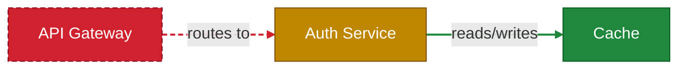

<div align="center">
  

  # CodeBoarding Architecture Diff (Mermaid)

  Posts a PR comment with a **Mermaid** architecture diagram showing which components changed — **green** added, **yellow** modified, **red** deleted — for both nodes and arrows.
</div>

## What it does

On every pull request, this action:

1. Resolves a **base ("before") analysis**: it reads the `.codeboarding/analysis.json` committed at the PR base commit if one exists; otherwise it runs a full CodeBoarding analysis on the base commit to produce one.
2. Runs an **incremental analysis on the PR head**, seeded from the base analysis — only LLM-calling the components whose code actually changed, so a typical PR costs a handful of LLM calls.
3. **Diffs the two analyses** and renders the architecture graph as a Mermaid block with changed components and relations colored:
   - **green** — added
   - **yellow** — modified
   - **red** (dashed) — deleted
4. Posts a sticky PR comment containing the Mermaid block. **GitHub renders the diagram inline** — no image, no Playwright, no extra branch.

## Usage

```yaml
name: Architecture diff
on:
  pull_request:
    types: [opened, synchronize, reopened, ready_for_review]
  issue_comment:               # enables the /codeboarding command on PRs
    types: [created]

permissions:
  contents: read               # checkout + fetch PR/base commits
  pull-requests: write         # post/update the PR comment
  issues: write                # issue_comment command reactions/comments

# Cancel a superseded run when new commits land on the same PR (avoid stacking
# multi-minute LLM jobs).
concurrency:
  group: codeboarding-${{ github.event.pull_request.number || github.event.issue.number }}
  cancel-in-progress: true

jobs:
  diagram:
    runs-on: ubuntu-latest
    # Run on (non-draft) PR events, OR when a TRUSTED collaborator comments on a PR.
    # The action itself checks whether the first word matches `trigger_command`.
    if: >
      (github.event_name == 'pull_request' && github.event.pull_request.draft == false) ||
      (github.event_name == 'issue_comment' && github.event.issue.pull_request != null &&
       contains(fromJSON('["OWNER","MEMBER","COLLABORATOR"]'), github.event.comment.author_association))
    timeout-minutes: 60
    steps:
      - uses: codeboarding/codeboarding-action@v1
        with:
          llm_api_key: ${{ secrets.OPENROUTER_API_KEY }}
```

> ⚠️ **Security — the `author_association` gate is required.** `issue_comment` workflows run from your default branch **with full repository secrets, for any commenter**. Without the `OWNER`/`MEMBER`/`COLLABORATOR` check, anyone could comment `/codeboarding` on a fork PR and have the action check out and run the engine over their PR-head code with your `OPENROUTER_API_KEY` present (a "pwn request"). The action's guard enforces this too, but gate it at the workflow level so a runner never even starts for an untrusted commenter.

You need **one secret**: an LLM API key. OpenRouter is the default; pass your own model via the `agent_model` / `parsing_model` inputs if you prefer.

### On-demand: the `/codeboarding` command

Comment **`/codeboarding`** on any same-repository pull request to (re)run the diagram on demand — handy after the engine/baseline changes, or on draft PRs you don't auto-review. The action reacts with 👀 to acknowledge. Change the word via the `trigger_command` input.

> **Note:** GitHub runs `issue_comment` workflows from the **default branch's** copy of the workflow file. So the command only works once this workflow is merged to your default branch — a workflow that exists only on a feature branch won't respond to comments.

## Inputs

| Input | Default | Description |
|---|---|---|
| `llm_api_key` | (required) | LLM API key. Currently OpenRouter (`OPENROUTER_API_KEY`). |
| `github_token` | `${{ github.token }}` | Token used to post the comment. |
| `engine_ref` | `v0.12.0` | Git ref of `CodeBoarding/CodeBoarding` (pinned to a release). Override to track a newer ref. |
| `depth_level` | `1` | Engine **analysis** depth (1–3). Higher = slower + richer data. See `render_depth` for the diagram. |
| `agent_model` | `openrouter/anthropic/claude-sonnet-4` | LLM for analysis. |
| `parsing_model` | `openrouter/anthropic/claude-sonnet-4` | LLM for parsing. |
| `comment_header` | `Architecture review` | Header line of the PR comment. |
| `diagram_direction` | `LR` | Mermaid layout direction: `LR`, `TD`, `TB`, `RL`, or `BT`. |
| `changed_only` | `false` | Draw only changed components and their incident edges. |
| `render_depth` | `1` | Component levels to **draw** in the PR diagram, independent of `depth_level`: `1` = top-level flat, `2` = +one nesting level as subgraphs. Analyze deep, display shallow. |
| `cta_base_url` | `''` | Base URL of a click proxy. When set, the comment adds "open in VS Code / Cursor" + "get the extension" links (with `owner`/`repo`/`pr` appended) that drive straight to the extension. Empty disables the CTA. |
| `trigger_command` | `/codeboarding` | PR-comment slash-command that triggers an on-demand run (requires the `issue_comment` trigger in your workflow). |

## Outputs

| Output | Description |
|---|---|
| `diagram_md` | Path to the rendered ```` ```mermaid ```` block in the runner workspace. |
| `n_changed` | Number of components added/modified/deleted, counted recursively. |
| `truncated` | `true` if the diagram was reduced to changed-only to fit GitHub's Mermaid limit. |

## How the diff is colored

Nodes are styled with Mermaid `classDef` / `class`; arrows are styled with positional `linkStyle`. A relation counts as **modified** when its endpoints are unchanged but its label text changed. Example of the emitted block:



## No baseline required

If `.codeboarding/analysis.json` isn't committed at the PR base commit, the action **generates the baseline itself** by running a full analysis on the base commit, then diffs the head against it. Committing a baseline on your default branch makes runs cheaper (the base run is skipped) and the diff more stable, but it is not required.

## Fork PRs

Because nothing is pushed (the diagram is inline Mermaid), there is no image step to skip on forks. The one caveat is GitHub's own policy: **secrets are withheld from `pull_request`-triggered runs on forks**, so the LLM key is unavailable and the run fails early with a clear message. Do not use `pull_request_target` for this action; it would analyze PR-head code while secrets are available. The trusted `/codeboarding` `issue_comment` path is intentionally limited to same-repository PRs, so fork code is not analyzed with repository secrets present.

## Limitations

- **GitHub Mermaid caps.** Inline Mermaid in comments is capped (≈500 edges / 50 000 chars). The action stays under this by auto-falling-back to a changed-only graph; if even that overflows it posts a text summary instead of a broken diagram.
- **Analysis depth vs. display depth.** `depth_level` controls how deep the engine *analyzes* (so the workspace/extension get rich nested data); `render_depth` controls how many levels the PR Mermaid *draws*. Keep `render_depth: 1` (default) for a clean top-level PR diagram even when `depth_level: 2`. Set `render_depth: 2` to draw one level of sub-components as subgraphs (leaf nodes filled, parent containers outlined). Large nested graphs are more likely to hit GitHub's Mermaid caps (above), in which case the action degrades to changed-only or a text summary.
- **Renames show as remove + add.** Components are matched across the two analyses by name (the stable join), so a renamed component appears as a red removal plus a green addition rather than a single yellow change.
- **No click-through.** GitHub renders Mermaid in strict security mode, so node hyperlinks are disabled.

## Local testing

A GitHub run is slow (engine install + two analyses). To iterate locally, use `scripts/run_local.sh`. It mirrors `action.yml` and writes `.cb-local/diagram.md` plus a `.cb-local/preview.html` you open in a browser (rendered with mermaid.js in GitHub's strict mode, so it looks like the comment will).

**Fast — no LLM, instant.** Diff two existing `analysis.json` files. Great for iterating on colors/layout. For a realistic pair, pull two revisions of a committed analysis:

```bash
git show <old-sha>:.codeboarding/analysis.json > /tmp/base.json
git show <new-sha>:.codeboarding/analysis.json > /tmp/head.json
scripts/run_local.sh --base-json /tmp/base.json --head-json /tmp/head.json
```

**Full pipeline — needs an LLM key.** Runs the engine on two refs of a local repo exactly like the action (committed-or-generated base, then incremental head):

```bash
export OPENROUTER_API_KEY=sk-or-...
scripts/run_local.sh --repo /path/to/repo --base <base-ref> --head <head-ref> \
  --engine /path/to/CodeBoarding      # defaults to ../CodeBoarding
```

Flags: `--depth N`, `--direction LR|TD|…`, `--render-depth N`, `--changed-only`, `--no-edge-labels`, `--out DIR`, `--no-open`.

The diagram step alone is also directly runnable:

```bash
python3 scripts/diff_to_mermaid.py --base base/analysis.json --head head/analysis.json --out diagram.md
```

## License

MIT — see [LICENSE](LICENSE).
