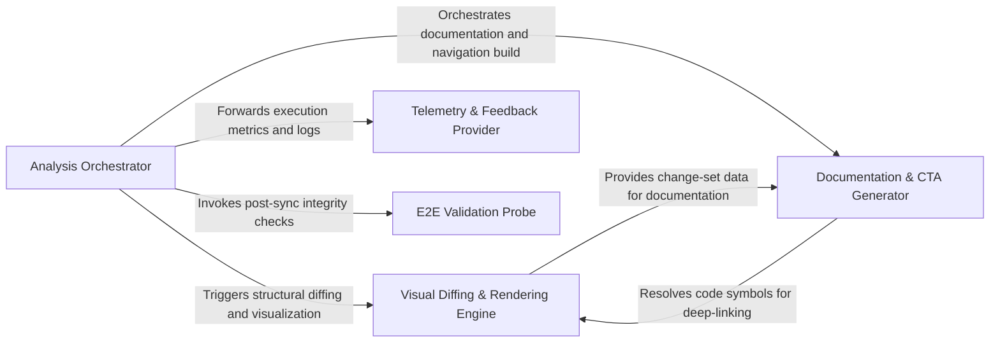
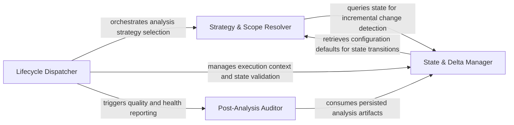
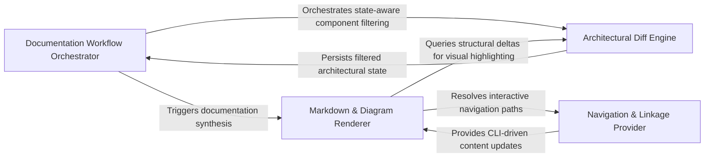
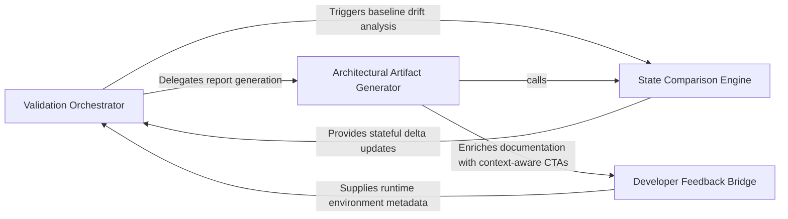
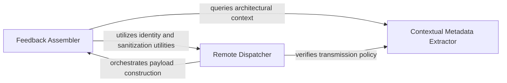
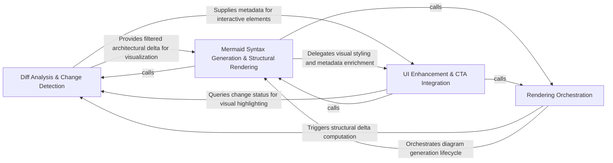

## Details

A stateful pipeline architecture for a CI/CD governance tool, orchestrating static analysis, visual diffing, documentation generation, and telemetry feedback loops to provide architectural insights.

### Analysis Orchestrator [[Expand]](./Analysis_Orchestrator.md)
Acts as the central controller and entry point for the Python execution environment. It manages the analysis lifecycle, determines whether to perform a full or incremental scan based on existing metadata, and coordinates the execution of the static analysis engine.

**Related Classes/Methods**:

- `scripts.engine_adapter.main`:658-764
- `scripts.engine_adapter.run_analyze`:520-569
- `scripts.engine_adapter._load_metadata`:217-222
- `scripts.engine_adapter.run_base`:398-401

**Source Files:**

- [`scripts/engine_adapter.py`](https://github.com/CodeBoarding/CodeBoarding-action/blob/sync-e2e-test/.codeboardingscripts/engine_adapter.py)
  - `scripts.engine_adapter._require_engine` ([L113-L129](https://github.com/CodeBoarding/CodeBoarding-action/blob/sync-e2e-test/.codeboardingscripts/engine_adapter.py#L113-L129)) - Function
  - `scripts.engine_adapter._max_depth` ([L146-L147](https://github.com/CodeBoarding/CodeBoarding-action/blob/sync-e2e-test/.codeboardingscripts/engine_adapter.py#L146-L147)) - Function
  - `scripts.engine_adapter._is_quota_exhausted` ([L156-L171](https://github.com/CodeBoarding/CodeBoarding-action/blob/sync-e2e-test/.codeboardingscripts/engine_adapter.py#L156-L171)) - Function
  - `scripts.engine_adapter._flag_quota_exhausted` ([L174-L183](https://github.com/CodeBoarding/CodeBoarding-action/blob/sync-e2e-test/.codeboardingscripts/engine_adapter.py#L174-L183)) - Function
  - `scripts.engine_adapter._log_path` ([L186-L187](https://github.com/CodeBoarding/CodeBoarding-action/blob/sync-e2e-test/.codeboardingscripts/engine_adapter.py#L186-L187)) - Function
  - `scripts.engine_adapter._run_ctx` ([L190-L195](https://github.com/CodeBoarding/CodeBoarding-action/blob/sync-e2e-test/.codeboardingscripts/engine_adapter.py#L190-L195)) - Function
  - `scripts.engine_adapter._clear_dir` ([L198-L204](https://github.com/CodeBoarding/CodeBoarding-action/blob/sync-e2e-test/.codeboardingscripts/engine_adapter.py#L198-L204)) - Function
  - `scripts.engine_adapter._load_analysis` ([L207-L214](https://github.com/CodeBoarding/CodeBoarding-action/blob/sync-e2e-test/.codeboardingscripts/engine_adapter.py#L207-L214)) - Function
  - `scripts.engine_adapter._load_metadata` ([L217-L222](https://github.com/CodeBoarding/CodeBoarding-action/blob/sync-e2e-test/.codeboardingscripts/engine_adapter.py#L217-L222)) - Function
  - `scripts.engine_adapter._metadata_depth` ([L225-L229](https://github.com/CodeBoarding/CodeBoarding-action/blob/sync-e2e-test/.codeboardingscripts/engine_adapter.py#L225-L229)) - Function
  - `scripts.engine_adapter._resolve_depth` ([L232-L261](https://github.com/CodeBoarding/CodeBoarding-action/blob/sync-e2e-test/.codeboardingscripts/engine_adapter.py#L232-L261)) - Function
  - `scripts.engine_adapter._analysis_depth_or_default` ([L264-L268](https://github.com/CodeBoarding/CodeBoarding-action/blob/sync-e2e-test/.codeboardingscripts/engine_adapter.py#L264-L268)) - Function
  - `scripts.engine_adapter._metadata_commit` ([L271-L273](https://github.com/CodeBoarding/CodeBoarding-action/blob/sync-e2e-test/.codeboardingscripts/engine_adapter.py#L271-L273)) - Function
  - `scripts.engine_adapter._analysis_model_error` ([L276-L296](https://github.com/CodeBoarding/CodeBoarding-action/blob/sync-e2e-test/.codeboardingscripts/engine_adapter.py#L276-L296)) - Function
  - `scripts.engine_adapter.baseline_info` ([L299-L309](https://github.com/CodeBoarding/CodeBoarding-action/blob/sync-e2e-test/.codeboardingscripts/engine_adapter.py#L299-L309)) - Function
  - `scripts.engine_adapter.baseline_depth` ([L312-L327](https://github.com/CodeBoarding/CodeBoarding-action/blob/sync-e2e-test/.codeboardingscripts/engine_adapter.py#L312-L327)) - Function
  - `scripts.engine_adapter.validate_base_analysis` ([L330-L395](https://github.com/CodeBoarding/CodeBoarding-action/blob/sync-e2e-test/.codeboardingscripts/engine_adapter.py#L330-L395)) - Function
  - `scripts.engine_adapter.run_base` ([L398-L401](https://github.com/CodeBoarding/CodeBoarding-action/blob/sync-e2e-test/.codeboardingscripts/engine_adapter.py#L398-L401)) - Function
  - `scripts.engine_adapter.run_seed` ([L404-L433](https://github.com/CodeBoarding/CodeBoarding-action/blob/sync-e2e-test/.codeboardingscripts/engine_adapter.py#L404-L433)) - Function
  - `scripts.engine_adapter._incremental_or_full` ([L436-L480](https://github.com/CodeBoarding/CodeBoarding-action/blob/sync-e2e-test/.codeboardingscripts/engine_adapter.py#L436-L480)) - Function
  - `scripts.engine_adapter.run_head` ([L483-L517](https://github.com/CodeBoarding/CodeBoarding-action/blob/sync-e2e-test/.codeboardingscripts/engine_adapter.py#L483-L517)) - Function
  - `scripts.engine_adapter.run_analyze` ([L520-L569](https://github.com/CodeBoarding/CodeBoarding-action/blob/sync-e2e-test/.codeboardingscripts/engine_adapter.py#L520-L569)) - Function
  - `scripts.engine_adapter.run_analyze.full` ([L541-L548](https://github.com/CodeBoarding/CodeBoarding-action/blob/sync-e2e-test/.codeboardingscripts/engine_adapter.py#L541-L548)) - Function
  - `scripts.engine_adapter.run_render` ([L572-L583](https://github.com/CodeBoarding/CodeBoarding-action/blob/sync-e2e-test/.codeboardingscripts/engine_adapter.py#L572-L583)) - Function
  - `scripts.engine_adapter.run_concat` ([L586-L599](https://github.com/CodeBoarding/CodeBoarding-action/blob/sync-e2e-test/.codeboardingscripts/engine_adapter.py#L586-L599)) - Function
  - `scripts.engine_adapter._count_report_issues` ([L602-L615](https://github.com/CodeBoarding/CodeBoarding-action/blob/sync-e2e-test/.codeboardingscripts/engine_adapter.py#L602-L615)) - Function
  - `scripts.engine_adapter._count_health_report` ([L618-L626](https://github.com/CodeBoarding/CodeBoarding-action/blob/sync-e2e-test/.codeboardingscripts/engine_adapter.py#L618-L626)) - Function
  - `scripts.engine_adapter.run_health` ([L629-L655](https://github.com/CodeBoarding/CodeBoarding-action/blob/sync-e2e-test/.codeboardingscripts/engine_adapter.py#L629-L655)) - Function
  - `scripts.engine_adapter.main` ([L658-L764](https://github.com/CodeBoarding/CodeBoarding-action/blob/sync-e2e-test/.codeboardingscripts/engine_adapter.py#L658-L764)) - Function

### Visual Diffing & Rendering Engine [[Expand]](./Visual_Diffing_Rendering_Engine.md)
Responsible for the structural comparison between the current code state and the baseline. It identifies modified components, relations, and methods, then transforms these differences into Mermaid.js syntax for visual representation within GitHub.

**Related Classes/Methods**:

- `scripts.diff_to_mermaid.main`:578-619
- `scripts.diff_to_mermaid.build_diff`:261-268
- `scripts.diff_to_mermaid._project_analysis`:61-77
- `scripts.diff_to_mermaid._Scope.resolve`:351-360
- `scripts.diff_to_mermaid.read_analysis_json`:80-84

**Source Files:**

- [`scripts/build_component_files.py`](https://github.com/CodeBoarding/CodeBoarding-action/blob/sync-e2e-test/.codeboardingscripts/build_component_files.py)
  - `scripts.build_component_files._block` ([L104-L121](https://github.com/CodeBoarding/CodeBoarding-action/blob/sync-e2e-test/.codeboardingscripts/build_component_files.py#L104-L121)) - Function
  - `scripts.build_component_files.render_component_files` ([L124-L175](https://github.com/CodeBoarding/CodeBoarding-action/blob/sync-e2e-test/.codeboardingscripts/build_component_files.py#L124-L175)) - Function
  - `scripts.build_component_files.main` ([L178-L216](https://github.com/CodeBoarding/CodeBoarding-action/blob/sync-e2e-test/.codeboardingscripts/build_component_files.py#L178-L216)) - Function
- [`scripts/diff_to_mermaid.py`](https://github.com/CodeBoarding/CodeBoarding-action/blob/sync-e2e-test/.codeboardingscripts/diff_to_mermaid.py)
  - `scripts.diff_to_mermaid._relation_dict` ([L50-L58](https://github.com/CodeBoarding/CodeBoarding-action/blob/sync-e2e-test/.codeboardingscripts/diff_to_mermaid.py#L50-L58)) - Function
  - `scripts.diff_to_mermaid._project_analysis` ([L61-L77](https://github.com/CodeBoarding/CodeBoarding-action/blob/sync-e2e-test/.codeboardingscripts/diff_to_mermaid.py#L61-L77)) - Function
  - `scripts.diff_to_mermaid._project_analysis.project_level` ([L65-L74](https://github.com/CodeBoarding/CodeBoarding-action/blob/sync-e2e-test/.codeboardingscripts/diff_to_mermaid.py#L65-L74)) - Function
  - `scripts.diff_to_mermaid.read_analysis_json` ([L80-L84](https://github.com/CodeBoarding/CodeBoarding-action/blob/sync-e2e-test/.codeboardingscripts/diff_to_mermaid.py#L80-L84)) - Function
  - `scripts.diff_to_mermaid.load_analysis` ([L87-L105](https://github.com/CodeBoarding/CodeBoarding-action/blob/sync-e2e-test/.codeboardingscripts/diff_to_mermaid.py#L87-L105)) - Function
  - `scripts.diff_to_mermaid._comp_id` ([L111-L112](https://github.com/CodeBoarding/CodeBoarding-action/blob/sync-e2e-test/.codeboardingscripts/diff_to_mermaid.py#L111-L112)) - Function
  - `scripts.diff_to_mermaid._comp_name` ([L115-L116](https://github.com/CodeBoarding/CodeBoarding-action/blob/sync-e2e-test/.codeboardingscripts/diff_to_mermaid.py#L115-L116)) - Function
  - `scripts.diff_to_mermaid._file_methods` ([L119-L120](https://github.com/CodeBoarding/CodeBoarding-action/blob/sync-e2e-test/.codeboardingscripts/diff_to_mermaid.py#L119-L120)) - Function
  - `scripts.diff_to_mermaid._methods_by_file` ([L123-L130](https://github.com/CodeBoarding/CodeBoarding-action/blob/sync-e2e-test/.codeboardingscripts/diff_to_mermaid.py#L123-L130)) - Function
  - `scripts.diff_to_mermaid._has_structural_changes` ([L133-L136](https://github.com/CodeBoarding/CodeBoarding-action/blob/sync-e2e-test/.codeboardingscripts/diff_to_mermaid.py#L133-L136)) - Function
  - `scripts.diff_to_mermaid._has_method_changes` ([L139-L144](https://github.com/CodeBoarding/CodeBoarding-action/blob/sync-e2e-test/.codeboardingscripts/diff_to_mermaid.py#L139-L144)) - Function
  - `scripts.diff_to_mermaid._rel_key` ([L147-L150](https://github.com/CodeBoarding/CodeBoarding-action/blob/sync-e2e-test/.codeboardingscripts/diff_to_mermaid.py#L147-L150)) - Function
  - `scripts.diff_to_mermaid._diff_relations` ([L153-L199](https://github.com/CodeBoarding/CodeBoarding-action/blob/sync-e2e-test/.codeboardingscripts/diff_to_mermaid.py#L153-L199)) - Function
  - `scripts.diff_to_mermaid._has_changes` ([L202-L210](https://github.com/CodeBoarding/CodeBoarding-action/blob/sync-e2e-test/.codeboardingscripts/diff_to_mermaid.py#L202-L210)) - Function
  - `scripts.diff_to_mermaid._diff_components` ([L213-L258](https://github.com/CodeBoarding/CodeBoarding-action/blob/sync-e2e-test/.codeboardingscripts/diff_to_mermaid.py#L213-L258)) - Function
  - `scripts.diff_to_mermaid.build_diff` ([L261-L268](https://github.com/CodeBoarding/CodeBoarding-action/blob/sync-e2e-test/.codeboardingscripts/diff_to_mermaid.py#L261-L268)) - Function
  - `scripts.diff_to_mermaid._sanitize` ([L274-L276](https://github.com/CodeBoarding/CodeBoarding-action/blob/sync-e2e-test/.codeboardingscripts/diff_to_mermaid.py#L274-L276)) - Function
  - `scripts.diff_to_mermaid._esc` ([L298-L304](https://github.com/CodeBoarding/CodeBoarding-action/blob/sync-e2e-test/.codeboardingscripts/diff_to_mermaid.py#L298-L304)) - Function
  - `scripts.diff_to_mermaid._truncate` ([L307-L309](https://github.com/CodeBoarding/CodeBoarding-action/blob/sync-e2e-test/.codeboardingscripts/diff_to_mermaid.py#L307-L309)) - Function
  - `scripts.diff_to_mermaid._display_status` ([L312-L313](https://github.com/CodeBoarding/CodeBoarding-action/blob/sync-e2e-test/.codeboardingscripts/diff_to_mermaid.py#L312-L313)) - Function
  - `scripts.diff_to_mermaid._Scope` ([L316-L360](https://github.com/CodeBoarding/CodeBoarding-action/blob/sync-e2e-test/.codeboardingscripts/diff_to_mermaid.py#L316-L360)) - Class
  - `scripts.diff_to_mermaid._Scope.__init__` ([L327-L349](https://github.com/CodeBoarding/CodeBoarding-action/blob/sync-e2e-test/.codeboardingscripts/diff_to_mermaid.py#L327-L349)) - Method
  - `scripts.diff_to_mermaid._Scope.resolve` ([L351-L360](https://github.com/CodeBoarding/CodeBoarding-action/blob/sync-e2e-test/.codeboardingscripts/diff_to_mermaid.py#L351-L360)) - Method
  - `scripts.diff_to_mermaid._filter_changed` ([L363-L405](https://github.com/CodeBoarding/CodeBoarding-action/blob/sync-e2e-test/.codeboardingscripts/diff_to_mermaid.py#L363-L405)) - Function
  - `scripts.diff_to_mermaid._filter_changed.touches` ([L396-L398](https://github.com/CodeBoarding/CodeBoarding-action/blob/sync-e2e-test/.codeboardingscripts/diff_to_mermaid.py#L396-L398)) - Function
  - `scripts.diff_to_mermaid._init_directive` ([L408-L427](https://github.com/CodeBoarding/CodeBoarding-action/blob/sync-e2e-test/.codeboardingscripts/diff_to_mermaid.py#L408-L427)) - Function
  - `scripts.diff_to_mermaid._count_changed_components` ([L430-L437](https://github.com/CodeBoarding/CodeBoarding-action/blob/sync-e2e-test/.codeboardingscripts/diff_to_mermaid.py#L430-L437)) - Function
  - `scripts.diff_to_mermaid._has_changed_relations` ([L440-L444](https://github.com/CodeBoarding/CodeBoarding-action/blob/sync-e2e-test/.codeboardingscripts/diff_to_mermaid.py#L440-L444)) - Function
  - `scripts.diff_to_mermaid.render_mermaid` ([L447-L572](https://github.com/CodeBoarding/CodeBoarding-action/blob/sync-e2e-test/.codeboardingscripts/diff_to_mermaid.py#L447-L572)) - Function
  - `scripts.diff_to_mermaid.render_mermaid.build` ([L475-L548](https://github.com/CodeBoarding/CodeBoarding-action/blob/sync-e2e-test/.codeboardingscripts/diff_to_mermaid.py#L475-L548)) - Function
  - `scripts.diff_to_mermaid.render_mermaid.build.emit_edges` ([L486-L498](https://github.com/CodeBoarding/CodeBoarding-action/blob/sync-e2e-test/.codeboardingscripts/diff_to_mermaid.py#L486-L498)) - Function
  - `scripts.diff_to_mermaid.render_mermaid.build.emit_level` ([L500-L517](https://github.com/CodeBoarding/CodeBoarding-action/blob/sync-e2e-test/.codeboardingscripts/diff_to_mermaid.py#L500-L517)) - Function
  - `scripts.diff_to_mermaid.main` ([L578-L619](https://github.com/CodeBoarding/CodeBoarding-action/blob/sync-e2e-test/.codeboardingscripts/diff_to_mermaid.py#L578-L619)) - Function

### Documentation & CTA Generator [[Expand]](./Documentation_CTA_Generator.md)
Maps the analyzed code structure back to the physical file system to generate developer-centric documentation. It creates markdown files for components and "Call-to-Action" (CTA) links that facilitate navigation between the code and the architectural view.

**Related Classes/Methods**:

- `scripts.build_cta.build_cta`:93-152
- `scripts.build_component_files._walk`:56-62

**Source Files:**

- [`scripts/build_component_files.py`](https://github.com/CodeBoarding/CodeBoarding-action/blob/sync-e2e-test/.codeboardingscripts/build_component_files.py)
  - `scripts.build_component_files._walk` ([L56-L62](https://github.com/CodeBoarding/CodeBoarding-action/blob/sync-e2e-test/.codeboardingscripts/build_component_files.py#L56-L62)) - Function
  - `scripts.build_component_files._subtree_files` ([L65-L74](https://github.com/CodeBoarding/CodeBoarding-action/blob/sync-e2e-test/.codeboardingscripts/build_component_files.py#L65-L74)) - Function
  - `scripts.build_component_files._subtree_methods` ([L77-L85](https://github.com/CodeBoarding/CodeBoarding-action/blob/sync-e2e-test/.codeboardingscripts/build_component_files.py#L77-L85)) - Function
  - `scripts.build_component_files._changed_files_for` ([L88-L101](https://github.com/CodeBoarding/CodeBoarding-action/blob/sync-e2e-test/.codeboardingscripts/build_component_files.py#L88-L101)) - Function
- [`scripts/build_cta.py`](https://github.com/CodeBoarding/CodeBoarding-action/blob/sync-e2e-test/.codeboardingscripts/build_cta.py)
  - `scripts.build_cta.detect_editors` ([L37-L49](https://github.com/CodeBoarding/CodeBoarding-action/blob/sync-e2e-test/.codeboardingscripts/build_cta.py#L37-L49)) - Function
  - `scripts.build_cta.webview_url` ([L63-L81](https://github.com/CodeBoarding/CodeBoarding-action/blob/sync-e2e-test/.codeboardingscripts/build_cta.py#L63-L81)) - Function
  - `scripts.build_cta._join_or` ([L84-L90](https://github.com/CodeBoarding/CodeBoarding-action/blob/sync-e2e-test/.codeboardingscripts/build_cta.py#L84-L90)) - Function
  - `scripts.build_cta.build_cta` ([L93-L152](https://github.com/CodeBoarding/CodeBoarding-action/blob/sync-e2e-test/.codeboardingscripts/build_cta.py#L93-L152)) - Function
  - `scripts.build_cta.build_cta.link` ([L126-L127](https://github.com/CodeBoarding/CodeBoarding-action/blob/sync-e2e-test/.codeboardingscripts/build_cta.py#L126-L127)) - Function
  - `scripts.build_cta.main` ([L155-L189](https://github.com/CodeBoarding/CodeBoarding-action/blob/sync-e2e-test/.codeboardingscripts/build_cta.py#L155-L189)) - Function

### Telemetry & Feedback Provider [[Expand]](./Telemetry_Feedback_Provider.md)
A specialized component that handles the collection and transmission of execution metrics and user feedback. It ensures data is anonymized and transmitted securely to the remote backend for service improvement.

**Related Classes/Methods**:

- `scripts.submit_feedback.main`:147-172
- `scripts.submit_feedback.post`:135-144
- `scripts.submit_feedback.build_payload`:119-132

**Source Files:**

- [`scripts/submit_feedback.py`](https://github.com/CodeBoarding/CodeBoarding-action/blob/sync-e2e-test/.codeboardingscripts/submit_feedback.py)
  - `scripts.submit_feedback.telemetry_disabled` ([L27-L31](https://github.com/CodeBoarding/CodeBoarding-action/blob/sync-e2e-test/.codeboardingscripts/submit_feedback.py#L27-L31)) - Function
  - `scripts.submit_feedback.resolve_key` ([L34-L35](https://github.com/CodeBoarding/CodeBoarding-action/blob/sync-e2e-test/.codeboardingscripts/submit_feedback.py#L34-L35)) - Function
  - `scripts.submit_feedback.resolve_host` ([L38-L40](https://github.com/CodeBoarding/CodeBoarding-action/blob/sync-e2e-test/.codeboardingscripts/submit_feedback.py#L38-L40)) - Function
  - `scripts.submit_feedback.resolve_command` ([L43-L44](https://github.com/CodeBoarding/CodeBoarding-action/blob/sync-e2e-test/.codeboardingscripts/submit_feedback.py#L43-L44)) - Function
  - `scripts.submit_feedback.resolve_max_chars` ([L47-L52](https://github.com/CodeBoarding/CodeBoarding-action/blob/sync-e2e-test/.codeboardingscripts/submit_feedback.py#L47-L52)) - Function
  - `scripts.submit_feedback.extract_feedback` ([L55-L69](https://github.com/CodeBoarding/CodeBoarding-action/blob/sync-e2e-test/.codeboardingscripts/submit_feedback.py#L55-L69)) - Function
  - `scripts.submit_feedback.cap_feedback` ([L72-L76](https://github.com/CodeBoarding/CodeBoarding-action/blob/sync-e2e-test/.codeboardingscripts/submit_feedback.py#L72-L76)) - Function
  - `scripts.submit_feedback._first` ([L79-L84](https://github.com/CodeBoarding/CodeBoarding-action/blob/sync-e2e-test/.codeboardingscripts/submit_feedback.py#L79-L84)) - Function
  - `scripts.submit_feedback.distinct_id` ([L87-L91](https://github.com/CodeBoarding/CodeBoarding-action/blob/sync-e2e-test/.codeboardingscripts/submit_feedback.py#L87-L91)) - Function
  - `scripts.submit_feedback.build_properties` ([L94-L116](https://github.com/CodeBoarding/CodeBoarding-action/blob/sync-e2e-test/.codeboardingscripts/submit_feedback.py#L94-L116)) - Function
  - `scripts.submit_feedback.build_payload` ([L119-L132](https://github.com/CodeBoarding/CodeBoarding-action/blob/sync-e2e-test/.codeboardingscripts/submit_feedback.py#L119-L132)) - Function
  - `scripts.submit_feedback.post` ([L135-L144](https://github.com/CodeBoarding/CodeBoarding-action/blob/sync-e2e-test/.codeboardingscripts/submit_feedback.py#L135-L144)) - Function
  - `scripts.submit_feedback.main` ([L147-L172](https://github.com/CodeBoarding/CodeBoarding-action/blob/sync-e2e-test/.codeboardingscripts/submit_feedback.py#L147-L172)) - Function

### E2E Validation Probe [[Expand]](./E2E_Validation_Probe.md)
A diagnostic component designed to verify the integrity of the synchronization process. It performs end-to-end checks to ensure that the generated architectural metadata and documentation accurately reflect the codebase state after a sync operation.

**Related Classes/Methods**:

- `scripts.e2e_probe.SyncE2EProbe`:4-15
- `scripts.e2e_probe.SyncE2EProbe.describe`:10-11
- `scripts.e2e_probe.SyncE2EProbe.summary`:13-15

**Source Files:**

- [`scripts/e2e_probe.py`](https://github.com/CodeBoarding/CodeBoarding-action/blob/sync-e2e-test/.codeboardingscripts/e2e_probe.py)
  - `scripts.e2e_probe.SyncE2EProbe` ([L4-L15](https://github.com/CodeBoarding/CodeBoarding-action/blob/sync-e2e-test/.codeboardingscripts/e2e_probe.py#L4-L15)) - Class
  - `scripts.e2e_probe.SyncE2EProbe.__init__` ([L7-L8](https://github.com/CodeBoarding/CodeBoarding-action/blob/sync-e2e-test/.codeboardingscripts/e2e_probe.py#L7-L8)) - Method
  - `scripts.e2e_probe.SyncE2EProbe.describe` ([L10-L11](https://github.com/CodeBoarding/CodeBoarding-action/blob/sync-e2e-test/.codeboardingscripts/e2e_probe.py#L10-L11)) - Method
  - `scripts.e2e_probe.SyncE2EProbe.summary` ([L13-L15](https://github.com/CodeBoarding/CodeBoarding-action/blob/sync-e2e-test/.codeboardingscripts/e2e_probe.py#L13-L15)) - Method

### [FAQ](https://github.com/CodeBoarding/GeneratedOnBoardings/tree/main?tab=readme-ov-file#faq)

## Details

Acts as the central controller and entry point for the Python execution environment. It manages the analysis lifecycle, determines whether to perform a full or incremental scan based on existing metadata, and coordinates the execution of the static analysis engine.

### Lifecycle Dispatcher
The primary entry point and command-line interface handler that interprets execution modes and manages the high-level sequence of operations.

**Related Classes/Methods**:

- `scripts.engine_adapter.main`:658-764
- `scripts.engine_adapter.run_base`:398-401
- `scripts.engine_adapter.run_seed`:404-433
- `scripts.engine_adapter.run_render`:572-583

**Source Files:**

- [`scripts/engine_adapter.py`](https://github.com/CodeBoarding/CodeBoarding-action/blob/sync-e2e-test/.codeboardingscripts/engine_adapter.py)
  - `scripts.engine_adapter._require_engine` ([L113-L129](https://github.com/CodeBoarding/CodeBoarding-action/blob/sync-e2e-test/.codeboardingscripts/engine_adapter.py#L113-L129)) - Function
  - `scripts.engine_adapter._is_quota_exhausted` ([L156-L171](https://github.com/CodeBoarding/CodeBoarding-action/blob/sync-e2e-test/.codeboardingscripts/engine_adapter.py#L156-L171)) - Function
  - `scripts.engine_adapter._flag_quota_exhausted` ([L174-L183](https://github.com/CodeBoarding/CodeBoarding-action/blob/sync-e2e-test/.codeboardingscripts/engine_adapter.py#L174-L183)) - Function
  - `scripts.engine_adapter._metadata_commit` ([L271-L273](https://github.com/CodeBoarding/CodeBoarding-action/blob/sync-e2e-test/.codeboardingscripts/engine_adapter.py#L271-L273)) - Function
  - `scripts.engine_adapter.baseline_info` ([L299-L309](https://github.com/CodeBoarding/CodeBoarding-action/blob/sync-e2e-test/.codeboardingscripts/engine_adapter.py#L299-L309)) - Function
  - `scripts.engine_adapter.run_base` ([L398-L401](https://github.com/CodeBoarding/CodeBoarding-action/blob/sync-e2e-test/.codeboardingscripts/engine_adapter.py#L398-L401)) - Function
  - `scripts.engine_adapter.run_seed` ([L404-L433](https://github.com/CodeBoarding/CodeBoarding-action/blob/sync-e2e-test/.codeboardingscripts/engine_adapter.py#L404-L433)) - Function
  - `scripts.engine_adapter.run_render` ([L572-L583](https://github.com/CodeBoarding/CodeBoarding-action/blob/sync-e2e-test/.codeboardingscripts/engine_adapter.py#L572-L583)) - Function
  - `scripts.engine_adapter.run_concat` ([L586-L599](https://github.com/CodeBoarding/CodeBoarding-action/blob/sync-e2e-test/.codeboardingscripts/engine_adapter.py#L586-L599)) - Function
  - `scripts.engine_adapter.main` ([L658-L764](https://github.com/CodeBoarding/CodeBoarding-action/blob/sync-e2e-test/.codeboardingscripts/engine_adapter.py#L658-L764)) - Function

### Strategy & Scope Resolver
Responsible for determining technical parameters of the analysis by loading metadata and calculating analysis depth based on configuration and history.

**Related Classes/Methods**:

- `scripts.engine_adapter.run_analyze`:520-569
- `scripts.engine_adapter._load_metadata`:217-222
- `scripts.engine_adapter._resolve_depth`:232-261
- `scripts.engine_adapter.baseline_depth`:312-327

**Source Files:**

- [`scripts/engine_adapter.py`](https://github.com/CodeBoarding/CodeBoarding-action/blob/sync-e2e-test/.codeboardingscripts/engine_adapter.py)
  - `scripts.engine_adapter._max_depth` ([L146-L147](https://github.com/CodeBoarding/CodeBoarding-action/blob/sync-e2e-test/.codeboardingscripts/engine_adapter.py#L146-L147)) - Function
  - `scripts.engine_adapter._load_metadata` ([L217-L222](https://github.com/CodeBoarding/CodeBoarding-action/blob/sync-e2e-test/.codeboardingscripts/engine_adapter.py#L217-L222)) - Function
  - `scripts.engine_adapter._resolve_depth` ([L232-L261](https://github.com/CodeBoarding/CodeBoarding-action/blob/sync-e2e-test/.codeboardingscripts/engine_adapter.py#L232-L261)) - Function
  - `scripts.engine_adapter._analysis_depth_or_default` ([L264-L268](https://github.com/CodeBoarding/CodeBoarding-action/blob/sync-e2e-test/.codeboardingscripts/engine_adapter.py#L264-L268)) - Function
  - `scripts.engine_adapter.baseline_depth` ([L312-L327](https://github.com/CodeBoarding/CodeBoarding-action/blob/sync-e2e-test/.codeboardingscripts/engine_adapter.py#L312-L327)) - Function
  - `scripts.engine_adapter.run_analyze` ([L520-L569](https://github.com/CodeBoarding/CodeBoarding-action/blob/sync-e2e-test/.codeboardingscripts/engine_adapter.py#L520-L569)) - Function

### State & Delta Manager
Manages stateful incremental logic, comparing commits against baselines, validating analysis integrity, and providing filesystem context.

**Related Classes/Methods**:

- `scripts.engine_adapter._incremental_or_full`:436-480
- `scripts.engine_adapter.run_head`:483-517
- `scripts.engine_adapter.validate_base_analysis`:330-395
- `scripts.engine_adapter._run_ctx`:190-195

**Source Files:**

- [`scripts/engine_adapter.py`](https://github.com/CodeBoarding/CodeBoarding-action/blob/sync-e2e-test/.codeboardingscripts/engine_adapter.py)
  - `scripts.engine_adapter._log_path` ([L186-L187](https://github.com/CodeBoarding/CodeBoarding-action/blob/sync-e2e-test/.codeboardingscripts/engine_adapter.py#L186-L187)) - Function
  - `scripts.engine_adapter._run_ctx` ([L190-L195](https://github.com/CodeBoarding/CodeBoarding-action/blob/sync-e2e-test/.codeboardingscripts/engine_adapter.py#L190-L195)) - Function
  - `scripts.engine_adapter._clear_dir` ([L198-L204](https://github.com/CodeBoarding/CodeBoarding-action/blob/sync-e2e-test/.codeboardingscripts/engine_adapter.py#L198-L204)) - Function
  - `scripts.engine_adapter._load_analysis` ([L207-L214](https://github.com/CodeBoarding/CodeBoarding-action/blob/sync-e2e-test/.codeboardingscripts/engine_adapter.py#L207-L214)) - Function
  - `scripts.engine_adapter._metadata_depth` ([L225-L229](https://github.com/CodeBoarding/CodeBoarding-action/blob/sync-e2e-test/.codeboardingscripts/engine_adapter.py#L225-L229)) - Function
  - `scripts.engine_adapter._analysis_model_error` ([L276-L296](https://github.com/CodeBoarding/CodeBoarding-action/blob/sync-e2e-test/.codeboardingscripts/engine_adapter.py#L276-L296)) - Function
  - `scripts.engine_adapter.validate_base_analysis` ([L330-L395](https://github.com/CodeBoarding/CodeBoarding-action/blob/sync-e2e-test/.codeboardingscripts/engine_adapter.py#L330-L395)) - Function
  - `scripts.engine_adapter._incremental_or_full` ([L436-L480](https://github.com/CodeBoarding/CodeBoarding-action/blob/sync-e2e-test/.codeboardingscripts/engine_adapter.py#L436-L480)) - Function
  - `scripts.engine_adapter.run_head` ([L483-L517](https://github.com/CodeBoarding/CodeBoarding-action/blob/sync-e2e-test/.codeboardingscripts/engine_adapter.py#L483-L517)) - Function
  - `scripts.engine_adapter.run_analyze.full` ([L541-L548](https://github.com/CodeBoarding/CodeBoarding-action/blob/sync-e2e-test/.codeboardingscripts/engine_adapter.py#L541-L548)) - Function

### Post-Analysis Auditor
A diagnostic component that parses generated metadata to produce health reports and identify architectural violations.

**Related Classes/Methods**:

- `scripts.engine_adapter.run_health`:629-655
- `scripts.engine_adapter._count_health_report`:618-626
- `scripts.engine_adapter._count_report_issues`:602-615

**Source Files:**

- [`scripts/engine_adapter.py`](https://github.com/CodeBoarding/CodeBoarding-action/blob/sync-e2e-test/.codeboardingscripts/engine_adapter.py)
  - `scripts.engine_adapter._count_report_issues` ([L602-L615](https://github.com/CodeBoarding/CodeBoarding-action/blob/sync-e2e-test/.codeboardingscripts/engine_adapter.py#L602-L615)) - Function
  - `scripts.engine_adapter._count_health_report` ([L618-L626](https://github.com/CodeBoarding/CodeBoarding-action/blob/sync-e2e-test/.codeboardingscripts/engine_adapter.py#L618-L626)) - Function
  - `scripts.engine_adapter.run_health` ([L629-L655](https://github.com/CodeBoarding/CodeBoarding-action/blob/sync-e2e-test/.codeboardingscripts/engine_adapter.py#L629-L655)) - Function

### [FAQ](https://github.com/CodeBoarding/GeneratedOnBoardings/tree/main?tab=readme-ov-file#faq)

## Details

Maps the analyzed code structure back to the physical file system to generate developer-centric documentation. It creates markdown files for components and "Call-to-Action" (CTA) links that facilitate navigation between the code and the architectural view.

### Documentation Workflow Orchestrator
Manages the end-to-end lifecycle of documentation generation, coordinating analysis artifacts, change detection, and the rendering process.

**Related Classes/Methods**: _None_

**Source Files:**

- [`scripts/build_component_files.py`](https://github.com/CodeBoarding/CodeBoarding-action/blob/sync-e2e-test/.codeboardingscripts/build_component_files.py)
  - `scripts.build_component_files._subtree_files` ([L65-L74](https://github.com/CodeBoarding/CodeBoarding-action/blob/sync-e2e-test/.codeboardingscripts/build_component_files.py#L65-L74)) - Function
  - `scripts.build_component_files._changed_files_for` ([L88-L101](https://github.com/CodeBoarding/CodeBoarding-action/blob/sync-e2e-test/.codeboardingscripts/build_component_files.py#L88-L101)) - Function

### Architectural Diff Engine
Analyzes the delta between architectural states to identify modified components and structural shifts for incremental updates.

**Related Classes/Methods**: _None_

**Source Files:**

- [`scripts/build_component_files.py`](https://github.com/CodeBoarding/CodeBoarding-action/blob/sync-e2e-test/.codeboardingscripts/build_component_files.py)
  - `scripts.build_component_files._walk` ([L56-L62](https://github.com/CodeBoarding/CodeBoarding-action/blob/sync-e2e-test/.codeboardingscripts/build_component_files.py#L56-L62)) - Function
  - `scripts.build_component_files._subtree_methods` ([L77-L85](https://github.com/CodeBoarding/CodeBoarding-action/blob/sync-e2e-test/.codeboardingscripts/build_component_files.py#L77-L85)) - Function
- [`scripts/build_cta.py`](https://github.com/CodeBoarding/CodeBoarding-action/blob/sync-e2e-test/.codeboardingscripts/build_cta.py)
  - `scripts.build_cta._join_or` ([L84-L90](https://github.com/CodeBoarding/CodeBoarding-action/blob/sync-e2e-test/.codeboardingscripts/build_cta.py#L84-L90)) - Function

### Markdown & Diagram Renderer
Translates component tree and diff data into structured Markdown and Mermaid.js diagrams.

**Related Classes/Methods**: _None_

**Source Files:**

- [`scripts/build_cta.py`](https://github.com/CodeBoarding/CodeBoarding-action/blob/sync-e2e-test/.codeboardingscripts/build_cta.py)
  - `scripts.build_cta.detect_editors` ([L37-L49](https://github.com/CodeBoarding/CodeBoarding-action/blob/sync-e2e-test/.codeboardingscripts/build_cta.py#L37-L49)) - Function
  - `scripts.build_cta.build_cta` ([L93-L152](https://github.com/CodeBoarding/CodeBoarding-action/blob/sync-e2e-test/.codeboardingscripts/build_cta.py#L93-L152)) - Function
  - `scripts.build_cta.build_cta.link` ([L126-L127](https://github.com/CodeBoarding/CodeBoarding-action/blob/sync-e2e-test/.codeboardingscripts/build_cta.py#L126-L127)) - Function

### Navigation & Linkage Provider
Generates interactive CTA links and sanitizes identifiers for documentation navigation.

**Related Classes/Methods**: _None_

**Source Files:**

- [`scripts/build_cta.py`](https://github.com/CodeBoarding/CodeBoarding-action/blob/sync-e2e-test/.codeboardingscripts/build_cta.py)
  - `scripts.build_cta.webview_url` ([L63-L81](https://github.com/CodeBoarding/CodeBoarding-action/blob/sync-e2e-test/.codeboardingscripts/build_cta.py#L63-L81)) - Function
  - `scripts.build_cta.main` ([L155-L189](https://github.com/CodeBoarding/CodeBoarding-action/blob/sync-e2e-test/.codeboardingscripts/build_cta.py#L155-L189)) - Function

### [FAQ](https://github.com/CodeBoarding/GeneratedOnBoardings/tree/main?tab=readme-ov-file#faq)

## Details

A diagnostic component designed to verify the integrity of the synchronization process. It performs end-to-end checks to ensure that the generated architectural metadata and documentation accurately reflect the codebase state after a sync operation.

### Validation Orchestrator
The central controller of the diagnostic process that manages the lifecycle of a validation run and produces the final integrity report for CI/CD integration.

**Related Classes/Methods**: _None_

**Source Files:**

- [`scripts/e2e_probe.py`](https://github.com/CodeBoarding/CodeBoarding-action/blob/sync-e2e-test/.codeboardingscripts/e2e_probe.py)
  - `scripts.e2e_probe.SyncE2EProbe.__init__` ([L7-L8](https://github.com/CodeBoarding/CodeBoarding-action/blob/sync-e2e-test/.codeboardingscripts/e2e_probe.py#L7-L8)) - Method

### State Comparison Engine
Responsible for the low-level analysis of changes between the current codebase and the persisted architectural baseline to identify file drift.

**Related Classes/Methods**: _None_

**Source Files:**

- [`scripts/e2e_probe.py`](https://github.com/CodeBoarding/CodeBoarding-action/blob/sync-e2e-test/.codeboardingscripts/e2e_probe.py)
  - `scripts.e2e_probe.SyncE2EProbe.describe` ([L10-L11](https://github.com/CodeBoarding/CodeBoarding-action/blob/sync-e2e-test/.codeboardingscripts/e2e_probe.py#L10-L11)) - Method

### Architectural Artifact Generator
Translates identified code changes into high-level architectural representations, including Mermaid.js diagrams and Markdown documentation.

**Related Classes/Methods**: _None_

**Source Files:**

- [`scripts/e2e_probe.py`](https://github.com/CodeBoarding/CodeBoarding-action/blob/sync-e2e-test/.codeboardingscripts/e2e_probe.py)
  - `scripts.e2e_probe.SyncE2EProbe.summary` ([L13-L15](https://github.com/CodeBoarding/CodeBoarding-action/blob/sync-e2e-test/.codeboardingscripts/e2e_probe.py#L13-L15)) - Method

### Developer Feedback Bridge
Converts validation results into actionable insights by detecting user environments and generating deep links to architectural components.

**Related Classes/Methods**: _None_

**Source Files:**

- [`scripts/e2e_probe.py`](https://github.com/CodeBoarding/CodeBoarding-action/blob/sync-e2e-test/.codeboardingscripts/e2e_probe.py)
  - `scripts.e2e_probe.SyncE2EProbe` ([L4-L15](https://github.com/CodeBoarding/CodeBoarding-action/blob/sync-e2e-test/.codeboardingscripts/e2e_probe.py#L4-L15)) - Class

### [FAQ](https://github.com/CodeBoarding/GeneratedOnBoardings/tree/main?tab=readme-ov-file#faq)

## Details

A specialized component that handles the collection and transmission of execution metrics and user feedback. It ensures data is anonymized and transmitted securely to the remote backend for service improvement.

### Contextual Metadata Extractor
Responsible for mining the results of the architectural analysis to provide context for the telemetry by identifying impacted components and calculating metrics.

**Related Classes/Methods**: _None_

**Source Files:**

- [`scripts/submit_feedback.py`](https://github.com/CodeBoarding/CodeBoarding-action/blob/sync-e2e-test/.codeboardingscripts/submit_feedback.py)
  - `scripts.submit_feedback.telemetry_disabled` ([L27-L31](https://github.com/CodeBoarding/CodeBoarding-action/blob/sync-e2e-test/.codeboardingscripts/submit_feedback.py#L27-L31)) - Function
  - `scripts.submit_feedback.resolve_key` ([L34-L35](https://github.com/CodeBoarding/CodeBoarding-action/blob/sync-e2e-test/.codeboardingscripts/submit_feedback.py#L34-L35)) - Function
  - `scripts.submit_feedback.resolve_host` ([L38-L40](https://github.com/CodeBoarding/CodeBoarding-action/blob/sync-e2e-test/.codeboardingscripts/submit_feedback.py#L38-L40)) - Function
  - `scripts.submit_feedback.resolve_command` ([L43-L44](https://github.com/CodeBoarding/CodeBoarding-action/blob/sync-e2e-test/.codeboardingscripts/submit_feedback.py#L43-L44)) - Function
  - `scripts.submit_feedback.resolve_max_chars` ([L47-L52](https://github.com/CodeBoarding/CodeBoarding-action/blob/sync-e2e-test/.codeboardingscripts/submit_feedback.py#L47-L52)) - Function
  - `scripts.submit_feedback.post` ([L135-L144](https://github.com/CodeBoarding/CodeBoarding-action/blob/sync-e2e-test/.codeboardingscripts/submit_feedback.py#L135-L144)) - Function

### Feedback Assembler
Acts as the data transformation layer that aggregates environment variables, user feedback, and architectural context into a standardized JSON schema.

**Related Classes/Methods**:

- `scripts.submit_feedback.build_payload`:119-132

**Source Files:**

- [`scripts/submit_feedback.py`](https://github.com/CodeBoarding/CodeBoarding-action/blob/sync-e2e-test/.codeboardingscripts/submit_feedback.py)
  - `scripts.submit_feedback._first` ([L79-L84](https://github.com/CodeBoarding/CodeBoarding-action/blob/sync-e2e-test/.codeboardingscripts/submit_feedback.py#L79-L84)) - Function
  - `scripts.submit_feedback.build_properties` ([L94-L116](https://github.com/CodeBoarding/CodeBoarding-action/blob/sync-e2e-test/.codeboardingscripts/submit_feedback.py#L94-L116)) - Function
  - `scripts.submit_feedback.build_payload` ([L119-L132](https://github.com/CodeBoarding/CodeBoarding-action/blob/sync-e2e-test/.codeboardingscripts/submit_feedback.py#L119-L132)) - Function

### Remote Dispatcher
Manages the egress of data to the external service, handling HTTP authentication, POST requests, and response management.

**Related Classes/Methods**:

- `scripts.submit_feedback.main`:147-172

**Source Files:**

- [`scripts/submit_feedback.py`](https://github.com/CodeBoarding/CodeBoarding-action/blob/sync-e2e-test/.codeboardingscripts/submit_feedback.py)
  - `scripts.submit_feedback.extract_feedback` ([L55-L69](https://github.com/CodeBoarding/CodeBoarding-action/blob/sync-e2e-test/.codeboardingscripts/submit_feedback.py#L55-L69)) - Function
  - `scripts.submit_feedback.cap_feedback` ([L72-L76](https://github.com/CodeBoarding/CodeBoarding-action/blob/sync-e2e-test/.codeboardingscripts/submit_feedback.py#L72-L76)) - Function
  - `scripts.submit_feedback.distinct_id` ([L87-L91](https://github.com/CodeBoarding/CodeBoarding-action/blob/sync-e2e-test/.codeboardingscripts/submit_feedback.py#L87-L91)) - Function
  - `scripts.submit_feedback.main` ([L147-L172](https://github.com/CodeBoarding/CodeBoarding-action/blob/sync-e2e-test/.codeboardingscripts/submit_feedback.py#L147-L172)) - Function

### [FAQ](https://github.com/CodeBoarding/GeneratedOnBoardings/tree/main?tab=readme-ov-file#faq)

## Details

Responsible for the structural comparison between the current code state and the baseline. It identifies modified components, relations, and methods, then transforms these differences into Mermaid.js syntax for visual representation within GitHub.

### Diff Analysis & Change Detection
Identifies the structural delta between the current code state and the baseline, filtering for architecturally significant modifications.

**Related Classes/Methods**: _None_

**Source Files:**

- [`scripts/build_component_files.py`](https://github.com/CodeBoarding/CodeBoarding-action/blob/sync-e2e-test/.codeboardingscripts/build_component_files.py)
  - `scripts.build_component_files._block` ([L104-L121](https://github.com/CodeBoarding/CodeBoarding-action/blob/sync-e2e-test/.codeboardingscripts/build_component_files.py#L104-L121)) - Function
  - `scripts.build_component_files.render_component_files` ([L124-L175](https://github.com/CodeBoarding/CodeBoarding-action/blob/sync-e2e-test/.codeboardingscripts/build_component_files.py#L124-L175)) - Function
  - `scripts.build_component_files.main` ([L178-L216](https://github.com/CodeBoarding/CodeBoarding-action/blob/sync-e2e-test/.codeboardingscripts/build_component_files.py#L178-L216)) - Function
- [`scripts/diff_to_mermaid.py`](https://github.com/CodeBoarding/CodeBoarding-action/blob/sync-e2e-test/.codeboardingscripts/diff_to_mermaid.py)
  - `scripts.diff_to_mermaid._comp_id` ([L111-L112](https://github.com/CodeBoarding/CodeBoarding-action/blob/sync-e2e-test/.codeboardingscripts/diff_to_mermaid.py#L111-L112)) - Function
  - `scripts.diff_to_mermaid._Scope` ([L316-L360](https://github.com/CodeBoarding/CodeBoarding-action/blob/sync-e2e-test/.codeboardingscripts/diff_to_mermaid.py#L316-L360)) - Class
  - `scripts.diff_to_mermaid._Scope.__init__` ([L327-L349](https://github.com/CodeBoarding/CodeBoarding-action/blob/sync-e2e-test/.codeboardingscripts/diff_to_mermaid.py#L327-L349)) - Method
  - `scripts.diff_to_mermaid._Scope.resolve` ([L351-L360](https://github.com/CodeBoarding/CodeBoarding-action/blob/sync-e2e-test/.codeboardingscripts/diff_to_mermaid.py#L351-L360)) - Method

### Mermaid Syntax Generation & Structural Rendering
Maps architectural entities and their relationships to Mermaid.js syntax, managing hierarchical scoping and visual styling.

**Related Classes/Methods**: _None_

**Source Files:**

- [`scripts/diff_to_mermaid.py`](https://github.com/CodeBoarding/CodeBoarding-action/blob/sync-e2e-test/.codeboardingscripts/diff_to_mermaid.py)
  - `scripts.diff_to_mermaid._comp_name` ([L115-L116](https://github.com/CodeBoarding/CodeBoarding-action/blob/sync-e2e-test/.codeboardingscripts/diff_to_mermaid.py#L115-L116)) - Function
  - `scripts.diff_to_mermaid._file_methods` ([L119-L120](https://github.com/CodeBoarding/CodeBoarding-action/blob/sync-e2e-test/.codeboardingscripts/diff_to_mermaid.py#L119-L120)) - Function
  - `scripts.diff_to_mermaid._diff_relations` ([L153-L199](https://github.com/CodeBoarding/CodeBoarding-action/blob/sync-e2e-test/.codeboardingscripts/diff_to_mermaid.py#L153-L199)) - Function
  - `scripts.diff_to_mermaid._diff_components` ([L213-L258](https://github.com/CodeBoarding/CodeBoarding-action/blob/sync-e2e-test/.codeboardingscripts/diff_to_mermaid.py#L213-L258)) - Function
  - `scripts.diff_to_mermaid._esc` ([L298-L304](https://github.com/CodeBoarding/CodeBoarding-action/blob/sync-e2e-test/.codeboardingscripts/diff_to_mermaid.py#L298-L304)) - Function
  - `scripts.diff_to_mermaid._display_status` ([L312-L313](https://github.com/CodeBoarding/CodeBoarding-action/blob/sync-e2e-test/.codeboardingscripts/diff_to_mermaid.py#L312-L313)) - Function
  - `scripts.diff_to_mermaid._filter_changed` ([L363-L405](https://github.com/CodeBoarding/CodeBoarding-action/blob/sync-e2e-test/.codeboardingscripts/diff_to_mermaid.py#L363-L405)) - Function
  - `scripts.diff_to_mermaid._filter_changed.touches` ([L396-L398](https://github.com/CodeBoarding/CodeBoarding-action/blob/sync-e2e-test/.codeboardingscripts/diff_to_mermaid.py#L396-L398)) - Function
  - `scripts.diff_to_mermaid._count_changed_components` ([L430-L437](https://github.com/CodeBoarding/CodeBoarding-action/blob/sync-e2e-test/.codeboardingscripts/diff_to_mermaid.py#L430-L437)) - Function
  - `scripts.diff_to_mermaid._has_changed_relations` ([L440-L444](https://github.com/CodeBoarding/CodeBoarding-action/blob/sync-e2e-test/.codeboardingscripts/diff_to_mermaid.py#L440-L444)) - Function

### UI Enhancement & CTA Integration
Enriches rendered diagrams with interactive elements, generating deep links for IDEs and webview URLs.

**Related Classes/Methods**: _None_

**Source Files:**

- [`scripts/diff_to_mermaid.py`](https://github.com/CodeBoarding/CodeBoarding-action/blob/sync-e2e-test/.codeboardingscripts/diff_to_mermaid.py)
  - `scripts.diff_to_mermaid.load_analysis` ([L87-L105](https://github.com/CodeBoarding/CodeBoarding-action/blob/sync-e2e-test/.codeboardingscripts/diff_to_mermaid.py#L87-L105)) - Function
  - `scripts.diff_to_mermaid._rel_key` ([L147-L150](https://github.com/CodeBoarding/CodeBoarding-action/blob/sync-e2e-test/.codeboardingscripts/diff_to_mermaid.py#L147-L150)) - Function
  - `scripts.diff_to_mermaid.build_diff` ([L261-L268](https://github.com/CodeBoarding/CodeBoarding-action/blob/sync-e2e-test/.codeboardingscripts/diff_to_mermaid.py#L261-L268)) - Function
  - `scripts.diff_to_mermaid._sanitize` ([L274-L276](https://github.com/CodeBoarding/CodeBoarding-action/blob/sync-e2e-test/.codeboardingscripts/diff_to_mermaid.py#L274-L276)) - Function
  - `scripts.diff_to_mermaid._truncate` ([L307-L309](https://github.com/CodeBoarding/CodeBoarding-action/blob/sync-e2e-test/.codeboardingscripts/diff_to_mermaid.py#L307-L309)) - Function
  - `scripts.diff_to_mermaid.render_mermaid` ([L447-L572](https://github.com/CodeBoarding/CodeBoarding-action/blob/sync-e2e-test/.codeboardingscripts/diff_to_mermaid.py#L447-L572)) - Function
  - `scripts.diff_to_mermaid.render_mermaid.build` ([L475-L548](https://github.com/CodeBoarding/CodeBoarding-action/blob/sync-e2e-test/.codeboardingscripts/diff_to_mermaid.py#L475-L548)) - Function
  - `scripts.diff_to_mermaid.render_mermaid.build.emit_edges` ([L486-L498](https://github.com/CodeBoarding/CodeBoarding-action/blob/sync-e2e-test/.codeboardingscripts/diff_to_mermaid.py#L486-L498)) - Function
  - `scripts.diff_to_mermaid.render_mermaid.build.emit_level` ([L500-L517](https://github.com/CodeBoarding/CodeBoarding-action/blob/sync-e2e-test/.codeboardingscripts/diff_to_mermaid.py#L500-L517)) - Function
  - `scripts.diff_to_mermaid.main` ([L578-L619](https://github.com/CodeBoarding/CodeBoarding-action/blob/sync-e2e-test/.codeboardingscripts/diff_to_mermaid.py#L578-L619)) - Function

### Rendering Orchestration
Acts as the controller for the subsystem, managing the execution lifecycle and sequencing the flow from diff detection to final output.

**Related Classes/Methods**: _None_

**Source Files:**

- [`scripts/diff_to_mermaid.py`](https://github.com/CodeBoarding/CodeBoarding-action/blob/sync-e2e-test/.codeboardingscripts/diff_to_mermaid.py)
  - `scripts.diff_to_mermaid._methods_by_file` ([L123-L130](https://github.com/CodeBoarding/CodeBoarding-action/blob/sync-e2e-test/.codeboardingscripts/diff_to_mermaid.py#L123-L130)) - Function
  - `scripts.diff_to_mermaid._has_structural_changes` ([L133-L136](https://github.com/CodeBoarding/CodeBoarding-action/blob/sync-e2e-test/.codeboardingscripts/diff_to_mermaid.py#L133-L136)) - Function
  - `scripts.diff_to_mermaid._has_method_changes` ([L139-L144](https://github.com/CodeBoarding/CodeBoarding-action/blob/sync-e2e-test/.codeboardingscripts/diff_to_mermaid.py#L139-L144)) - Function
  - `scripts.diff_to_mermaid._has_changes` ([L202-L210](https://github.com/CodeBoarding/CodeBoarding-action/blob/sync-e2e-test/.codeboardingscripts/diff_to_mermaid.py#L202-L210)) - Function
  - `scripts.diff_to_mermaid._init_directive` ([L408-L427](https://github.com/CodeBoarding/CodeBoarding-action/blob/sync-e2e-test/.codeboardingscripts/diff_to_mermaid.py#L408-L427)) - Function

### [FAQ](https://github.com/CodeBoarding/GeneratedOnBoardings/tree/main?tab=readme-ov-file#faq)
