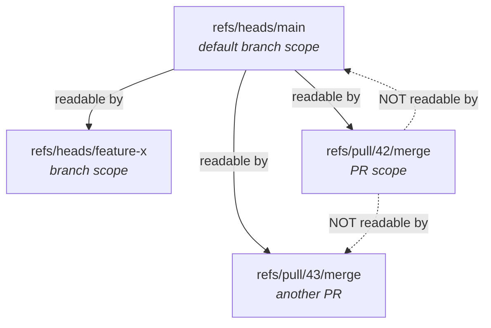
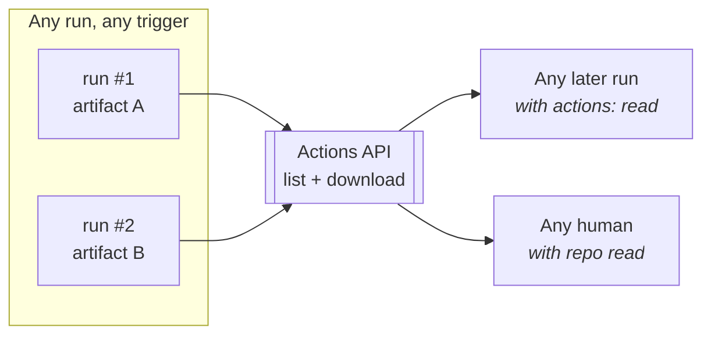

# GitHub Actions storage: what exists, who can reach it

A working note on the three places a workflow can leave data, how GitHub scopes
each one, and what that means for CodeBoarding. Not committed — a draft to
argue with.

The short version: **caches are scoped by git ref, artifacts are scoped by
workflow run, and git is scoped by branch permissions.** Almost every surprise
we hit came from assuming the cache behaved like the other two.

---

## 1. The three stores

| | Actions cache | Workflow artifact | Git (`.codeboarding/`) |
|---|---|---|---|
| **Unit** | a key, within a ref scope | a named file set, within a run | a commit |
| **Who can read** | runs in the same or a parent scope | any run with `actions: read`, plus humans | anyone with repo read |
| **Who can write** | trusted triggers only (§2) | any run, no special permission | anything with `contents: write` |
| **Lifetime** | 7 days idle, then LRU eviction at the limit | retention window (default 90 days) | forever |
| **Mutable** | no — a key is written once | no — finalized at upload | yes, it's a commit |
| **Quota** | **10 GB per repository** | account-wide, plan-dependent (§3.2) | repo size limits |
| **Billed** | only above a raised limit | GB-hours past the allowance (§3.2) | no |
| **Built for** | speeding up a run | publishing a result | durable state |

The distinction that matters: a cache is addressed by **key within a ref**, an
artifact is addressed by **run id + name**. Nothing about an artifact is
branch-scoped, which is why they behave so differently.

---

## 2. Caches: a tree of ref scopes

Every cache entry belongs to the ref of the run that wrote it. Reads flow
**upward only** — a run sees its own scope and its ancestors, never siblings or
children.



Stated as rules:

- A run can restore caches from **its own ref** and from the **default branch**.
- A run triggered for a pull request can *also* restore from the **base branch**.
- A cache written by a pull request run lives in `refs/pull/N/merge` and **can
  only be restored by re-runs of that same pull request** — not by the base
  branch, not by other pull requests.

So the default-branch scope is the only shared one. Anything written there is
visible everywhere; anything written in a PR scope is visible only to that PR.

### 2.1 Writing is a separate question from reading

Since **2026-06-26** ("read-only Actions cache for untrusted triggers"), being
able to read a scope no longer implies being able to write it. GitHub classifies
the *trigger*:

| Trigger | Runs on ref | Can read | Can write |
|---|---|---|---|
| `push` | `refs/heads/<branch>` | that branch + default | ✅ that scope, default branch included |
| `workflow_dispatch` | ref you dispatch | that ref + default | ✅ |
| `schedule` | default branch | default | ✅ |
| `pull_request` | `refs/pull/N/merge` | own PR scope + base + default | ⚠️ **own PR scope only** — denied on the default-branch scope |
| `pull_request_target` | `refs/heads/<base>` | base + default | ❓ probably nothing — its only scope *is* the default-branch one it is denied |
| `issue_comment` | default branch | default | ❌ **nothing** — same reason |

A denied write surfaces as:

```
##[warning]Cache reservation failed: cache write denied: token has no writable scopes
Failed to save: Unable to reserve cache with key ..., another job may be creating this cache.
```

The second line is the cache action's generic fallback and is misleading; the
first line is the real reason. **No `permissions:` block changes this** — it is
enforced on the trigger, not on the token. Teams have confirmed that granting
`actions: write` makes no difference.

### 2.2 Why GitHub did this

A comment can be written by someone with less privilege than a pusher, on a pull
request whose head is a fork. If such a run could write the *default-branch*
scope, it could plant an entry that trusted workflows later restore — cache
poisoning across the trust boundary. PR runs keep write access to their own
isolated scope, because poisoning it only affects a pull request whose code the
attacker already controls.

---

## 3. Artifacts: scoped by run, gated by permission

An artifact belongs to the run that produced it. There is no ref scoping at all.



- **Writing** needs no special permission and works from **every** trigger,
  `issue_comment` included. Our comment-triggered runs upload one on every call.
- **Reading another run's artifact** needs `actions: read` on the token, plus the
  `run-id`. `actions/download-artifact` takes `run-id` + `github-token` for this.
- Artifacts expire on a retention window (90 days by default; a repo or org
  policy can lower it and caps what a workflow may request).
- Immutable once uploaded, and names must be unique within a run.

### 3.1 So yes — an artifact *can* be the previous analysis

This is the asymmetry worth internalising:

> A comment-triggered run **cannot write a cache**, but it **can write an
> artifact**. And any later run can read that artifact, from any ref.

Which means a chain stored in artifacts would work on every path the cache
cannot: `/codeboarding`, the webview's refresh, forks, everything.

Three costs come with it:

1. **A permission change for consumers.** Reading needs `actions: read` in the
   workflow's `permissions:` block. Today's recommended block does not have it.
2. **A smaller, shared quota — but charged by time, which we control.** See
   §3.2: the allowance is account-wide and much smaller than the cache's 10 GB
   per repository, so the nominal size is worse. But artifacts accrue in
   **GB-hours**, so what costs is size × how long it lives, and both levers are
   ours. `retention-days: 1` on a state artifact makes a 5 MB blob cost 0.12
   GB-hours; deleting it after the next run supersedes it costs less still.
3. **It rebuilds the hole GitHub closed.** An untrusted run can write an
   artifact, so a trusted run reading one by name would be unpickling data an
   attacker could have produced. Safe use means checking the *producing run*
   first — its `event`, and whether `head_repository` is a fork — rather than
   trusting a name. With caches, GitHub enforces that boundary for us.

### 3.2 The actual limits

| Plan | Minutes / month | Artifact storage | Cache |
|---|---|---|---|
| Free | 2,000 | 500 MB | 10 GB per repo |
| Pro | 3,000 | 1 GB | 10 GB per repo |
| Team | 3,000 | 2 GB | 10 GB per repo |
| Enterprise Cloud | 50,000 | 50 GB | 10 GB per repo |

**Public repositories are free** on standard runners — minutes and storage both.
So everything below is about private repositories.

Artifact storage is **account-wide** and shared with Packages; cache is **per
repository**. That is the real asymmetry, more than the raw numbers.

**Charging is by GB-hours, not by peak.** Storage accrues hourly against actual
usage. Deleting an artifact makes current storage drop immediately and stops
future accrual — what is already accrued this cycle stays on the bill. Deleting
needs `actions: write`.

Which means the quota is manageable rather than fixed:

| Lever | Permission | Effect |
|---|---|---|
| `retention-days: 1` on the state artifact | none | a 5 MB blob costs ~0.12 GB-hours instead of ~0.84 over a week |
| delete the previous state after uploading a new one | `actions: write` | at most one live state artifact per open pull request |
| leave it at the 90-day default | none | every run's state bills for three months |

Short retention gets most of the benefit with no permission cost, and behaves
like the cache's 7-day idle eviction: a pull request left alone longer than the
window falls back to the base analysis.

### 3.3 Measured sizes, and how many runs fit

Raw sizes from committed baselines, compressed sizes from real runs. Compression
matters: the state dir compresses about 8.5x, JSON graphs about 10x.

"Raw state" below is the whole directory the engine needs — `analysis.json`,
`static_analysis.pkl`, `fingerprint.json`, `static_analysis.sha` — not the pickle
alone. At webview scale the pickle is 58% of it and the graph 41%.

| Repo | Tracked files | `analysis.json` | `static_analysis.pkl` | Raw state | Cache entry | Review artifact |
|---|---|---|---|---|---|---|
| CodeBoarding-action | 24 | 32 KB | 30 KB | 64 KB | **18 KB** | **10 KB** |
| graph-viewer | 62 | 773 KB | 956 KB | 1.73 MB | — | — |
| CodeBoarding-evals | 92 | 1.24 MB | 1.63 MB | 2.88 MB | — | — |
| **CodeBoarding-webview** | **217** | **2.71 MB** | **3.82 MB** | **6.54 MB** | **0.77 MB** | **0.51 MB** |

Everything below uses the webview numbers — the largest repo we have, so a
pessimistic case. A small repo is roughly 40x cheaper.

**Model.** Included storage is an average-GB-over-the-month allowance, and usage
accrues hourly, so one run contributes `size × retention_hours / 730` to that
average. We assume **half** the allowance is available to us; the rest is
packages and other repositories. Public repositories are free and unaffected.

| Plan | A — cache + 30-day artifact | B — artifacts, state kept 1 day | B — artifacts, state kept 30 days |
|---|---|---|---|
| Free | ~500 runs/mo | ~470 | ~170 |
| Pro | ~1,000 | ~935 | ~340 |
| Team | ~2,000 | ~1,870 | ~670 |
| Enterprise | ~50,000 | ~46,700 | ~16,800 |

### 3.4 The base copy is half the artifact

Every run's artifact carries `base_analysis.json`, and the merge base rarely
changes during a pull request — so ten runs store ten identical copies. Measured
at webview scale, with zip compressing each file independently (it does **not**
dedupe near-identical files):

| Artifact contents | Size |
|---|---|
| head graph only | 0.241 MB |
| head + base | 0.482 MB |
| **cost of the base copy** | **0.241 MB — half of it** |

Shipping the base once per merge base instead, as its own artifact named
`codeboarding-base-<merge_base_sha>`, with the review artifact keeping only the
pointer it already has in `metadata.merge_base_sha`:

| | per run | 500 runs/mo across 50 PRs | Team plan, half allowance |
|---|---|---|---|
| Today | 0.482 MB | 241 MB | ~2,000 runs/mo |
| Base shipped once per merge base | 0.265 MB | 133 MB | **~3,600 runs/mo** |

**And it needs no new permission**, if the upload is gated on something the
action already knows: it uploads a base artifact only when it *computed* the
base, which is exactly when the base cache missed. On a warm pull request the
base is restored, not recomputed, so nothing is uploaded. That lands close to
"once per merge base" without having to list artifacts to check.

The consumer looks the base up by name — `GET /actions/artifacts?name=…` — takes
the newest, and caches it by sha, so it fetches each base once no matter how
many times it refreshes. The fallback when no base artifact exists is what the
webview does today: read the committed baseline at that commit.

Give the base artifact a longer retention than the review artifact. It is
uploaded rarely, so the extra retention is cheap, and it must not expire while a
review artifact still points at it.

**Two things fall out of this.**

*The cache limit is unreachable.* Half of 10 GB per repository holds ~6,500 live
chain entries at webview scale, and entries expire after 7 days idle. You would
need thousands of runs per week on one repository to feel it. Capacity is not
what constrains approach A — the 7-day idle window is.

*Approach B costs the same as A, if the state artifact is short-lived.* At
1-day retention the two are within 6% of each other, because the 30-day review
artifact dominates both and a 1-day state artifact is nearly free. Left at the
90-day default, B is 3-4x worse. **Retention, not the choice of store, is what
decides the storage bill.**

---

## 4. Everything in one table

Read (R) and write (W) per trigger, per store:

| Trigger | Cache: default scope | Cache: own PR scope | Artifacts | Git |
|---|---|---|---|---|
| `push` (sync) | R + **W** | — | R + W | W with `contents: write` |
| `pull_request` (same-repo) | R only | R + **W** | R with `actions: read`, W always | R |
| `pull_request` (fork) | R only | R + W | R + W | R |
| `issue_comment` | **R only** | not visible | R with `actions: read`, W always | R |
| `workflow_dispatch` | R + **W** | — | R + W | W with `contents: write` |

The two cells that shaped our design: `issue_comment` cannot write any cache,
and it cannot even *see* a PR-scoped one.

---

## 5. What this means for CodeBoarding today

### 5.1 Which files live where

The cache holds the engine's **working state**. The artifact holds the run's
**results**. They overlap on the graphs and differ on everything else:

| File | Cache entry | Artifact | What it is for |
|---|---|---|---|
| `analysis.json` | ✅ | ✅ | the component graph — the diagram |
| `base_analysis.json` | ✅ *(as the base entry's own `analysis.json`)* | ✅ | what the head was compared against |
| `health_report.json` | ✅ | ✅ | warnings |
| `metadata.json` | ❌ | ✅ | which commits those graphs describe |
| `fingerprint.json` | ✅ | ❌ | whole-tree file hashes — **how a run detects what changed** |
| `static_analysis.pkl` | ✅ | ❌ | LSP/CFG cache and cluster baseline — **MB-scale**, the reason the state dir is big |
| `static_analysis.sha` | ✅ | ❌ | the warm-start gate for the pickle |
| `origin.json` | ✅ | ❌ | provenance: chain depth, and the base digest the chain grew from |

**The rule that follows:** continuing an analysis needs `analysis.json`,
`fingerprint.json` and `static_analysis.pkl` **together**, in one directory. The
artifact carries the first and not the other two, so today's artifact can render
a diagram but cannot seed a run. Handed only `analysis.json`, the engine falls
back to a full analysis.

That is the whole reason the cache exists in this design. It is not a faster copy
of the artifact; it is the only place the *inputs* to an incremental run live.

Who can reach each of these is §4: the chain is written by that pull request's
own push-triggered runs and readable only by them, the base entry is written by
sync and readable everywhere, and the artifact is readable by anything with
`actions: read`.

### 5.2 So could we read everything from artifacts instead?

Yes — but only by moving `fingerprint.json`, `static_analysis.pkl` and
`static_analysis.sha` into an artifact too. That is exactly the "artifact chain"
row in §6, and the three costs in §3.1 apply: the shared 500 MB–2 GB quota rather
than 10 GB per repo, no automatic eviction, and an origin check we would have to
write ourselves before unpickling.

If we did it, the state should be a **separate artifact** with short retention,
not folded into the review artifact — the review artifact is a consumer contract
the webview reads, and shipping a multi-megabyte pickle through it would make
every consumer download the engine's scratch space to draw one diagram.

## 6. Two designs

**A — caches (today).** Working state in the Actions cache, results in an
artifact. GitHub's scope and trust rules decide who participates.

**B — artifacts for everything.** Put `fingerprint.json` and
`static_analysis.pkl` in a state artifact alongside the graphs. Artifacts are
addressable by name across runs, so this makes them a key-value store without
the ref scoping.

### 6.1 What A optimises for

The cache was picked to be a **well-behaved guest in someone else's
repository**, and that is still what it is best at:

- **It is not the user's bill.** Cache is invisible and free to them; artifacts
  land in their storage quota and their artifact list. This, not the raw
  numbers, is why quota matters.
- **It cleans up after itself.** LRU plus 7-day idle eviction. Artifacts can be
  bounded too — short retention, or deleting the superseded one — but that is a
  policy we would own, and deleting costs `actions: write` on top of the
  `actions: read` needed to fetch.
- **It needs no permission.** Artifacts need `actions: read` in every consumer
  workflow, which some organisations restrict centrally.
- **GitHub enforces the untrusted-code boundary**, rather than us.
- **`restore-keys` is free machinery** — "newest entry matching this prefix" is
  exactly what a chain needs.

**Not a reason: speed.** Measured on a real run, a base restore moved 18,450
bytes at 1.2 MB/s and finished in about 290 ms. Both stores are an HTTP transfer
of a compressed blob; the cache saves one API round trip and uses zstd rather
than zip. At MB scale that is a second or two against a 2–6 minute run.

**Worth knowing for the discussion:** this trade-off was never actually
evaluated. The cache was chosen before the trust and scope rules were known, on
the strength of being free, needing no permissions, and giving a PR→base
fallback for nothing. That last property — native ref scoping — is the same
mechanism that now excludes `/codeboarding`. It is both the reason we chose it
and the reason it falls short.

| | A — caches | B — artifacts |
|---|---|---|
| **Triggers that share incremental state** | pushes only. `/codeboarding` can neither read the chain nor write one; forks never | **all of them** — push, comment, dispatch, forks |
| **Needs `synchronize`** | yes, it is the only writer | no — optional, any trigger builds state |
| **Needs dispatch to make refresh useful** | yes | no |
| **Channels to reason about** | 3: cache default scope, cache PR scope, artifact | 1: artifact (+ git baseline for cold start) |
| **Rules to hold in your head** | ref scope tree, trust-by-trigger, eviction, immutability | name, retention, origin check |
| **Rough code** | `cache-keys.sh` + 5 workflow steps + fork namespace + digest/depth checks | lookup by name, download, origin check, upload — comparable size, fewer concepts |
| **Consumer workflow change** | add `synchronize` + `concurrency` | add `actions: read` |
| **Webview impact** | refresh is the most expensive path and never amortises; run→PR matched by title | refresh gets cheaper each time; keeps posting a comment, no dispatch needed |
| **Quota** | 10 GB per repo, self-evicting, unreachable in practice | shared account-wide, but within ~6% of A when the state artifact is kept a day (§3.3) |
| **Who enforces the trust boundary** | GitHub | **us** — verify the producing run before unpickling |
| **Ports to GitLab / others** | poorly — the scope and trust model is GitHub-specific | well — "publish a result, read the last one by name" exists everywhere |

**Reading it.** B is better on every axis a user or a maintainer feels: one
channel instead of three, every trigger participates, no required trigger
changes, a cheaper webview, and it ports. A is better on the two axes that bite
later: storage headroom is 10 GB per repo against a shared 500 MB, and GitHub
enforces the untrusted-code boundary that B makes ours to get right.

The pickle is what makes both of those hurt. It is the reason the state is
MB-scale rather than KB-scale, and the reason reading someone else's state is
dangerous rather than merely wrong.

## Open questions

1. Is `pull_request_target` genuinely unable to write any cache? If so we should
   drop support for it rather than document a path that silently never caches.
2. If we go the artifact route, what is the minimum origin check before
   unpickling — producing run's `event` and `head_repository`, or a signature?
3. Do we want one on-demand mechanism or two? Dispatch strictly dominates
   `/codeboarding` on capability; `/codeboarding` wins purely on the UX of typing
   it into a pull request.

## Sources

- GitHub docs, dependency caching reference — scope rules and the merge-ref restriction
- GitHub changelog 2026-06-26, "read-only Actions cache for untrusted triggers"
- `actions/download-artifact` v4 — `run-id` + `github-token` for cross-run reads
- Our own runs: `CodeBoarding-action` #82 and `CodeBoarding-webview` #77
