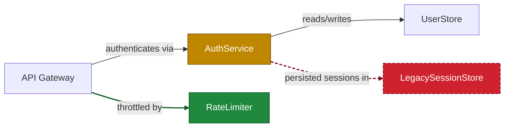

# Mockup: per-component file dropdowns in the sticky PR comment

The sticky PR comment currently shows the Mermaid diff diagram, the color legend,
and the CTA footer — but never lists *which files* made a component change color.
The data is already there: every component in `analysis.json` carries
`file_methods[]` (file paths + methods), which the diff logic uses internally but
never renders.

This doc mocks up two candidate formats, both using collapsed-by-default
`
` blocks below the legend so the diagram stays the hero. The same two
variants are posted as comments on the mockup PR so they can be compared exactly
as reviewers would see them. All component/file/method names below are invented.

---

## Variant A — component → changed files

One dropdown per changed component; expanding it lists the files in that
component that the PR actually touched (intersection of the component's
`file_methods[]` with the git diff — not the component's full file list).

---

### Architecture review · 3 components changed

Colors indicate component changes compared to `main`: 🟩 Added · 🟨 Modified · 🟥 Removed

🟨 <b>AuthService</b> — 3 files changed

- `src/auth/handler.py`
- `src/auth/session.py`
- `src/auth/middleware.py`

🟩 <b>RateLimiter</b> — 2 files added

- `src/ratelimit/bucket.py`
- `src/ratelimit/config.py`

🟥 <b>LegacySessionStore</b> — 2 files removed

- `src/auth/legacy/store.py`
- `src/auth/legacy/migrations.py`

---

See this architecture in your editor: [**Open in VS Code →**](https://marketplace.visualstudio.com/items?itemName=Codeboarding.codeboarding)

codeboarding-action · run 0000000001 · **mockup — Variant A: component → changed files**

---

## Variant B — component → files → methods

Same as Variant A, but each file is itself a dropdown that reveals the changed
methods inside it, each tagged added / modified / removed. The inner dropdowns
sit in a `<blockquote>` so they indent under their component.

---

### Architecture review · 3 components changed

Colors indicate component changes compared to `main`: 🟩 Added · 🟨 Modified · 🟥 Removed

🟨 <b>AuthService</b> — 3 files · 6 methods changed

<blockquote>

🟨 <code>src/auth/handler.py</code> · 3 methods

- 🟩 `validate_token` added
- 🟨 `login` modified
- 🟥 `legacy_login` removed

🟨 <code>src/auth/session.py</code> · 1 method

- 🟨 `refresh` modified

🟩 <code>src/auth/middleware.py</code> · 2 methods

- 🟩 `require_auth` added
- 🟩 `inject_claims` added

</blockquote>

🟩 <b>RateLimiter</b> — 2 files · 3 methods added

<blockquote>

🟩 <code>src/ratelimit/bucket.py</code> · 2 methods

- 🟩 `acquire` added
- 🟩 `refill` added

🟩 <code>src/ratelimit/config.py</code> · 1 method

- 🟩 `load_limits` added

</blockquote>

🟥 <b>LegacySessionStore</b> — 2 files · 4 methods removed

<blockquote>

🟥 <code>src/auth/legacy/store.py</code> · 3 methods

- 🟥 `get_session` removed
- 🟥 `put_session` removed
- 🟥 `evict_expired` removed

🟥 <code>src/auth/legacy/migrations.py</code> · 1 method

- 🟥 `migrate_v1_sessions` removed

</blockquote>

---

See this architecture in your editor: [**Open in VS Code →**](https://marketplace.visualstudio.com/items?itemName=Codeboarding.codeboarding)

codeboarding-action · run 0000000002 · **mockup — Variant B: component → files → methods**

---

## Implementation notes (if either variant is adopted)

- **List changed files only.** Intersect each component's `file_methods[]` paths
  with the PR's git diff. A component can own 40 files while the PR touched 2 —
  listing all of them answers the wrong question.
- **Method statuses** (Variant B) come from comparing base vs head
  `file_methods[].methods` per file — the same comparison
  `_has_method_changes()` already does, surfaced instead of discarded.
- **Comment size cap.** GitHub caps comment bodies at 65,536 chars and the
  Mermaid block alone may use ~45k. Cap files per component (e.g. 15 +
  "…and N more") and drop the dropdowns before dropping the diagram.
- **Rendering gotchas.** Markdown inside `
` needs a blank line after
  `
`; nested dropdowns need the `<blockquote>` wrapper for indentation.
  Build the block in a Python helper next to `build_cta.py` rather than inline
  bash in `action.yml`.
- **Deleted components/files** don't exist on the head ref — render paths as
  plain code spans, not links.
