```mermaid
graph LR
    Action_Orchestrator["Action Orchestrator"]
    Code_Fetcher_Version_Control_Integrator["Code Fetcher & Version Control Integrator"]
    Static_Code_Analyzer["Static Code Analyzer"]
    LLM_Interface_Prompt_Engineer["LLM Interface & Prompt Engineer"]
    Documentation_Generator_Formatter["Documentation Generator & Formatter"]
    Output_Handler["Output Handler"]
    Action_Orchestrator -- "triggers" --> Code_Fetcher_Version_Control_Integrator
    Code_Fetcher_Version_Control_Integrator -- "provides_code_to" --> Static_Code_Analyzer
    Static_Code_Analyzer -- "generates_analysis_for" --> LLM_Interface_Prompt_Engineer
    LLM_Interface_Prompt_Engineer -- "produces_raw_docs_for" --> Documentation_Generator_Formatter
    Documentation_Generator_Formatter -- "creates_final_docs_for" --> Output_Handler
    Output_Handler -- "reports_status_to" --> Action_Orchestrator
```

## Details

The `CodeBoarding-GHAction` is designed as a GitHub Action to automate the generation of code documentation using static analysis and Large Language Models (LLMs). It operates as a pipeline, starting with an orchestrator that triggers the fetching of source code from a repository. The fetched code then undergoes static analysis to extract structural and semantic information. This analysis output is fed into an LLM via a dedicated interface, which processes the information and generates raw documentation. A documentation generator then formats this raw output into a structured document, which is finally handled by an output component responsible for publishing or committing the documentation back to the repository.

### Action Orchestrator
Manages the overall GitHub Action workflow, parses inputs, and orchestrates the execution of other components. It serves as the primary entry point for the action.

**Related Classes/Methods**: _None_

### Code Fetcher & Version Control Integrator
Responsible for securely fetching the source code from the GitHub repository, handling version control specifics (e.g., branch, commit), and making it available for subsequent analysis steps.

**Related Classes/Methods**: _None_

### Static Code Analyzer
Performs static analysis on the fetched source code to extract relevant structural information, dependencies, and code metrics. This structured output is crucial for informing the LLM.

**Related Classes/Methods**: _None_

### LLM Interface & Prompt Engineer
Manages the communication with the Large Language Model, including constructing effective prompts based on the static code analysis results and parsing the LLM's responses into a usable format.

**Related Classes/Methods**: _None_

### Documentation Generator & Formatter
Takes the raw documentation output from the LLM and formats it into a structured and readable document, typically using Markdown or reStructuredText, applying predefined templates.

**Related Classes/Methods**: _None_

### Output Handler
Manages how the final generated documentation is published or made available, such as committing it back to the repository, creating a pull request comment, or setting action outputs.

**Related Classes/Methods**: _None_

### [FAQ](https://github.com/CodeBoarding/GeneratedOnBoardings/tree/main?tab=readme-ov-file#faq)
